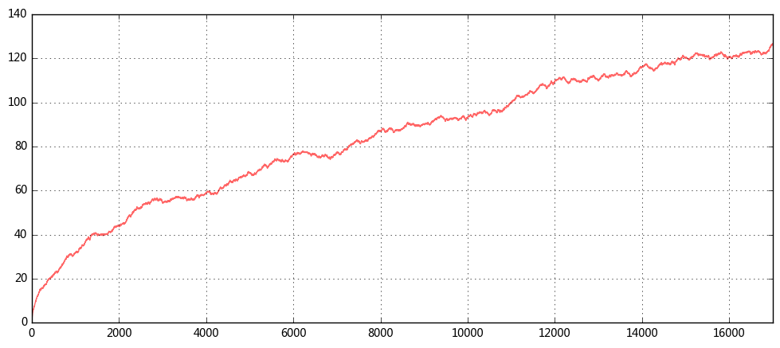
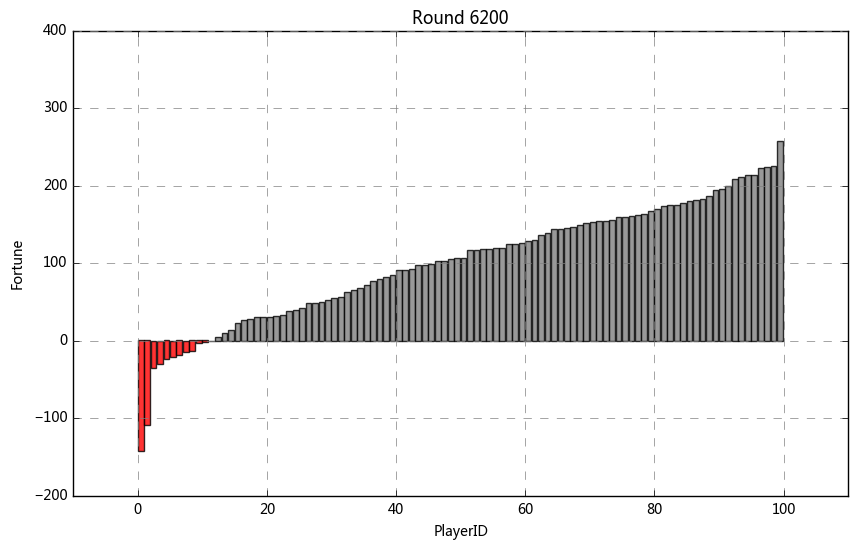

```python
'''
【项目13】  社会财富分配问题模拟

一个财富分配游戏：
房间里有100个人，每人都有100元钱，他们在玩一个游戏。每轮游戏中，每个人都要拿出一元钱随机给另一个人，最后这100个人的财富分布是怎样的？

研究问题：
1、财富分配模型
模型假设：
① 每个人初始基金100元
② 从18岁到65岁，每天玩一次，简化运算按照一共玩17000轮
③ 每天拿出一元钱，并且随机分配给另一个人
④ 当某人的财富值降到0元时，他在该轮无需拿出1元钱给别人，但仍然有机会得到别人给出的钱
要求：
① 构建模型模拟（这里需要跑17000轮）
② 绘制柱状图，查看该轮财富情况
   ** 横轴标签代表一个玩家的编号，柱子的高低变动反映该玩家财富值的变化
   ** 制图分两个情况绘制：不排序绘制、每轮按照财富值排序绘制
   ** 前100轮，按照每10轮绘制一次柱状图，查看财富变化情况
   ** 100至1000轮，按照每100轮绘制一次柱状图，查看财富变化情况
   ** 1000至17000轮，按照每400轮绘制一次柱状图，查看财富变化情况
③ 查看最后财富分配数据是什么分布？
④ 最富有的人相比于初始财富，翻了多少倍？
⑤ 10%的人掌握着多少的财富？30%的人掌握着多少的财富？又有百分之多少人财富缩水至100元以下了？
提示：
① 首先，模拟第一轮游戏分配，不考虑某人财富值降到0元的情况
② 其次，仍然模拟第一轮游戏分配，但考虑某人的财富值降到0元时的情况
③ 构建模型
④ 运行模型，先试运行100条/1000条，再运行17000
⑤ 制图

2、在允许借贷情况下，研究以下问题
和初始模型的区别：
允许借贷意味着可以找亲友、银行、投资人借贷 → 资产为负时，仍然参与游戏
要求：
① 构建模型模拟，再次模拟财富分配情况
   ** 最富有的人相比于初始财富，翻了多少倍？
   ** 10%的人掌握着多少的财富？30%的人掌握着多少的财富？又有百分之多少人财富缩水至100元以下了？
② 绘制柱状图，查看该轮财富情况
   ** 横轴标签代表一个玩家的编号，柱子的高低变动反映该玩家财富值的变化
   ** 这里只需要每轮按照财富值排序绘制
   ** 前100轮，按照每10轮绘制一次柱状图，查看财富变化情况
   ** 100至1000轮，按照每100轮绘制一次柱状图，查看财富变化情况
   ** 1000至17000轮，按照每400轮绘制一次柱状图，查看财富变化情况
③ 游戏次数与财富分布的标准差的情况，绘图来表示
   ** 这里用允许借贷情况下模拟的结果
   ** 横坐标为游戏次数（总共17000次），纵坐标为财富分配标准差
   ** 绘制折线图
④ 玩家从18岁开始，在经过17年后为35岁，这个期间共进行游戏6200次左右，则此刻查看财富情况，将财富值为负的标记成“破产”，通过图表研究
   该类玩家在今后的游戏中能否成功“逆袭”（财富值从负到正为逆袭）、
   ** 这里绘制柱状图 → 6200至17000轮，按照每500轮绘制一次柱状图
提示：
① 该模型只需要将初始模型中，“财富小于零时无需拿钱给别人”的条件删掉即可
② 最后绘制柱状图时，需要将负债的玩家标红，这里可以通过截取dataframe之后，给与color字段来设置颜色

3、努力的人生会更好吗？
模型假设：
① 每个人初始基金仍为100元
② 一共玩17000轮
③ 每天拿出一元钱，并且随机分配给另一个人
④ 有10个人加倍努力，从而获得了1%的竞争优势
⑤ 允许借贷
允许借贷意味着可以找亲友、银行、投资人借贷 → 资产为负时，仍然参与游戏
要求：
① 构建模型模拟，再次模拟财富分配情况
② 努力的人，最后是否富有？
③ 绘制柱状图，查看该轮财富情况
   ** 横轴标签代表一个玩家的编号，柱子的高低变动反映该玩家财富值的变化
   ** 这里只需要每轮按照财富值排序绘制
   ** 前100轮，按照每10轮绘制一次柱状图，查看财富变化情况
   ** 100至1000轮，按照每100轮绘制一次柱状图，查看财富变化情况
   ** 1000至17000轮，按照每400轮绘制一次柱状图，查看财富变化情况
提示：
① 这里设置的10个人id分别为：[1,11,21,31,41,51,61,71,81,91]
② np.random.choice(person_n, p =[...]) → 这里通过设置p来修改概率：努力的10人概率为（1/100.1*1.01），其他人概率为（1/100.1）


'''
```


```python
import numpy as np
import pandas as pd
import matplotlib.pyplot as plt
import os

import warnings
warnings.filterwarnings('ignore') 
# 不发出警告

import time
# 导入时间模块
```


```python
'''
一个财富分配游戏：
房间里有100个人，每人都有100元钱，他们在玩一个游戏。每轮游戏中，每个人都要拿出一元钱随机给另一个人，最后这100个人的财富分布是怎样的？

1、财富分配模型
模型假设：
① 每个人初始基金100元
② 从18岁到65岁，每天玩一次，简化运算按照一共玩17000轮
③ 每天拿出一元钱，并且随机分配给另一个人
④ 当某人的财富值降到0元时，他在该轮无需拿出1元钱给别人，但仍然有机会得到别人给出的钱
要求：
① 构建模型模拟（这里需要跑17000轮）
② 绘制柱状图，查看该轮财富情况
   ** 横轴标签代表一个玩家的编号，柱子的高低变动反映该玩家财富值的变化
   ** 制图分两个情况绘制：不排序绘制、每轮按照财富值排序绘制
   ** 前100轮，按照每10轮绘制一次柱状图，查看财富变化情况
   ** 100至1000轮，按照每100轮绘制一次柱状图，查看财富变化情况
   ** 1000至17000轮，按照每400轮绘制一次柱状图，查看财富变化情况
③ 查看最后财富分配数据是什么分布？
④ 最富有的人相比于初始财富，翻了多少倍？
⑤ 10%的人掌握着多少的财富？30%的人掌握着多少的财富？又有百分之多少人财富缩水至100元以下了？
提示：
① 首先，模拟第一轮游戏分配，不考虑某人财富值降到0元的情况
② 其次，仍然模拟第一轮游戏分配，但考虑某人的财富值降到0元时的情况
③ 构建模型
④ 运行模型，先试运行100条/1000条，再运行17000
⑤ 制图

'''
```


```python
# 1、财富分配模型测试
# 模型假设：
# ① 每个人初始基金100元
# ② 从18岁到65岁，每天玩一次，简化运算按照一共玩17000天
# ③ 每天拿出一元钱，并且随机分配给另一个人
# ④ 当某人的财富值降到0元时，他在该轮无需拿出1元钱给别人，但仍然有机会得到别人给出的钱
# （1） 模拟第一轮游戏分配
# 先不考虑某人财富值降到0元的情况

person_n = [x for x in range(1,101)]
fortune = pd.DataFrame([100 for i in range(100)], index = person_n)
fortune.index.name = 'id'
# 设定初始参数：游戏玩家100人，起始资金100元

round_r1 = pd.DataFrame({'pre_round':fortune[0],'lost':1})
# 设定第一轮分配财富之前的情况
choice_r1 = pd.Series(np.random.choice(person_n,100))      
gain_r1 = pd.DataFrame({'gain':choice_r1.value_counts()})                  
# 这一轮中每个人随机指定给“谁”1元钱，并汇总这一轮每个人的盈利情况
round_r1 = round_r1.join(gain_r1)
round_r1.fillna(0,inplace = True)
fortune[1] = round_r1['pre_round'] - round_r1['lost'] + round_r1['gain']
# 合并数据，得到这一轮每个人“盈亏”多少钱 → 得到这一轮财富分配的结果
fortune.head()
```


<div>
<table border="1" class="dataframe">
  <thead>
    <tr style="text-align: right;">
      <th></th>
      <th>0</th>
      <th>1</th>
    </tr>
    <tr>
      <th>id</th>
      <th></th>
      <th></th>
    </tr>
  </thead>
  <tbody>
    <tr>
      <th>1</th>
      <td>100</td>
      <td>101.0</td>
    </tr>
    <tr>
      <th>2</th>
      <td>100</td>
      <td>101.0</td>
    </tr>
    <tr>
      <th>3</th>
      <td>100</td>
      <td>99.0</td>
    </tr>
    <tr>
      <th>4</th>
      <td>100</td>
      <td>100.0</td>
    </tr>
    <tr>
      <th>5</th>
      <td>100</td>
      <td>99.0</td>
    </tr>
  </tbody>
</table>
</div>


```python
# （2） 模拟第一轮游戏分配
# 考虑情况：当某人的财富值降到0元时，他在该轮无需拿出1元钱给别人，但仍然有机会得到别人给出的钱

person_n = [x for x in range(1,101)]
fortune = pd.DataFrame([100 for i in range(100)], index = person_n)
fortune.index.name = 'id'
# 设定初始参数：游戏玩家100人，起始资金100元

round_r1 = pd.DataFrame({'pre_round':fortune[0],'lost':0})
round_r1['lost'][round_r1['pre_round'] > 0] = 1
# 设定第一轮分配财富之前的情况 → 该轮财富值为0的不需要拿钱给别人
round_players = round_r1[round_r1['pre_round'] > 0]
# 筛选出参与游戏的玩家：财富值>0
choice_r1 = pd.Series(np.random.choice(person_n,len(round_players)))      
gain_r1 = pd.DataFrame({'gain':choice_r1.value_counts()})                  
# 这一轮中每个人随机指定给“谁”1元钱，并汇总这一轮每个人的盈利情况
round_r1 = round_r1.join(gain_r1)
round_r1.fillna(0,inplace = True)
fortune[1] = round_r1['pre_round'] - round_r1['lost'] + round_r1['gain']
# 合并数据，得到这一轮财富分配的结果
fortune.head()
```


<div>
<table border="1" class="dataframe">
  <thead>
    <tr style="text-align: right;">
      <th></th>
      <th>0</th>
      <th>1</th>
    </tr>
    <tr>
      <th>id</th>
      <th></th>
      <th></th>
    </tr>
  </thead>
  <tbody>
    <tr>
      <th>1</th>
      <td>100</td>
      <td>99.0</td>
    </tr>
    <tr>
      <th>2</th>
      <td>100</td>
      <td>102.0</td>
    </tr>
    <tr>
      <th>3</th>
      <td>100</td>
      <td>102.0</td>
    </tr>
    <tr>
      <th>4</th>
      <td>100</td>
      <td>100.0</td>
    </tr>
    <tr>
      <th>5</th>
      <td>100</td>
      <td>101.0</td>
    </tr>
  </tbody>
</table>
</div>


```python
# （3）构建函数模型
# 这里注意：当某人的财富值降到0元时，他在该轮无需拿出1元钱给别人，但仍然有机会得到别人给出的钱

def game1(data, roundi):
    if len(data[data[roundi - 1] ==0]) > 0:   
    # 当数据包含财富值为0的玩家时
        round_i = pd.DataFrame({'pre_round':data[roundi-1],'lost':0})
        con = round_i['pre_round'] > 0
        round_i['lost'][con] = 1               # 设定每轮分配财富之前的情况 → 该轮财富值为0的不需要拿钱给别人
        round_players_i = round_i[con]         # 筛选出参与游戏的玩家：财富值>0
        choice_i = pd.Series(np.random.choice(person_n,len(round_players_i)))
        gain_i = pd.DataFrame({'gain':choice_i.value_counts()})     # 这一轮中每个人随机指定给“谁”1元钱，并汇总这一轮每个人的盈利情况
        round_i = round_i.join(gain_i)
        round_i.fillna(0,inplace = True)
        return round_i['pre_round'] -  round_i['lost'] + round_i['gain']
        # 合并数据，得到这一轮财富分配的结果
    else:
    # 当数据不包含财富值为0的玩家时
        round_i = pd.DataFrame({'pre_round':data[roundi-1],'lost':1}) # 设定每轮分配财富之前的情况
        choice_i = pd.Series(np.random.choice(person_n,100))
        gain_i = pd.DataFrame({'gain':choice_i.value_counts()})       # 这一轮中每个人随机指定给“谁”1元钱，并汇总这一轮每个人的盈利情况
        round_i = round_i.join(gain_i)
        round_i.fillna(0,inplace = True)
        return round_i['pre_round'] -  round_i['lost'] + round_i['gain']
        # 合并数据，得到这一轮财富分配的结果
print('finished!')
```

    finished!
    


```python
# （4）运行模型，模拟财富分配

person_n = [x for x in range(1,101)]
fortune = pd.DataFrame([100 for i in range(100)], index = person_n)
fortune.index.name = 'id'
# 设定初始参数：游戏玩家100人，起始资金100元

starttime = time.time()                     # 模型开始时间
for round in range(1,17001):
    fortune[round] = game1(fortune,round)   # 进行17000轮随机分配模拟
game1_result = fortune.T                    # 转置后得到结果数据 → 列为每一个人的id，行为每一轮的财富分配结果   
endtime = time.time()                       # 模型结束时间
print('模型总共用时%i秒' % (endtime - starttime))
# 计算时间

game1_result.tail()
# 查看最后5条数据
```

    模型总共用时496秒
    


<div>
<table border="1" class="dataframe">
  <thead>
    <tr style="text-align: right;">
      <th>id</th>
      <th>1</th>
      <th>2</th>
      <th>3</th>
      <th>4</th>
      <th>5</th>
      <th>6</th>
      <th>7</th>
      <th>8</th>
      <th>9</th>
      <th>10</th>
      <th>...</th>
      <th>91</th>
      <th>92</th>
      <th>93</th>
      <th>94</th>
      <th>95</th>
      <th>96</th>
      <th>97</th>
      <th>98</th>
      <th>99</th>
      <th>100</th>
    </tr>
  </thead>
  <tbody>
    <tr>
      <th>16996</th>
      <td>255.0</td>
      <td>21.0</td>
      <td>215.0</td>
      <td>46.0</td>
      <td>3.0</td>
      <td>24.0</td>
      <td>41.0</td>
      <td>102.0</td>
      <td>29.0</td>
      <td>160.0</td>
      <td>...</td>
      <td>80.0</td>
      <td>24.0</td>
      <td>248.0</td>
      <td>90.0</td>
      <td>78.0</td>
      <td>14.0</td>
      <td>65.0</td>
      <td>7.0</td>
      <td>200.0</td>
      <td>104.0</td>
    </tr>
    <tr>
      <th>16997</th>
      <td>255.0</td>
      <td>22.0</td>
      <td>214.0</td>
      <td>45.0</td>
      <td>2.0</td>
      <td>24.0</td>
      <td>40.0</td>
      <td>102.0</td>
      <td>30.0</td>
      <td>159.0</td>
      <td>...</td>
      <td>81.0</td>
      <td>24.0</td>
      <td>248.0</td>
      <td>92.0</td>
      <td>77.0</td>
      <td>13.0</td>
      <td>64.0</td>
      <td>9.0</td>
      <td>200.0</td>
      <td>103.0</td>
    </tr>
    <tr>
      <th>16998</th>
      <td>257.0</td>
      <td>22.0</td>
      <td>216.0</td>
      <td>44.0</td>
      <td>1.0</td>
      <td>24.0</td>
      <td>39.0</td>
      <td>102.0</td>
      <td>31.0</td>
      <td>159.0</td>
      <td>...</td>
      <td>83.0</td>
      <td>23.0</td>
      <td>248.0</td>
      <td>92.0</td>
      <td>77.0</td>
      <td>12.0</td>
      <td>63.0</td>
      <td>8.0</td>
      <td>199.0</td>
      <td>103.0</td>
    </tr>
    <tr>
      <th>16999</th>
      <td>258.0</td>
      <td>21.0</td>
      <td>215.0</td>
      <td>43.0</td>
      <td>2.0</td>
      <td>24.0</td>
      <td>40.0</td>
      <td>103.0</td>
      <td>30.0</td>
      <td>158.0</td>
      <td>...</td>
      <td>83.0</td>
      <td>22.0</td>
      <td>247.0</td>
      <td>92.0</td>
      <td>78.0</td>
      <td>13.0</td>
      <td>64.0</td>
      <td>8.0</td>
      <td>198.0</td>
      <td>103.0</td>
    </tr>
    <tr>
      <th>17000</th>
      <td>257.0</td>
      <td>22.0</td>
      <td>214.0</td>
      <td>43.0</td>
      <td>1.0</td>
      <td>23.0</td>
      <td>39.0</td>
      <td>102.0</td>
      <td>30.0</td>
      <td>158.0</td>
      <td>...</td>
      <td>83.0</td>
      <td>22.0</td>
      <td>247.0</td>
      <td>92.0</td>
      <td>77.0</td>
      <td>15.0</td>
      <td>63.0</td>
      <td>8.0</td>
      <td>199.0</td>
      <td>103.0</td>
    </tr>
  </tbody>
</table>
<p>5 rows × 100 columns</p>
</div>


```python
# （5）绘制柱状图
# ** 前100轮，按照每10轮绘制一次柱状图，查看财富变化情况
# ** 100至1000轮，按照每100轮绘制一次柱状图，查看财富变化情况
# ** 1000至17000轮，按照每400轮绘制一次柱状图，查看财富变化情况
# ① 不排序绘制

os.chdir('C:\\Users\\Hjx\\Desktop\\项目13社会财富分配问题模拟\\财富分配模型_初始模型_不排序绘制\\')

def graph1(data,start,end,length):
    for n in list(range(start,end,length)):
        datai = data.iloc[n]
        plt.figure(figsize = (10,6))
        plt.bar(datai.index,datai.values,color='gray',alpha = 0.8,width = 0.9)
        plt.ylim((0,400))
        plt.xlim((-10,110))
        plt.title('Round %d' % n)
        plt.xlabel('PlayerID')
        plt.ylabel('Fortune')
        plt.grid(color='gray', linestyle='--', linewidth=0.5)
        plt.savefig('graph1_round_%d.png' % n, dpi=200)
# 创建绘图函数1

graph1(game1_result,0,100,10)
graph1(game1_result,100,1000,100)
graph1(game1_result,1000,17400,400)

print('finished!')
```

    finished!
    


```python
# （5）绘制柱状图
# ** 前100轮，按照每10轮绘制一次柱状图，查看财富变化情况
# ** 100至1000轮，按照每100轮绘制一次柱状图，查看财富变化情况
# ** 1000至17000轮，按照每400轮绘制一次柱状图，查看财富变化情况
# ② 每轮按照财富值排序绘制

os.chdir('C:\\Users\\Hjx\\Desktop\\项目13社会财富分配问题模拟\\财富分配模型_初始模型_排序绘制\\')

def graph2(data,start,end,length):
    for n in list(range(start,end,length)):
        datai = data.iloc[n].sort_values().reset_index()[n]
        plt.figure(figsize = (10,6))
        plt.bar(datai.index,datai.values,color='gray',alpha = 0.8,width = 0.9)
        plt.ylim((0,400))
        plt.xlim((-10,110))
        plt.title('Round %d' % n)
        plt.xlabel('PlayerID')
        plt.ylabel('Fortune')
        plt.grid(color='gray', linestyle='--', linewidth=0.5)
        plt.savefig('graph2_round_%d.png' % n, dpi=200)
# 创建绘图函数2

graph2(game1_result,0,100,10)
graph2(game1_result,100,1000,100)
graph2(game1_result,1000,17400,400)

print('finished!')
```

    finished!
    


```python
# 一些结论

round_17000_1 = pd.DataFrame({'money':game1_result.iloc[17000]}).sort_values(by = 'money',ascending = False).reset_index()
round_17000_1['fortune_pre'] = round_17000_1['money'] / round_17000_1['money'].sum()
round_17000_1['fortune_cumsum'] = round_17000_1['fortune_pre'].cumsum()
round_17000_1.head()

# 最后一轮中，最富有的人财富值为365元，相比于初始财富，翻了3.65倍
# 10%的人掌握着28%的财富，20%的人掌握着51%的财富？
# 60%的人财富缩水至100元以下了？
```


<div>
<table border="1" class="dataframe">
  <thead>
    <tr style="text-align: right;">
      <th></th>
      <th>id</th>
      <th>money</th>
      <th>fortune_pre</th>
      <th>fortune_cumsum</th>
    </tr>
  </thead>
  <tbody>
    <tr>
      <th>0</th>
      <td>74</td>
      <td>365.0</td>
      <td>0.0365</td>
      <td>0.0365</td>
    </tr>
    <tr>
      <th>1</th>
      <td>13</td>
      <td>310.0</td>
      <td>0.0310</td>
      <td>0.0675</td>
    </tr>
    <tr>
      <th>2</th>
      <td>56</td>
      <td>280.0</td>
      <td>0.0280</td>
      <td>0.0955</td>
    </tr>
    <tr>
      <th>3</th>
      <td>81</td>
      <td>263.0</td>
      <td>0.0263</td>
      <td>0.1218</td>
    </tr>
    <tr>
      <th>4</th>
      <td>71</td>
      <td>259.0</td>
      <td>0.0259</td>
      <td>0.1477</td>
    </tr>
  </tbody>
</table>
</div>


```python
'''
2、在允许借贷情况下，研究以下问题
和初始模型的区别：
允许借贷意味着可以找亲友、银行、投资人借贷 → 资产为负时，仍然参与游戏
要求：
① 构建模型模拟，再次模拟财富分配情况
   ** 最富有的人相比于初始财富，翻了多少倍？
   ** 10%的人掌握着多少的财富？30%的人掌握着多少的财富？又有百分之多少人财富缩水至100元以下了？
② 绘制柱状图，查看该轮财富情况
   ** 横轴标签代表一个玩家的编号，柱子的高低变动反映该玩家财富值的变化
   ** 这里只需要每轮按照财富值排序绘制
   ** 前100轮，按照每10轮绘制一次柱状图，查看财富变化情况
   ** 100至1000轮，按照每100轮绘制一次柱状图，查看财富变化情况
   ** 1000至17000轮，按照每400轮绘制一次柱状图，查看财富变化情况
③ 游戏次数与财富分布的标准差的情况，绘图来表示
   ** 这里用允许借贷情况下模拟的结果
   ** 横坐标为游戏次数（总共17000次），纵坐标为财富分配标准差
   ** 绘制折线图
④ 玩家从18岁开始，在经过17年后为35岁，这个期间共进行游戏6200次左右，则此刻查看财富情况，将财富值为负的标记成“破产”，通过图表研究
   该类玩家在今后的游戏中能否成功“逆袭”（财富值从负到正为逆袭）、
   ** 这里绘制柱状图 → 6200至17000轮，按照每500轮绘制一次柱状图
提示：
① 该模型只需要将初始模型中，“财富小于零时无需拿钱给别人”的条件删掉即可
② 最后绘制柱状图时，需要将负债的玩家标红，这里可以通过截取dataframe之后，给与color字段来设置颜色

'''
```


```python
# （1）构建函数模型
# 这里注意：当某人的财富值降到0元时，他在该轮无需拿出1元钱给别人，但仍然有机会得到别人给出的钱

def game2(data, roundi):
    round_i = pd.DataFrame({'pre_round':data[roundi-1],'lost':1}) # 设定每轮分配财富之前的情况
    choice_i = pd.Series(np.random.choice(person_n,100))
    gain_i = pd.DataFrame({'gain':choice_i.value_counts()})       # 这一轮中每个人随机指定给“谁”1元钱，并汇总这一轮每个人的盈利情况
    round_i = round_i.join(gain_i)
    round_i.fillna(0,inplace = True)
    return round_i['pre_round'] -  round_i['lost'] + round_i['gain']
    # 合并数据，得到这一轮财富分配的结果
print('finished!')
```

    finished!
    


```python
# （2）运行模型，模拟财富分配

person_n = [x for x in range(1,101)]
fortune = pd.DataFrame([100 for i in range(100)], index = person_n)
fortune.index.name = 'id'
# 设定初始参数：游戏玩家100人，起始资金100元

starttime = time.time()                     # 模型开始时间
for round in range(1,17001):
    fortune[round] = game2(fortune,round)   # 进行17000轮随机分配模拟
game2_result = fortune.T                    # 转置后得到结果数据 → 列为每一个人的id，行为每一轮的财富分配结果   
endtime = time.time()                       # 模型结束时间
print('模型总共用时%i秒' % (endtime - starttime))
# 计算时间

game2_result.tail()
# 查看最后5条数据
```

    模型总共用时81秒
    


<div>
<table border="1" class="dataframe">
  <thead>
    <tr style="text-align: right;">
      <th>id</th>
      <th>1</th>
      <th>2</th>
      <th>3</th>
      <th>4</th>
      <th>5</th>
      <th>6</th>
      <th>7</th>
      <th>8</th>
      <th>9</th>
      <th>10</th>
      <th>...</th>
      <th>91</th>
      <th>92</th>
      <th>93</th>
      <th>94</th>
      <th>95</th>
      <th>96</th>
      <th>97</th>
      <th>98</th>
      <th>99</th>
      <th>100</th>
    </tr>
  </thead>
  <tbody>
    <tr>
      <th>16996</th>
      <td>220.0</td>
      <td>270.0</td>
      <td>180.0</td>
      <td>38.0</td>
      <td>297.0</td>
      <td>173.0</td>
      <td>161.0</td>
      <td>57.0</td>
      <td>289.0</td>
      <td>188.0</td>
      <td>...</td>
      <td>121.0</td>
      <td>33.0</td>
      <td>425.0</td>
      <td>-43.0</td>
      <td>219.0</td>
      <td>182.0</td>
      <td>184.0</td>
      <td>214.0</td>
      <td>399.0</td>
      <td>158.0</td>
    </tr>
    <tr>
      <th>16997</th>
      <td>219.0</td>
      <td>272.0</td>
      <td>180.0</td>
      <td>39.0</td>
      <td>299.0</td>
      <td>172.0</td>
      <td>160.0</td>
      <td>58.0</td>
      <td>291.0</td>
      <td>187.0</td>
      <td>...</td>
      <td>122.0</td>
      <td>33.0</td>
      <td>426.0</td>
      <td>-43.0</td>
      <td>219.0</td>
      <td>182.0</td>
      <td>187.0</td>
      <td>214.0</td>
      <td>398.0</td>
      <td>161.0</td>
    </tr>
    <tr>
      <th>16998</th>
      <td>218.0</td>
      <td>272.0</td>
      <td>180.0</td>
      <td>40.0</td>
      <td>298.0</td>
      <td>173.0</td>
      <td>160.0</td>
      <td>58.0</td>
      <td>291.0</td>
      <td>186.0</td>
      <td>...</td>
      <td>121.0</td>
      <td>32.0</td>
      <td>425.0</td>
      <td>-43.0</td>
      <td>218.0</td>
      <td>181.0</td>
      <td>186.0</td>
      <td>215.0</td>
      <td>398.0</td>
      <td>161.0</td>
    </tr>
    <tr>
      <th>16999</th>
      <td>220.0</td>
      <td>272.0</td>
      <td>180.0</td>
      <td>39.0</td>
      <td>297.0</td>
      <td>172.0</td>
      <td>159.0</td>
      <td>59.0</td>
      <td>290.0</td>
      <td>185.0</td>
      <td>...</td>
      <td>123.0</td>
      <td>33.0</td>
      <td>424.0</td>
      <td>-43.0</td>
      <td>217.0</td>
      <td>182.0</td>
      <td>185.0</td>
      <td>216.0</td>
      <td>399.0</td>
      <td>160.0</td>
    </tr>
    <tr>
      <th>17000</th>
      <td>220.0</td>
      <td>271.0</td>
      <td>181.0</td>
      <td>39.0</td>
      <td>297.0</td>
      <td>171.0</td>
      <td>160.0</td>
      <td>59.0</td>
      <td>289.0</td>
      <td>187.0</td>
      <td>...</td>
      <td>122.0</td>
      <td>34.0</td>
      <td>424.0</td>
      <td>-44.0</td>
      <td>216.0</td>
      <td>184.0</td>
      <td>185.0</td>
      <td>215.0</td>
      <td>398.0</td>
      <td>160.0</td>
    </tr>
  </tbody>
</table>
<p>5 rows × 100 columns</p>
</div>


```python
# 一些结论

round_17000_2 = pd.DataFrame({'money':game2_result.iloc[17000]}).sort_values(by = 'money',ascending = False).reset_index()
round_17000_2['fortune_pre'] = round_17000_2['money'] / round_17000_2['money'].sum()
round_17000_2['fortune_cumsum'] = round_17000_2['fortune_pre'].cumsum()
round_17000_2.head()

# 最后一轮中，最富有的人财富值为458元，相比于初始财富，翻了4.58倍
# 10%的人掌握着33%的财富，20%的人掌握着59%的财富？
# 50%的人财富缩水至100元以下了？
```


<div>
<table border="1" class="dataframe">
  <thead>
    <tr style="text-align: right;">
      <th></th>
      <th>id</th>
      <th>money</th>
      <th>fortune_pre</th>
      <th>fortune_cumsum</th>
    </tr>
  </thead>
  <tbody>
    <tr>
      <th>0</th>
      <td>93</td>
      <td>424.0</td>
      <td>0.0424</td>
      <td>0.0424</td>
    </tr>
    <tr>
      <th>1</th>
      <td>99</td>
      <td>398.0</td>
      <td>0.0398</td>
      <td>0.0822</td>
    </tr>
    <tr>
      <th>2</th>
      <td>80</td>
      <td>367.0</td>
      <td>0.0367</td>
      <td>0.1189</td>
    </tr>
    <tr>
      <th>3</th>
      <td>90</td>
      <td>307.0</td>
      <td>0.0307</td>
      <td>0.1496</td>
    </tr>
    <tr>
      <th>4</th>
      <td>5</td>
      <td>297.0</td>
      <td>0.0297</td>
      <td>0.1793</td>
    </tr>
  </tbody>
</table>
</div>


```python
# （3）游戏次数与财富分布的标准差的情况，绘图来表示

os.chdir('C:\\Users\\Hjx\\Desktop\\项目13社会财富分配问题模拟\\财富分配模型_允许借贷\\')

def graph3(data,start,end,length):
    for n in list(range(start,end,length)):
        datai = data.iloc[n].sort_values().reset_index()[n]
        plt.figure(figsize = (10,6))
        plt.bar(datai.index,datai.values,color='gray',alpha = 0.8,width = 0.9)
        plt.grid(color='gray', linestyle='--', linewidth=0.5)
        plt.ylim((-200,400))
        plt.xlim((-10,110))
        plt.title('Round %d' % n)
        plt.xlabel('PlayerID')
        plt.ylabel('Fortune')
        plt.savefig('graph3_round_%d.png' % n, dpi=200)
# 创建绘图函数2

graph3(game2_result,0,100,10)
graph3(game2_result,100,1000,100)
graph3(game2_result,1000,17400,400)

print('finished!')
```

    finished!
    


```python
# （4）游戏次数与财富分布的标准差的情况，绘图来表示

game2_st = game2_result.std(axis = 1)
game2_st.plot(figsize = (12,5),color = 'red',alpha = 0.6,grid = True)
plt.show()

# 游戏早期前2000轮的标准差变动最为激烈；
# 而在6000-6500轮游戏后，标准差的变化趋于平缓，但仍在上升；
# 按照我们设定的游戏与人生的对应规则，这时玩家年龄为35岁
```





```python
# （5）玩家从18岁开始，在经过17年后为35岁，这个期间共进行游戏6200次左右，则此刻查看财富情况，将财富值为负的标记成“破产
# 通过图表研究该类玩家在今后的游戏中能否成功“逆袭”（财富值从负到正为逆袭）、
# 这里绘制折线图

game2_round6200 = pd.DataFrame({'money':game2_result.iloc[6200].sort_values().reset_index()[6200],
                                'id':game2_result.iloc[6200].sort_values().reset_index()['id'],
                                'color':'gray'})
game2_round6200['color'][game2_round6200['money'] < 0] = 'red'
id_pc = game2_round6200['id'][game2_round6200['money'] < 0].tolist()
print('财富值为负的玩家id为：\n',id_pc)
# 筛选数据
# 设置颜色参数

plt.figure(figsize = (10,6))
plt.bar(game2_round6200.index,game2_round6200['money'],color = game2_round6200['color'],alpha = 0.8,width = 0.9)
plt.grid(color='gray', linestyle='--', linewidth=0.5)
plt.ylim((-200,400))
plt.xlim((-10,110))
plt.title('Round 6200')
plt.xlabel('PlayerID')
plt.ylabel('Fortune')
plt.show()
# 绘制柱状图
```

    财富值为负的玩家id为：
     [14, 63, 54, 42, 69, 18, 40, 21, 33, 6, 66]
    





```python
# 绘图分析

os.chdir('C:\\Users\\Hjx\\Desktop\\项目13社会财富分配问题模拟\\财富分配模型_允许借贷_负债玩家逆袭\\')

def graph4(data,start,end,length):
    for n in list(range(start,end,length)):
        datai = pd.DataFrame({'money':data.iloc[n],'color':'gray'})
        datai['color'].loc[id_pc] = 'red'
        datai = datai.sort_values(by = 'money').reset_index()
        plt.figure(figsize = (10,6))
        plt.bar(datai.index,datai['money'],color=datai['color'],alpha = 0.8,width = 0.9)
        plt.grid(color='gray', linestyle='--', linewidth=0.5)
        plt.ylim((-200,400))
        plt.xlim((-10,110))
        plt.title('Round %d' % n)
        plt.xlabel('PlayerID')
        plt.ylabel('Fortune')
        plt.savefig('graph4_round_%d.png' % n, dpi=200)
# 创建绘图函数2

graph4(game2_result,6200,17000,500)

print('finished!')

# 结论
# 以35岁为界，虽然破产以后，不足一半的概率回复到普通人的生活，但想要逆袭暴富，却是相当困难的
```

    finished!
    


```python
'''
3、努力的人生会更好吗？
模型假设：
① 每个人初始基金仍为100元
② 一共玩17000轮
③ 每天拿出一元钱，并且随机分配给另一个人
④ 有10个人加倍努力，从而获得了1%的竞争优势
⑤ 允许借贷
允许借贷意味着可以找亲友、银行、投资人借贷 → 资产为负时，仍然参与游戏
要求：
① 构建模型模拟，再次模拟财富分配情况
② 努力的人，最后是否富有？
③ 绘制柱状图，查看该轮财富情况
   ** 横轴标签代表一个玩家的编号，柱子的高低变动反映该玩家财富值的变化
   ** 这里只需要每轮按照财富值排序绘制
   ** 前100轮，按照每10轮绘制一次柱状图，查看财富变化情况
   ** 100至1000轮，按照每100轮绘制一次柱状图，查看财富变化情况
   ** 1000至17000轮，按照每400轮绘制一次柱状图，查看财富变化情况
提示：
① 这里设置的10个人id分别为：[1,11,21,31,41,51,61,71,81,91]
② np.random.choice(person_n, p =[...]) → 这里通过设置p来修改概率：努力的10人概率为0.0101，其他人概率为（0.899/90）

'''
```


```python
# （1）构建函数模型
# 这里注意：当某人的财富值降到0元时，他在该轮无需拿出1元钱给别人，但仍然有机会得到别人给出的钱

person_p = [0.899/90 for i in range(100)]
for i in [1,11,21,31,41,51,61,71,81,91]:
    person_p[i-1] = 0.0101
# 设置概率

def game3(data, roundi):
    round_i = pd.DataFrame({'pre_round':data[roundi-1],'lost':1}) # 设定每轮分配财富之前的情况
    choice_i = pd.Series(np.random.choice(person_n,100, p = person_p))
    gain_i = pd.DataFrame({'gain':choice_i.value_counts()})       # 这一轮中每个人随机指定给“谁”1元钱，并汇总这一轮每个人的盈利情况
    round_i = round_i.join(gain_i)
    round_i.fillna(0,inplace = True)
    return round_i['pre_round'] -  round_i['lost'] + round_i['gain']
    # 合并数据，得到这一轮财富分配的结果
print('finished!')
```

    finished!
    


```python
# （2）运行模型，模拟财富分配

person_n = [x for x in range(1,101)]
fortune = pd.DataFrame([100 for i in range(100)], index = person_n)
fortune.index.name = 'id'
# 设定初始参数：游戏玩家100人，起始资金100元

starttime = time.time()                     # 模型开始时间
for round in range(1,17001):
    fortune[round] = game3(fortune,round)   # 进行17000轮随机分配模拟
game3_result = fortune.T                    # 转置后得到结果数据 → 列为每一个人的id，行为每一轮的财富分配结果   
endtime = time.time()                       # 模型结束时间
print('模型总共用时%i秒' % (endtime - starttime))
# 计算时间

game3_result.tail()
# 查看最后5条数据
```

    模型总共用时84秒
    


<div>
<table border="1" class="dataframe">
  <thead>
    <tr style="text-align: right;">
      <th>id</th>
      <th>1</th>
      <th>2</th>
      <th>3</th>
      <th>4</th>
      <th>5</th>
      <th>6</th>
      <th>7</th>
      <th>8</th>
      <th>9</th>
      <th>10</th>
      <th>...</th>
      <th>91</th>
      <th>92</th>
      <th>93</th>
      <th>94</th>
      <th>95</th>
      <th>96</th>
      <th>97</th>
      <th>98</th>
      <th>99</th>
      <th>100</th>
    </tr>
  </thead>
  <tbody>
    <tr>
      <th>16996</th>
      <td>430.0</td>
      <td>134.0</td>
      <td>-48.0</td>
      <td>190.0</td>
      <td>-50.0</td>
      <td>-13.0</td>
      <td>-50.0</td>
      <td>49.0</td>
      <td>-88.0</td>
      <td>271.0</td>
      <td>...</td>
      <td>-7.0</td>
      <td>317.0</td>
      <td>-1.0</td>
      <td>168.0</td>
      <td>137.0</td>
      <td>88.0</td>
      <td>90.0</td>
      <td>126.0</td>
      <td>56.0</td>
      <td>227.0</td>
    </tr>
    <tr>
      <th>16997</th>
      <td>430.0</td>
      <td>135.0</td>
      <td>-49.0</td>
      <td>190.0</td>
      <td>-50.0</td>
      <td>-14.0</td>
      <td>-51.0</td>
      <td>51.0</td>
      <td>-86.0</td>
      <td>271.0</td>
      <td>...</td>
      <td>-8.0</td>
      <td>318.0</td>
      <td>3.0</td>
      <td>168.0</td>
      <td>137.0</td>
      <td>88.0</td>
      <td>89.0</td>
      <td>125.0</td>
      <td>56.0</td>
      <td>227.0</td>
    </tr>
    <tr>
      <th>16998</th>
      <td>431.0</td>
      <td>134.0</td>
      <td>-47.0</td>
      <td>190.0</td>
      <td>-50.0</td>
      <td>-13.0</td>
      <td>-50.0</td>
      <td>51.0</td>
      <td>-86.0</td>
      <td>271.0</td>
      <td>...</td>
      <td>-8.0</td>
      <td>317.0</td>
      <td>2.0</td>
      <td>167.0</td>
      <td>139.0</td>
      <td>87.0</td>
      <td>89.0</td>
      <td>125.0</td>
      <td>55.0</td>
      <td>227.0</td>
    </tr>
    <tr>
      <th>16999</th>
      <td>431.0</td>
      <td>134.0</td>
      <td>-46.0</td>
      <td>190.0</td>
      <td>-46.0</td>
      <td>-14.0</td>
      <td>-50.0</td>
      <td>51.0</td>
      <td>-85.0</td>
      <td>271.0</td>
      <td>...</td>
      <td>-8.0</td>
      <td>320.0</td>
      <td>2.0</td>
      <td>168.0</td>
      <td>139.0</td>
      <td>86.0</td>
      <td>89.0</td>
      <td>125.0</td>
      <td>54.0</td>
      <td>226.0</td>
    </tr>
    <tr>
      <th>17000</th>
      <td>433.0</td>
      <td>134.0</td>
      <td>-46.0</td>
      <td>190.0</td>
      <td>-46.0</td>
      <td>-14.0</td>
      <td>-51.0</td>
      <td>50.0</td>
      <td>-86.0</td>
      <td>271.0</td>
      <td>...</td>
      <td>-9.0</td>
      <td>322.0</td>
      <td>2.0</td>
      <td>168.0</td>
      <td>139.0</td>
      <td>87.0</td>
      <td>88.0</td>
      <td>125.0</td>
      <td>55.0</td>
      <td>225.0</td>
    </tr>
  </tbody>
</table>
<p>5 rows × 100 columns</p>
</div>


```python
# 绘图分析

os.chdir('C:\\Users\\Hjx\\Desktop\\项目13社会财富分配问题模拟\\财富分配模型_努力人生\\')

plt.figure(figsize = (10,6))
data0 = pd.DataFrame({'money':game3_result.iloc[0],'color':'gray'})
data0['color'].loc[[1,11,21,31,41,51,61,71,81,91]] = 'red'
plt.bar(data0.index,data0['money'],color=data0['color'],alpha = 0.8,width = 0.9)
plt.grid(color='gray', linestyle='--', linewidth=0.5)
plt.ylim((-200,400))
plt.xlim((-10,110))
plt.title('Round %d' % 0)
plt.xlabel('PlayerID')
plt.ylabel('Fortune')
plt.savefig('graph5_round_%d.png' % 0, dpi=200)
# 绘制起始图片

def graph5(data,start,end,length):
    for n in list(range(start,end,length)):
        datai = pd.DataFrame({'money':data.iloc[n],'color':'gray'})
        datai['color'].loc[[1,11,21,31,41,51,61,71,81,91]] = 'red'
        datai = datai.sort_values(by = 'money').reset_index()
        plt.figure(figsize = (10,6))
        plt.bar(datai.index,datai['money'],color=datai['color'],alpha = 0.8,width = 0.9)
        plt.grid(color='gray', linestyle='--', linewidth=0.5)
        plt.ylim((-200,400))
        plt.xlim((-10,110))
        plt.title('Round %d' % n)
        plt.xlabel('PlayerID')
        plt.ylabel('Fortune')
        plt.savefig('graph5_round_%d.png' % n, dpi=200)
# 创建绘图函数2

graph5(game3_result,10,100,10)
graph5(game3_result,100,1000,100)
graph5(game3_result,1000,17400,400)

print('finished!')

# 结论
# 社会财富的总体分布形态没有什么变化
# 10位努力玩家中多位都进入了富人top20！
```

    finished!
    
