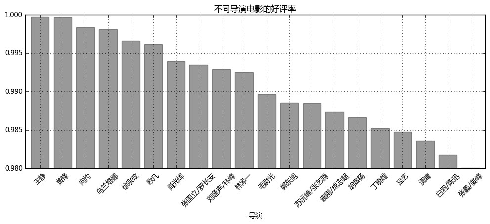
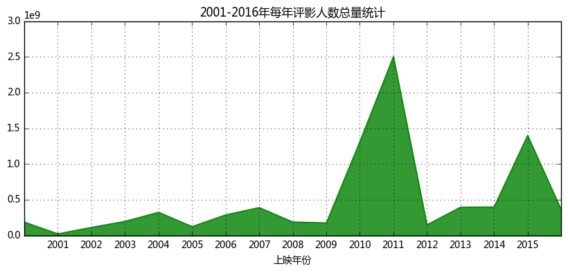
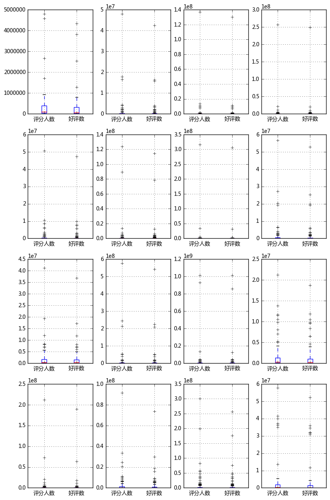

```python
'''
【项目04】  视频网站数据清洗整理和结论研究

作业要求：
1、数据清洗 - 去除空值
要求：创建函数
提示：fillna方法填充缺失数据，注意inplace参数

2、数据清洗 - 时间标签转化
要求：
① 将时间字段改为时间标签
② 创建函数
提示：
需要将中文日期转化为非中文日期，例如 2016年5月24日 → 2016.5.24

3、问题1 分析出不同导演电影的好评率，并筛选出TOP20
要求：
① 计算统计出不同导演的好评率，不要求创建函数
② 通过多系列柱状图，做图表可视化
提示：
① 好评率 = 好评数 / 评分人数
② 可自己设定图表风格

4、问题2 统计分析2001-2016年每年评影人数总量
要求：
① 计算统计出2001-2016年每年评影人数总量，不要求创建函数
② 通过面积图，做图表可视化，分析每年人数总量变化规律
③ 验证是否有异常值（极度异常）
④ 创建函数分析出数据外限最大最小值）
⑤ 筛选查看异常值 → 是否异常值就是每年的热门电影？
提示：
① 通过箱型图验证异常值情况
② 通过quantile(q=0.5)方法，得到四分位数
③ IQR=Q3-Q1
④ 外限：最大值区间Q3+3IQR,最小值区间Q1-3IQR （IQR=Q3-Q1）
⑤ 可自己设定图表风格

'''
```


```python
import pandas as pd
import numpy as np 
import matplotlib.pyplot as plt
% matplotlib inline
```


```python
# 数据读取

data = pd.read_csv('C:/Users/Hjx/Desktop/爱奇艺视频数据.csv', engine = 'python')
print(data.head())
```

           数据获取日期   演员  视频ID                                        详细链接  \
    0  2016年5月24日  NaN   100  http://www.iqiyi.com/dianshiju/douyu2.html   
    1  2016年5月24日  NaN  1037   http://www.iqiyi.com/dianshiju/jhuxd.html   
    2  2016年5月24日  NaN  1573  http://www.iqiyi.com/dianshiju/fmxqj2.html   
    3  2016年5月24日  NaN  1739    http://www.iqiyi.com/dianshiju/qtjm.html   
    4  2016年5月24日  NaN  1756   http://www.iqiyi.com/dianshiju/18jbj.html   
    
                   剧名   状态                     类型 来源平台     整理后剧名 更新时间    ...     \
    0     斗鱼Ⅱ(1-20)全集  已完结  粤语电视剧/偶像剧/言情剧/超清1080P  爱奇艺       斗鱼2  NaN    ...      
    1    江湖兄弟(1-32)全集  已完结  粤语电视剧/悬疑剧/年代剧/超清1080P  爱奇艺    江湖兄弟全集  NaN    ...      
    2  肥猫寻亲记2(1-30)全集  已完结           粤语电视剧/家庭剧/喜剧  爱奇艺  肥猫寻亲记2全集  NaN    ...      
    3    舞台姐妹(1-34)全集  已完结          粤语电视剧/年代剧/家庭剧  爱奇艺    舞台姐妹全集  NaN    ...      
    4   18禁不禁(1-30)全集  已完结   粤语电视剧/偶像剧/超清1080P/喜剧  爱奇艺   18禁不禁全集  NaN    ...      
    
         上映年份                                                 简介   导演      差评数  \
    0  2004.0  在单子杀了阿豹派去强暴语燕的手下而入狱后，众人的生活都有了改变。语燕为了让自己不再是于皓的包...  NaN   2034.0   
    1  2008.0  1930年代，海龙城首富唐英明用五斗上等珍珠，击败列国商业对手，买得与铁达尼齐名之奥丽号邮轮...  NaN   7291.0   
    2  2005.0  肥猫经历了几番风雨，终于寻回了他的亲生弟妹们：年轻有为的医生二弟华世杰、大律师三妹婉容、美丽...  NaN   1183.0   
    3  2006.0  一对原本乡下“阳春舞台班“苦命姐妹春花和月红，在戏霸唐经理的阴谋算计下来到大上海的灯红酒绿下...  NaN    451.0   
    4  2007.0  一部台湾偶像剧，由三个偶像团体（模范棒棒堂Choc7、黑Girl、翼势力）的成员和多位新进演...  NaN  63551.0   
    
           评分人数         播放量 更新至   总集数  第几季       好评数  
    0   32722.0   8069526.0 NaN  20.0    2   30688.0  
    1   39492.0  70213917.0 NaN  32.0    1   32201.0  
    2   10105.0   3310768.0 NaN  30.0    1    8922.0  
    3    2639.0   2088958.0 NaN  34.0    1    2188.0  
    4  748338.0  41287893.0 NaN  30.0    1  684787.0  
    
    [5 rows x 24 columns]
    


```python
# 数据清洗 - 去除空值
# 文本型字段空值改为“缺失数据”，数字型字段空值改为 0 
# 要求：创建函数
# 提示：fillna方法填充缺失数据，注意inplace参数

def data_cleaning(df):
    cols = df.columns
    for col in cols:
        if df[col].dtype ==  'object':
            df[col].fillna('缺失数据', inplace = True)
        else:
            df[col].fillna(0, inplace = True)
    return(df)
# 该函数可以将任意数据内空值替换

data_c1 = data_cleaning(data)
print(data_c1.head(10))
```

           数据获取日期    演员       视频ID                                        详细链接  \
    0  2016年5月24日  缺失数据        100  http://www.iqiyi.com/dianshiju/douyu2.html   
    1  2016年5月24日  缺失数据       1037   http://www.iqiyi.com/dianshiju/jhuxd.html   
    2  2016年5月24日  缺失数据       1573  http://www.iqiyi.com/dianshiju/fmxqj2.html   
    3  2016年5月24日  缺失数据       1739    http://www.iqiyi.com/dianshiju/qtjm.html   
    4  2016年5月24日  缺失数据       1756   http://www.iqiyi.com/dianshiju/18jbj.html   
    5  2016年5月24日  缺失数据       1757  http://www.iqiyi.com/dianshiju/18sdtk.html   
    6  2016年5月24日  缺失数据       1837      http://www.iqiyi.com/dianshiju/dy.html   
    7  2016年5月24日  缺失数据  200175401      http://www.iqiyi.com/a_19rrgjd745.html   
    8  2016年5月24日  缺失数据  202938201      http://www.iqiyi.com/a_19rrhb9eet.html   
    9  2016年5月24日  缺失数据       2212   http://www.iqiyi.com/dianshiju/yjjhx.html   
    
                   剧名    状态                                类型 来源平台     整理后剧名  \
    0     斗鱼Ⅱ(1-20)全集   已完结             粤语电视剧/偶像剧/言情剧/超清1080P  爱奇艺       斗鱼2   
    1    江湖兄弟(1-32)全集   已完结             粤语电视剧/悬疑剧/年代剧/超清1080P  爱奇艺    江湖兄弟全集   
    2  肥猫寻亲记2(1-30)全集   已完结                      粤语电视剧/家庭剧/喜剧  爱奇艺  肥猫寻亲记2全集   
    3    舞台姐妹(1-34)全集   已完结                     粤语电视剧/年代剧/家庭剧  爱奇艺    舞台姐妹全集   
    4   18禁不禁(1-30)全集   已完结              粤语电视剧/偶像剧/超清1080P/喜剧  爱奇艺   18禁不禁全集   
    5  18岁的约定(1-21)全集   已完结             粤语电视剧/偶像剧/言情剧/超清1080P  爱奇艺  18岁的约定全集   
    6      斗鱼(1-20)全集   已完结             粤语电视剧/偶像剧/言情剧/超清1080P  爱奇艺      斗鱼全集   
    7          人生需要揭穿  缺失数据  粤语电视剧/超清1080P/偶像剧/家庭剧/青春剧/网络剧/喜剧  爱奇艺    人生需要揭穿   
    8           太阳的后裔  缺失数据          粤语电视剧/偶像剧/剧情/言情剧/超清1080P  爱奇艺     太阳的后裔   
    9   又见橘花香(1-20)全集   已完结     粤语电视剧/偶像剧/言情剧/超清1080P/青春剧/家庭剧  爱奇艺   又见橘花香全集   
    
       更新时间    ...        上映年份                                                 简介  \
    0  缺失数据    ...      2004.0  在单子杀了阿豹派去强暴语燕的手下而入狱后，众人的生活都有了改变。语燕为了让自己不再是于皓的包...   
    1  缺失数据    ...      2008.0  1930年代，海龙城首富唐英明用五斗上等珍珠，击败列国商业对手，买得与铁达尼齐名之奥丽号邮轮...   
    2  缺失数据    ...      2005.0  肥猫经历了几番风雨，终于寻回了他的亲生弟妹们：年轻有为的医生二弟华世杰、大律师三妹婉容、美丽...   
    3  缺失数据    ...      2006.0  一对原本乡下“阳春舞台班“苦命姐妹春花和月红，在戏霸唐经理的阴谋算计下来到大上海的灯红酒绿下...   
    4  缺失数据    ...      2007.0  一部台湾偶像剧，由三个偶像团体（模范棒棒堂Choc7、黑Girl、翼势力）的成员和多位新进演...   
    5  缺失数据    ...      2002.0  何帆，是一个天才型调酒师，也是各高校极欲网罗的名师对象。晓彤，班上的一名女学生。在日积月累之...   
    6  缺失数据    ...      2004.0  两个世界的人，可以是朋友、可以是仇人、可以错身而过，但是如果他们相爱了，结局只有走上灭绝的命...   
    7  缺失数据    ...         0.0                           人生需要揭穿-统帅电器-高清视频在线观看-爱奇艺   
    8  缺失数据    ...         0.0  《太阳的后裔》是由李应福导演，由宋仲基、宋慧乔等主演的电视剧，共16集，爱奇艺为你提供太阳的...   
    9  缺失数据    ...      2003.0  每一次恋爱，有多少回忆停驻在你的脑海里？初恋的滋味，总是带点甜蜜，带点苦涩。杜凯翔接到小学同...   
    
         导演       差评数       评分人数         播放量  更新至   总集数  第几季        好评数  
    0  缺失数据    2034.0    32722.0   8069526.0  0.0  20.0    2    30688.0  
    1  缺失数据    7291.0    39492.0  70213917.0  0.0  32.0    1    32201.0  
    2  缺失数据    1183.0    10105.0   3310768.0  0.0  30.0    1     8922.0  
    3  缺失数据     451.0     2639.0   2088958.0  0.0  34.0    1     2188.0  
    4  缺失数据   63551.0   748338.0  41287893.0  0.0  30.0    1   684787.0  
    5  缺失数据    1632.0    11529.0   3946404.0  0.0  21.0    1     9897.0  
    6  缺失数据    8358.0   124810.0  22701460.0  0.0  20.0    1   116452.0  
    7  缺失数据    3282.0    27528.0         0.0  0.0   0.0    1    24246.0  
    8  缺失数据  642608.0  5009885.0         0.0  0.0   0.0    1  4367277.0  
    9  缺失数据     884.0     3378.0   1599915.0  0.0  20.0    1     2494.0  
    
    [10 rows x 24 columns]
    


```python
# 数据清洗 - 时间标签转化
# 将时间字段改为时间标签
# 要求：创建函数
# 提示：需要将中文日期转化为非中文日期，例如 2016年5月24日 → 2016.5.24

def data_time(df,*cols):
    for col in cols:
        df[col] = df[col].str.replace('年','.')
        df[col] = df[col].str.replace('月','.')
        df[col] = df[col].str.replace('日','')
        df[col] = pd.to_datetime(df[col])
    return(df)
# 该函数将输入列名的列，改为DatetimeIndex格式

data_c2 = data_time(data_c1,'数据获取日期')
print(data_c2.head(10))
```

          数据获取日期    演员       视频ID                                        详细链接  \
    0 2016-05-24  缺失数据        100  http://www.iqiyi.com/dianshiju/douyu2.html   
    1 2016-05-24  缺失数据       1037   http://www.iqiyi.com/dianshiju/jhuxd.html   
    2 2016-05-24  缺失数据       1573  http://www.iqiyi.com/dianshiju/fmxqj2.html   
    3 2016-05-24  缺失数据       1739    http://www.iqiyi.com/dianshiju/qtjm.html   
    4 2016-05-24  缺失数据       1756   http://www.iqiyi.com/dianshiju/18jbj.html   
    5 2016-05-24  缺失数据       1757  http://www.iqiyi.com/dianshiju/18sdtk.html   
    6 2016-05-24  缺失数据       1837      http://www.iqiyi.com/dianshiju/dy.html   
    7 2016-05-24  缺失数据  200175401      http://www.iqiyi.com/a_19rrgjd745.html   
    8 2016-05-24  缺失数据  202938201      http://www.iqiyi.com/a_19rrhb9eet.html   
    9 2016-05-24  缺失数据       2212   http://www.iqiyi.com/dianshiju/yjjhx.html   
    
                   剧名    状态                                类型 来源平台     整理后剧名  \
    0     斗鱼Ⅱ(1-20)全集   已完结             粤语电视剧/偶像剧/言情剧/超清1080P  爱奇艺       斗鱼2   
    1    江湖兄弟(1-32)全集   已完结             粤语电视剧/悬疑剧/年代剧/超清1080P  爱奇艺    江湖兄弟全集   
    2  肥猫寻亲记2(1-30)全集   已完结                      粤语电视剧/家庭剧/喜剧  爱奇艺  肥猫寻亲记2全集   
    3    舞台姐妹(1-34)全集   已完结                     粤语电视剧/年代剧/家庭剧  爱奇艺    舞台姐妹全集   
    4   18禁不禁(1-30)全集   已完结              粤语电视剧/偶像剧/超清1080P/喜剧  爱奇艺   18禁不禁全集   
    5  18岁的约定(1-21)全集   已完结             粤语电视剧/偶像剧/言情剧/超清1080P  爱奇艺  18岁的约定全集   
    6      斗鱼(1-20)全集   已完结             粤语电视剧/偶像剧/言情剧/超清1080P  爱奇艺      斗鱼全集   
    7          人生需要揭穿  缺失数据  粤语电视剧/超清1080P/偶像剧/家庭剧/青春剧/网络剧/喜剧  爱奇艺    人生需要揭穿   
    8           太阳的后裔  缺失数据          粤语电视剧/偶像剧/剧情/言情剧/超清1080P  爱奇艺     太阳的后裔   
    9   又见橘花香(1-20)全集   已完结     粤语电视剧/偶像剧/言情剧/超清1080P/青春剧/家庭剧  爱奇艺   又见橘花香全集   
    
       更新时间    ...        上映年份                                                 简介  \
    0  缺失数据    ...      2004.0  在单子杀了阿豹派去强暴语燕的手下而入狱后，众人的生活都有了改变。语燕为了让自己不再是于皓的包...   
    1  缺失数据    ...      2008.0  1930年代，海龙城首富唐英明用五斗上等珍珠，击败列国商业对手，买得与铁达尼齐名之奥丽号邮轮...   
    2  缺失数据    ...      2005.0  肥猫经历了几番风雨，终于寻回了他的亲生弟妹们：年轻有为的医生二弟华世杰、大律师三妹婉容、美丽...   
    3  缺失数据    ...      2006.0  一对原本乡下“阳春舞台班“苦命姐妹春花和月红，在戏霸唐经理的阴谋算计下来到大上海的灯红酒绿下...   
    4  缺失数据    ...      2007.0  一部台湾偶像剧，由三个偶像团体（模范棒棒堂Choc7、黑Girl、翼势力）的成员和多位新进演...   
    5  缺失数据    ...      2002.0  何帆，是一个天才型调酒师，也是各高校极欲网罗的名师对象。晓彤，班上的一名女学生。在日积月累之...   
    6  缺失数据    ...      2004.0  两个世界的人，可以是朋友、可以是仇人、可以错身而过，但是如果他们相爱了，结局只有走上灭绝的命...   
    7  缺失数据    ...         0.0                           人生需要揭穿-统帅电器-高清视频在线观看-爱奇艺   
    8  缺失数据    ...         0.0  《太阳的后裔》是由李应福导演，由宋仲基、宋慧乔等主演的电视剧，共16集，爱奇艺为你提供太阳的...   
    9  缺失数据    ...      2003.0  每一次恋爱，有多少回忆停驻在你的脑海里？初恋的滋味，总是带点甜蜜，带点苦涩。杜凯翔接到小学同...   
    
         导演       差评数       评分人数         播放量  更新至   总集数  第几季        好评数  
    0  缺失数据    2034.0    32722.0   8069526.0  0.0  20.0    2    30688.0  
    1  缺失数据    7291.0    39492.0  70213917.0  0.0  32.0    1    32201.0  
    2  缺失数据    1183.0    10105.0   3310768.0  0.0  30.0    1     8922.0  
    3  缺失数据     451.0     2639.0   2088958.0  0.0  34.0    1     2188.0  
    4  缺失数据   63551.0   748338.0  41287893.0  0.0  30.0    1   684787.0  
    5  缺失数据    1632.0    11529.0   3946404.0  0.0  21.0    1     9897.0  
    6  缺失数据    8358.0   124810.0  22701460.0  0.0  20.0    1   116452.0  
    7  缺失数据    3282.0    27528.0         0.0  0.0   0.0    1    24246.0  
    8  缺失数据  642608.0  5009885.0         0.0  0.0   0.0    1  4367277.0  
    9  缺失数据     884.0     3378.0   1599915.0  0.0  20.0    1     2494.0  
    
    [10 rows x 24 columns]
    


```python
# 问题1 分析出不同导演电影的好评率，并筛选出TOP20
# 要求：
# ① 计算统计出不同导演的好评率，不要求创建函数
# ② 通过多系列柱状图，做图表可视化
# 提示：
# ① 好评率 = 好评数 / 评分人数

df_q1 = data_c2.groupby('导演')[['好评数','评分人数']].sum()
df_q1['好评率'] = df_q1['好评数'] / df_q1['评分人数']
result_q1 = df_q1.sort_values(['好评率'], ascending=False)[:20]
# 计算统计不同导演的好评率

result_q1['好评率'].plot(kind='bar',
       color = 'k',
       width = 0.8,
       alpha = 0.4,
       rot = 45,
       grid = True,
       ylim = [0.98,1],
       figsize = (12,4),
       title = '不同导演电影的好评率')
```


    <matplotlib.axes._subplots.AxesSubplot at 0xf97b4e0>





```python
# 问题2 统计分析2001-2016年每年评影人数总量
# 要求：
# ① 计算统计出2001-2016年每年评影人数总量，不要求创建函数
# ② 通过面积图，做图表可视化，分析每年人数总量变化规律
# ③ 验证是否有异常值（极度异常）
# ④ 创建函数分析出数据外限最大最小值）
# ⑤ 筛选查看异常值 → 是否异常值就是每年的热门电影？
# 提示：
# ① 通过箱型图验证异常值情况
# ② 通过quantile(q=0.5)方法，得到四分位数
# ③ IQR=Q3-Q1
# ④ 外限：最大值区间Q3+3IQR,最小值区间Q1-3IQR （IQR=Q3-Q1）

q2data1 = data_c2[['导演','上映年份','整理后剧名']].drop_duplicates()  
q2data1 = q2data1[q2data1['上映年份'] != 0]
# 筛选出不同年份的数据，去除‘上映年份’字段缺失数据

q2data2 = data_c2.groupby('整理后剧名').sum()[['评分人数','好评数']]
#print(q2data2)
# 求出不同剧的评分人数、好评数总和

q2data3 = pd.merge(q2data1,q2data2,left_on='整理后剧名',right_index=True)
#print(q2data3)
# 合并数据，得到不同年份，不同剧的评分人数、好评数总和

q2data4 = q2data3.groupby('上映年份').sum()[['评分人数','好评数']]
print(q2data4.head())
# 按照电影上映年份统计，评分人数量

fig1 = plt.figure(num=1,figsize=(12,4))
q2data4['评分人数'].loc[2000:].plot.area(figsize = (10,4),
                                    grid = True,
                                    color = 'g',
                                    alpha = 0.8)
plt.xticks(range(2001,2016))
plt.title('2001-2016年每年评影人数总量统计')
# 创建面积图
# 每年影评人数通过每个电影来判断是否合理？
# 存在异常值，哪些是异常值？

fig,axes = plt.subplots(4,4,figsize=(10,16))
start = 2001
for i in range(4):
    for j in range(4):
        data = q2data3[q2data3['上映年份'] == start]
        data[['评分人数','好评数']].boxplot(whis = 3,  # IQR为3
                                            return_type='dict',ax = axes[i,j])  # 创建矩阵箱型图
        start += 1
# 发现基本每年的数据中都有异常值，且为极度异常
```

                 评分人数        好评数
    上映年份                        
    1937.0    84367.0    63120.0
    1985.0   163064.0   135462.0
    1986.0    58593.0    41216.0
    1987.0  3930018.0  3728651.0
    1988.0   410722.0   337484.0
    








```python
# 创建函数得到外限最大最小值
# 查看异常值

a = q2data3[q2data3['上映年份'] == 2001]
def data_error(df,col):
    q1 = df[col].quantile(q=0.25)  # 上四分位数
    q3 = df[col].quantile(q=0.75)  # 下四分位数
    iqr = q3 - q1   # IQR
    tmax = q3 + 3 * iqr  # 外限最大值
    tmin = q3 - 3 * iqr  # 外限最小值
    return(tmax,tmin)
# 创建函数，得到外限最大最小值

for i in range(2000,2016):
    datayear = q2data3[q2data3['上映年份'] == i]  # 筛选该年度的数据
    print('%i年有%i条数据' % (i,len(datayear)))  # 查看每年的数据量
    t = data_error(datayear,'评分人数')  # 得到外限最大最小值
    #print(t)
    print(datayear[datayear['评分人数'] > t[0]])  # 查看评分人数大于外限最大值的异常值
    print('-------\n')
# 查看异常值信息
```

    2000年有40条数据
           导演    上映年份     整理后剧名         评分人数          好评数
    704   刘家成  2000.0   铁齿铜牙纪晓岚   12231677.0   10887118.0
    713   张国立  2000.0  康熙微服私访记3    2509980.0    2246035.0
    979    梦继  2000.0   都是天使惹的祸    2078751.0    1870221.0
    997   徐庆东  2000.0      重案6组    5849945.0    5294455.0
    1494  张子恩  2000.0   上错花轿嫁对郎   11265400.0   10477592.0
    1909  陈宝国  2000.0     请你原谅我  148345298.0  146438880.0
    -------
    
    2001年有49条数据
               导演    上映年份   整理后剧名       评分人数        好评数
    1027       英达  2001.0   东北1家人  2674339.0  2550233.0
    1338      王冀邢  2001.0      黑冰  1703364.0  1278592.0
    1863      胡明凯  2001.0  少年包青天2  4809919.0  4335522.0
    1972  陈家林、刘大印  2001.0    康熙王朝  4589462.0  3811875.0
    -------
    
    2002年有76条数据
              导演    上映年份       整理后剧名        评分人数         好评数
    69       赵宝刚  2002.0  拿什么拯救你我的爱人   2184294.0   1954774.0
    670      梁德龙  2002.0       少年张3丰  48030057.0  42450999.0
    179      王文杰  2002.0         大染坊   1213903.0    943441.0
    542      高力强  2002.0       乌龙闯情关  17787335.0  16282770.0
    560      胡雪杨  2002.0        白领公寓   1056247.0   1042170.0
    705      刘家成  2002.0    铁齿铜牙纪晓岚2   4116280.0   3598471.0
    711      张国立  2002.0    康熙微服私访记4   2430093.0   2139569.0
    978       欧凡  2002.0      我的淘气天使   3100421.0   3088701.0
    1026      英达  2002.0     东北1家人续集    832767.0    783944.0
    1118     王重光  2002.0         半生缘   1788765.0   1593117.0
    1267   马骁/赵镭  2002.0        乾隆王朝   1807823.0   1519044.0
    1533      沈庄  2002.0        无敌县令  16449254.0  15840532.0
    1813      林龙  2002.0       少年黄飞鸿   4336169.0   3923933.0
    26514    梁本熙  2002.0        大汉天子   2471649.0   2174612.0
    -------
    
    2003年有102条数据
                   导演    上映年份    整理后剧名         评分人数          好评数
    184           李济昌  2003.0   18岁的天空    1315676.0    1158297.0
    518            丁黑  2003.0      玉观音   10799600.0   10111099.0
    698            沈怡  2003.0     布衣天子    1434892.0    1313230.0
    727       李翰韬/王炎冰  2003.0       火帅    1313022.0    1283602.0
    939        黄力加/江洪  2003.0    神医喜来乐     850050.0     681646.0
    1393          徐庆东  2003.0    重案6组2    9219568.0    8549757.0
    1537           赖成  2003.0    倚天屠龙记  137252859.0  130354883.0
    1733        小多/澄丰  2003.0     少年康熙    1428427.0    1349838.0
    1897          伍宗德  2003.0      双响炮    1122473.0    1108071.0
    2140  朱德承/余明生/张耀星  2003.0  风流少年唐伯虎   13334067.0   11626244.0
    2148          胡明凯  2003.0    隋唐英雄传    7834399.0    6871162.0
    2149           何群  2003.0     萍踪侠影    1395491.0    1367926.0
    -------
    
    2004年有112条数据
                导演    上映年份     整理后剧名         评分人数          好评数
    0         缺失数据  2004.0       斗鱼2    1488378.0    1398674.0
    6         缺失数据  2004.0      斗鱼全集    5717163.0    5337043.0
    317        滕文骥  2004.0      血色浪漫   10652993.0    9838765.0
    353        张晓光  2004.0      1米阳光    1077617.0    1003363.0
    536        郭靖宇  2004.0      我非英雄    1033558.0     870254.0
    703        刘家成  2004.0  铁齿铜牙纪晓岚3   20693600.0   19826413.0
    1150       钱雁秋  2004.0     神探狄仁杰    4543136.0    3988682.0
    1202        丁黑  2004.0      平淡生活    1890641.0    1800771.0
    1503   周晓文/鞠觉亮  2004.0      天龙8部  257017777.0  249324460.0
    1636        徐耿  2004.0      小兵张嘎    3438397.0    2873167.0
    2152        何培  2004.0   谍战之特殊较量    2926284.0    2172274.0
    26508       董力  2004.0     大汉天子2    1093481.0     961560.0
    -------
    
    2005年有127条数据
                导演    上映年份      整理后剧名        评分人数         好评数
    126        阚卫平  2005.0      大宋提刑官   2089457.0   1808082.0
    143        赖水清  2005.0    秦王李世民传奇   3074575.0   2811473.0
    429         英达  2005.0      地下交通站  10581120.0   9860511.0
    534        郭靖宇  2005.0     刀锋1937   8637909.0   7900251.0
    671         王晶  2005.0    小鱼儿与花无缺   1031509.0    953431.0
    706        张国立  2005.0       少年嘉庆   1013432.0    933014.0
    718        赖水清  2005.0       刁蛮公主  50604859.0  47325137.0
    930    邓衍成/梁欣全  2005.0       天下第1   3574686.0   3245269.0
    1695       李惠民  2005.0        风云2   6327340.0   5577826.0
    1737        刘恒  2005.0  少年天子之顺治王朝   2086341.0   1867984.0
    1761       瞿友宁  2005.0      恶作剧之吻   8618136.0   7494951.0
    1841       张晓光  2005.0       午夜阳光   1807467.0   1467337.0
    1896       杨文军  2005.0      我爱河东狮   2635663.0   2493475.0
    1905        胡玫  2005.0       汉武大帝   1354595.0   1133144.0
    25806       冯凯  2005.0       绿光森林   5896571.0   5576341.0
    -------
    
    2006年有125条数据
                导演    上映年份     整理后剧名         评分人数          好评数
    16     林清芳/王明台  2006.0    花样少年少女    2009262.0    1767514.0
    83     于荣光/黄文利  2006.0       狼毒花    2714823.0    2438527.0
    188        丁仰国  2006.0     薛仁贵传奇    4587460.0    4054318.0
    198        叶鸿伟  2006.0  会有天使替我爱你    1576509.0    1283288.0
    794        张国立  2006.0      济公新传   13553447.0   12964318.0
    894        刘逢声  2006.0     楚留香传奇    4512446.0    4458799.0
    986      张前/陈健  2006.0        亮剑  123629453.0  114330960.0
    1120    陈家霖/张敏  2006.0       地下铁    2618582.0    2352788.0
    1149       钱雁秋  2006.0    神探狄仁杰2    7564279.0    6679585.0
    1176        乔梁  2006.0      爱了散了    1590735.0    1355628.0
    1319       康洪雷  2006.0      士兵突击    3049742.0    2766981.0
    1425        澄丰  2006.0      女人不哭    3653253.0    3181067.0
    1521   侯继元/任海滔  2006.0  风尘3侠之红拂女    1277972.0    1139068.0
    1523       梁国冠  2006.0      精卫填海    1782078.0    1594502.0
    1738       胡明凯  2006.0    少年包青天3    5365684.0    5025006.0
    2138     于敏/赵箭  2006.0      神雕侠侣   89728495.0   78438716.0
    23891     缺失数据  2006.0   梦比优斯奥特曼    1403654.0    1210569.0
    -------
    
    2007年有112条数据
            导演    上映年份      整理后剧名         评分人数          好评数
    4     缺失数据  2007.0    18禁不禁全集   34402833.0   31482452.0
    20      未知  2007.0     命定之爱国语    1585560.0    1349494.0
    142    陈俊良  2007.0    梁山伯与祝英台    1937107.0    1672513.0
    318    张建栋  2007.0    我们生活的年代    2189955.0    2172411.0
    1084   陈家林  2007.0        王昭君    1658803.0    1427373.0
    1100   董志强  2007.0    妈妈再爱我1次    2703607.0    2338169.0
    1203    胡坤  2007.0  爱是1颗幸福的子弹    1653974.0    1586200.0
    1222    尚敬  2007.0    炊事班的故事3    5265527.0    4901011.0
    1595   廖斐鸿  2007.0       终极1家  316121794.0  305682501.0
    1958   赵宝刚  2007.0       梅艳芳菲    1711027.0    1618048.0
    -------
    
    2008年有135条数据
                导演    上映年份   整理后剧名        评分人数         好评数
    433        于浩威  2008.0      剑谍   2510120.0   2403648.0
    445        王晓明  2008.0     空巷子   1960966.0   1834299.0
    726        刘心刚  2008.0   5星大饭店   6239373.0   6086452.0
    905    吴锦源/陈国华  2008.0   1千滴眼泪   2485499.0   1814721.0
    987         苏舟  2008.0      红日   2119555.0   2056284.0
    991     张新建/孔笙  2008.0     闯关东   2828423.0   2437388.0
    1024       余明生  2008.0    魔幻手机  56579430.0  52814034.0
    1065    刘逢声/林峰  2008.0   敌营18年   3617351.0   3591638.0
    1148       钱雁秋  2008.0  神探狄仁杰3  27291678.0  25205428.0
    1224       李惠民  2008.0    少林僧兵  20303865.0  19902192.0
    1422      乌兰塔娜  2008.0      暖春  19200908.0  19165240.0
    1832       刘立立  2008.0    新包青天   6579831.0   5679799.0
    2082       何丽萍  2008.0    宁为女人   4140592.0   3387567.0
    25001       王晶  2008.0   10大奇冤   3002099.0   2801151.0
    -------
    
    2009年有85条数据
               导演    上映年份     整理后剧名        评分人数         好评数
    594       陈伟祥  2009.0    牌坊下的女人   8272572.0   6032685.0
    699   张国立/罗长安  2009.0  铁齿铜牙纪晓岚4   8230880.0   8177111.0
    1394      徐庆东  2009.0     重案6组3  19289721.0  17141887.0
    1727      连奕名  2009.0      中天悬剑   7139122.0   6836408.0
    1785   袁刚/成志超  2009.0       万卷楼  12005965.0  11854390.0
    1970       韦正  2009.0  爱情公寓那些事儿   8186550.0   7277273.0
    2022       余淳  2009.0      青春舞台   6787007.0   6776805.0
    2139      杨文军  2009.0        暗香  41153667.0  36843941.0
    -------
    
    2010年有81条数据
             导演    上映年份   整理后剧名         评分人数          好评数
    514      韦正  2010.0   爱情公寓2  577167954.0  542195824.0
    613     谷锦云  2010.0      尖刀   19374945.0   19331419.0
    830     江丰宏  2010.0    泡沫之夏  244816854.0  224072795.0
    1064    柳国庆  2010.0   保姆与保安   15321054.0   15265581.0
    1171     韦正  2010.0  爱情公寓外传   18102089.0   13617416.0
    1594  张蠡/姜峰  2010.0    第5空间  214338242.0  210061655.0
    1615    柯翰辰  2010.0   就想爱着你   53007279.0   49013748.0
    1887    程力栋  2010.0     西游记   18555046.0   18431140.0
    2013    王加宾  2010.0   11向前冲   39765046.0   37876394.0
    2081    何澍培  2010.0     大丫鬟   51099269.0   51090616.0
    -------
    
    2011年有97条数据
                导演    上映年份     整理后剧名          评分人数           好评数
    284         杨玄  2011.0      千山暮雪  1.734464e+07  1.547548e+07
    311         延艺  2011.0   盘龙卧虎高山顶  3.934580e+07  3.924897e+07
    337        李国立  2011.0      步步惊心  3.733689e+07  3.408750e+07
    691        黄建中  2011.0   王海涛今年41  1.344592e+08  1.234235e+08
    702        张国立  2011.0        养父  1.951364e+07  1.950149e+07
    1083    于正/李慧珠  2011.0      宫锁心玉  9.324091e+08  8.586994e+08
    1384        尚敬  2011.0  大学生士兵的故事  3.489208e+07  3.488127e+07
    1446       林添一  2011.0     回家的诱惑  1.014866e+09  1.014811e+09
    1689        王迎  2011.0     家的n次方  1.561293e+07  1.447166e+07
    1750        沈怡  2011.0     爱情睡醒了  3.727770e+07  3.387295e+07
    1855       付百良  2011.0      女人当官  1.673618e+07  1.410034e+07
    1948   林添一/王伟庭  2011.0     活佛济公2  2.711872e+07  2.404193e+07
    25227       萧锋  2011.0      幸福密码  4.413600e+07  4.413327e+07
    -------
    
    2012年有83条数据
            导演    上映年份    整理后剧名        评分人数         好评数
    681     刘进  2012.0       悬崖   5124120.0   3996351.0
    1196   金炳株  2012.0  仁显王后的男人   5206043.0   4626576.0
    1208   王振宏  2012.0       樱桃   8084382.0   6513878.0
    1369   谷锦云  2012.0     麻辣女兵  10547988.0   9669712.0
    1380   郭靖宇  2012.0      红娘子   9846816.0   8314314.0
    1489   张建亚  2012.0     新西游记  11484162.0   9729792.0
    1668   李翰韬  2012.0   太平公主秘史  13857734.0  11888665.0
    1837   赖水清  2012.0    天涯明月刀  11671479.0  10490442.0
    1871   张博昱  2012.0    胜女的代价  21273416.0  18701904.0
    26309  林添一  2012.0  薛平贵与王宝钏   7069296.0   6477006.0
    -------
    
    2013年有134条数据
                   导演    上映年份    整理后剧名         评分人数          好评数
    72             习辛  2013.0       2叔    2969473.0    2140252.0
    261           邵警辉  2013.0     神秘人质    2670010.0    2175571.0
    807            刘猛  2013.0  特种兵之火凤凰   72746550.0   63740227.0
    912           于正华  2013.0    邻家花美男   12222002.0   11266397.0
    913           姜信孝  2013.0     继承者们   20423276.0   18397819.0
    1354          林建中  2013.0     英雄联盟    7582577.0    6379507.0
    1444          陶秋普  2013.0       独狼    4859055.0    3555687.0
    1534  赖水清/曹国莉/刘国辉  2013.0     非缘勿扰    3731714.0    3304170.0
    1609       沈怡/周国栋  2013.0    真爱惹麻烦    4437138.0    3762100.0
    1649          赵浚凯  2013.0    武工队传奇    4803930.0    3867390.0
    1824          张太侑  2013.0   来自星星的你  211803173.0  189782635.0
    -------
    
    2014年有246条数据
               导演    上映年份   整理后剧名        评分人数         好评数
    339       李国立  2014.0  风中奇缘全集  33582919.0  29736130.0
    425    林弢/胡宗祥  2014.0     谢文东   6652357.0   5734525.0
    426    林弢/胡宗祥  2014.0    谢文东2   6334067.0   5527893.0
    559       柯翰辰  2014.0   真爱遇到他   5934085.0   5001460.0
    745        俞钟  2014.0      绝爱   8264974.0   6453041.0
    747       潘镜丞  2014.0   新闺蜜时代   6957162.0   5964282.0
    813       侯明杰  2014.0   我的特1营  10393899.0   8609670.0
    878       钱雁秋  2014.0    大漠枪神   6288644.0   5253431.0
    1112      张孝正  2014.0     涛女郎   9383046.0   7252193.0
    1553      高翊浚  2014.0   武媚娘传奇  91328299.0  73444480.0
    1617  曾丽珍/王丽文  2014.0    恋恋不忘  24824510.0  18722585.0
    1736      刘惠宁  2014.0   相爱10年  20462924.0  15930988.0
    1939      张博昱  2014.0    幸福爱人  11069444.0   9022412.0
    -------
    
    2015年有324条数据
                        导演    上映年份      整理后剧名         评分人数          好评数
    98                  刘猛  2015.0       特警力量   38965035.0   34765796.0
    116                毛小睿  2015.0        小爸妈   13843324.0   10845473.0
    263                朱锐斌  2015.0        仙侠剑   12257353.0    8589762.0
    281            吴锦源/邓衍成  2015.0    抓住彩虹的男人   16323976.0   13230803.0
    430                焦晓雨  2015.0        地雷战    9350124.0    7335714.0
    476        陈玉珊/马华干/周晓鹏  2015.0       千金女贼   57678789.0   49943512.0
    587                吴子牛  2015.0         大舜    8865405.0    6782176.0
    652                邹集城  2015.0         花火   12446127.0   10594296.0
    743                黄家辉  2015.0        鸳鸯佩   17827128.0   12909386.0
    1106            虎子/张文东  2015.0        野山鹰    9643269.0    6707485.0
    1366            滕文骥/王为  2015.0       2胎时代   24608401.0   21156992.0
    1663               潘镜丞  2015.0     冰与火的青春   47471498.0   38431391.0
    1674                孙皓  2015.0     加油吧实习生  198990274.0  175397693.0
    1730                李印  2015.0       左手劈刀   10972150.0    8111186.0
    1774               陈铭章  2015.0       克拉之恋   11178336.0    9864390.0
    1775               陈铭章  2015.0       克拉恋人  301107808.0  256092092.0
    1805               王小列  2015.0       神犬小7   82828676.0   76041178.0
    1857                王梓  2015.0      俺娘田小草   11559426.0    8039081.0
    1968                韦正  2015.0    爱情公寓番外篇   13816459.0   12222270.0
    2018                俞钟  2015.0    我的媳妇是女王   17072270.0   14224495.0
    2033   黄祖权/蓝志伟/麦炳华/谭朗昌  2015.0       聊斋新编   10692667.0    8420913.0
    2084           李惠民/白云默  2015.0       多情江山   33151339.0   25256433.0
    2121                林峰  2015.0    少年神探狄仁杰   35482235.0   31894395.0
    2142               林合隆  2015.0    锦绣缘华丽冒险   54482448.0   46376708.0
    24177             缺失数据  2015.0  熊出没之冬日乐翻天    8967986.0    6191465.0
    -------
    
    
