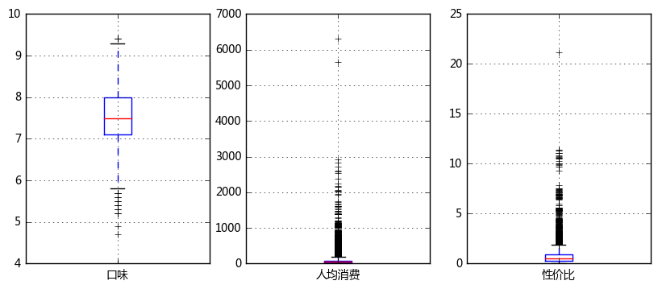

```python
'''
【项目11】  国产烂片深度揭秘

作业要求
1、读取数据，以“豆瓣评分”为标准，看看电影评分分布，及烂片情况
要求：
① 读取数据“moviedata.xlsx”
② 查看“豆瓣评分”数据分布，绘制直方图、箱型图
③ 判断“豆瓣评”数据是否符合正态分布
④ 如果符合正态分布，这里以上四分位数（该样本中所有数值由小到大排列后第25%的数字）评分为“烂片标准”
⑤ 筛选出烂片数据，并做排名，找到TOP20
提示：
① 读取数据之后去除缺失值
② 这里可以用ks检验来判断数据是否符合正态分布

2、什么题材的电影烂片最多？
要求：
① 按照“类型”字段分类，筛选不同电影属于什么题材
② 整理数据，按照“题材”汇总，查看不同题材的烂片比例，并选取TOP20
③ 将得到的题材烂片比例TOP20制作散点图 → 横坐标为“题材”类型，纵坐标为烂片比例，点大小为样本数量
   ** 用bokeh制图
   ** 按照烂片比例做降序排列
提示：
① 删除“类型”字段空值的数据
② 由于一个电影“类型”会有多个，这里需要将一个电影每个“类型”都识别出来，在统计某个题材时都需要计算，例如：
   如果一个电影的类型为：“喜剧/爱情”，则在计算“喜剧”、“爱情”题材的烂片比例时，都需要将该电影算上
③ 注意类型字段中，要删除空格字符
④ bokeh图设置点大小，这里通过开方减小数据差距 → size = count**0.5*系数

3、和什么国家合拍更可能产生烂片？
要求：
① 按照“制片国家/地区”字段分类，筛选不同电影的制片地
② 整理数据，按照“题材”汇总，查看不同题材的烂片比例，并选取TOP20
提示：
① 删除“制片国家/地区”字段空值的数据
② 删除“制片国家/地区”中不包括“中国大陆”的数据
③ 制片地删除“中国大陆”、“中国”、“台湾”、“香港”等噪音数据
④ 筛选合作电影大于等于3部以上的国家

4、卡司数量是否和烂片有关？
要求：
① 计算每部电影的主演人数
② 按照主演人数分类，并统计烂片率
   ** 分类：'1-2人','3-4人','5-6人','7-9人','10以上'
③ 查看烂片比例最高的演员TOP20
提示：
① 通过“主演”字段内做分列来计算主演人数
② 需要分别统计不同主演人数的电影数量及烂片数量，再计算烂片比例
③ 这里可以按照明星再查看一下他们的烂片率，比如：吴亦凡、杨幂、黄晓明、甄子丹、刘亦菲、范冰冰....

5、不同导演每年电影产量情况是如何的？
要求：
① 通过“上映日期”筛选出每个电影的上映年份
② 查看不同导演的烂片比例、这里去除掉拍过10次电影以下的导演
③ 查看不同导演每年的电影产量制作散点图 → 横坐标为年份，纵坐标为每年电影平均分，点大小该年电影数量
   ** 用bokeh制图
   ** 横坐标限定为2007-2017年
   ** 绘制散点图只需要用产出过烂片的导演数据
提示：
① 注意要删除“上映日期”中的空格字符
② 绘制图表时，分开建立数据绘制

'''
```


```python
import numpy as np
import pandas as pd
import matplotlib.pyplot as plt
% matplotlib inline

import warnings
warnings.filterwarnings('ignore') 
# 不发出警告

from bokeh.io import output_notebook
output_notebook()
# 导入notebook绘图模块

from bokeh.plotting import figure,show
from bokeh.models import ColumnDataSource,HoverTool
# 导入图表绘制、图标展示模块
# 导入ColumnDataSource模块
```


    <div class="bk-root">
        <a href="https://bokeh.pydata.org" target="_blank" class="bk-logo bk-logo-small bk-logo-notebook"></a>
        <span id="c7490c8d-ac1d-4095-87b1-35787f023513">Loading BokehJS ...</span>
    </div>


```python
'''
1、读取数据，以“豆瓣评分”为标准，看看电影评分分布，及烂片情况
要求：
① 读取数据“moviedata.xlsx”
② 查看“豆瓣评分”数据分布，绘制直方图、箱型图
③ 判断“豆瓣评”数据是否符合正态分布
④ 如果符合正态分布，这里以上四分位数（该样本中所有数值由小到大排列后第25%的数字）评分为“烂片标准”
⑤ 筛选出烂片数据，并做排名，找到TOP20
提示：
① 读取数据之后去除缺失值
② 这里可以用ks检验来判断数据是否符合正态分布

'''
```


```python
# 查看数据,数据清洗

import os
os.chdir('C:/Users/Hjx/Desktop/项目11国产烂片深度揭秘/')
# 创建工作路径

df = pd.read_excel('moviedata.xlsx')
df = df[df['豆瓣评分'] > 0]
print('初步清洗后数据量为%i条' % len(df))
# 读取数据
# 删除“豆瓣评分”小于等于0的值

df.iloc[1]
#查看数据
```

    初步清洗后数据量为2306条
    


    电影名称                  黑猫大旅社 黑貓大旅社
    豆瓣评论数                         514
    豆瓣评分                          6.8
    上映日期                           不详
    主演          陆奕静 / 老鄧 （夏靖庭 ） / 蔡振南
    制片国家/地区                        台湾
    又名                Hotel Black Cat
    导演                            徐丽雯
    片长                            112
    类型                             剧情
    编剧                            徐丽雯
    语言                           台湾国语
    r5                          0.102
    r4                          0.332
    r3                          0.453
    r2                          0.091
    r1                          0.022
    Name: 1, dtype: object


```python
# 查看豆瓣评分情况

fig = plt.figure(figsize = (10,6))
plt.subplots_adjust(hspace=0.2)
# 创建绘图空间

ax1 = fig.add_subplot(2,1,1)  
df['豆瓣评分'].plot.hist(stacked=True,bins=50,color = 'green',alpha=0.5,grid=True)
plt.ylim([0,150])
plt.title('豆瓣评分数据分布-直方图')
# 绘制直方图

ax2 = fig.add_subplot(2,1,2)
color = dict(boxes='DarkGreen', whiskers='DarkOrange', medians='DarkBlue', caps='Gray')
df['豆瓣评分'].plot.box(vert=False, grid = True,color = color) 
plt.title('豆瓣评分数据分布-箱型图')
# 绘制箱型图

df['豆瓣评分'].describe()
```


    count    2306.000000
    mean        5.604250
    std         1.595514
    min         2.100000
    25%         4.300000
    50%         5.700000
    75%         6.800000
    max         9.300000
    Name: 豆瓣评分, dtype: float64





```python
# 判断是否符合正态分布

from scipy import stats
# 导入相关模块

u = df['豆瓣评分'].mean()  # 计算均值
std = df['豆瓣评分'].std()  # 计算标准差
stats.kstest(df['豆瓣评分'], 'norm', (u, std))
# 这里p值大于0.05，为正态分布

# 结论
# 这里以样本数据上四分位数为烂片评判标准 → 4.3分
```


    KstestResult(statistic=0.061493870089715519, pvalue=5.0506841597908192e-08)


```python
# 筛选出烂片数据，并做排名，找到TOP20

data_lp = df[df['豆瓣评分']<4.3].reset_index()
print('数据整理后，得到烂片数据量为%i条' % len(data_lp))
# 筛选烂片数据

lp_top20 = data_lp[['电影名称','豆瓣评分','导演','主演']].sort_values(by = '豆瓣评分').iloc[:20].reset_index()
del lp_top20['index']
lp_top20
# 查看烂片top20
```

    数据整理后，得到烂片数据量为546条
    


<div>
<table border="1" class="dataframe">
  <thead>
    <tr style="text-align: right;">
      <th></th>
      <th>电影名称</th>
      <th>豆瓣评分</th>
      <th>导演</th>
      <th>主演</th>
    </tr>
  </thead>
  <tbody>
    <tr>
      <th>0</th>
      <td>渡灵人</td>
      <td>2.1</td>
      <td>孔令杭</td>
      <td>王磊 / 邱佩霞 / 杜冯欣怡 / 郑礼宇</td>
    </tr>
    <tr>
      <th>1</th>
      <td>白日杀机</td>
      <td>2.2</td>
      <td>张帆</td>
      <td>张小仟 / 章宇 / 郑诺 / 亦涵</td>
    </tr>
    <tr>
      <th>2</th>
      <td>大震撼</td>
      <td>2.2</td>
      <td>崔立新</td>
      <td>石小群 / 宫哲 / 徐爽 / 齐如意 / 姚心蕊 / 崔可法 / 卢彦西</td>
    </tr>
    <tr>
      <th>3</th>
      <td>戚继光英雄传</td>
      <td>2.2</td>
      <td>姚林 / 杨清峰 / 吴鲁光 / 沈丹冶</td>
      <td>NaN</td>
    </tr>
    <tr>
      <th>4</th>
      <td>B区32号</td>
      <td>2.3</td>
      <td>吕建民</td>
      <td>邓紫衣 / 唐宸禹 / 李锐</td>
    </tr>
    <tr>
      <th>5</th>
      <td>找个高富帅？</td>
      <td>2.3</td>
      <td>陈童</td>
      <td>徐申东 / 张惠鑫 / 曲昱曈 / 王乐天 / 王妍 / 闫美伊 / 陈童 / 李飞</td>
    </tr>
    <tr>
      <th>6</th>
      <td>换脸新娘</td>
      <td>2.3</td>
      <td>林云翔</td>
      <td>翟文斌 / 吴菲 / 褚颖颖 / 林娜</td>
    </tr>
    <tr>
      <th>7</th>
      <td>皇帝的新装之圣诞大明星</td>
      <td>2.3</td>
      <td>李霞</td>
      <td>NaN</td>
    </tr>
    <tr>
      <th>8</th>
      <td>整形归来</td>
      <td>2.4</td>
      <td>张翔宇</td>
      <td>苏菲 / 张乃歌 / 张慧雯</td>
    </tr>
    <tr>
      <th>9</th>
      <td>火星归来</td>
      <td>2.4</td>
      <td>刘谋峰</td>
      <td>马诺 / 胡北 / 高森鹏 / 刘谋峰 / Edward Zee</td>
    </tr>
    <tr>
      <th>10</th>
      <td>雷锋的微笑</td>
      <td>2.4</td>
      <td>张玉中</td>
      <td>万思维 / 唐国强 / 徐箭 / 巫刚 / 李幼斌 / 宋春丽 / 冯恩鹤 / 马晓伟 /...</td>
    </tr>
    <tr>
      <th>11</th>
      <td>不死之身</td>
      <td>2.4</td>
      <td>邵传勇</td>
      <td>吴启华 / 吕颂贤 / 邵传勇</td>
    </tr>
    <tr>
      <th>12</th>
      <td>南泥湾</td>
      <td>2.4</td>
      <td>彭丹</td>
      <td>彭丹 / 任帅 / 姬他</td>
    </tr>
    <tr>
      <th>13</th>
      <td>少年杨靖宇</td>
      <td>2.4</td>
      <td>张文艺</td>
      <td>叶艺城 / 温佳翼 / 马新皓 / 杜旭东 / 栗思涵</td>
    </tr>
    <tr>
      <th>14</th>
      <td>青春.com</td>
      <td>2.4</td>
      <td>马雍</td>
      <td>古丽娜 / 曲国强 / 孙夕尧 / 严萌 / 陶玉洁 / 卢小璐 / 马一傲</td>
    </tr>
    <tr>
      <th>15</th>
      <td>幸福很囧</td>
      <td>2.4</td>
      <td>马雍</td>
      <td>章小军 / 张希爱 / 慕钰华 / 姚红军 / 卢小璐 / 孙绽 / 邓杨宁 / 裴妤辰 ...</td>
    </tr>
    <tr>
      <th>16</th>
      <td>悟空大战二郎神</td>
      <td>2.4</td>
      <td>梁汉森 / 徐鹏海</td>
      <td>NaN</td>
    </tr>
    <tr>
      <th>17</th>
      <td>超能兔战队</td>
      <td>2.4</td>
      <td>傅燕</td>
      <td>刘红韵 / 李旭乔 / 白文显 / 申克 / 宋磊 / 周岩 / 李思娴 / 张子焜 / ...</td>
    </tr>
    <tr>
      <th>18</th>
      <td>净土</td>
      <td>2.4</td>
      <td>刑健</td>
      <td>孙文婷</td>
    </tr>
    <tr>
      <th>19</th>
      <td>我是大明星</td>
      <td>2.4</td>
      <td>张艺飞</td>
      <td>刘波 / 腾飞 / 马瑞曼 / 谭皓 / 高天 / 聂琳峰</td>
    </tr>
  </tbody>
</table>
</div>


```python
'''
2、什么题材的电影烂片最多？
要求：
① 按照“类型”字段分类，筛选不同电影属于什么题材
② 整理数据，按照“题材”汇总，查看不同题材的烂片比例，并选取TOP20
③ 将得到的题材烂片比例TOP20制作散点图 → 横坐标为“题材”类型，纵坐标为烂片比例，点大小为样本数量
   ** 用bokeh制图
   ** 按照烂片比例做降序排列
提示：
① 删除“类型”字段空值的数据
② 由于一个电影“类型”会有多个，这里需要将一个电影每个“类型”都识别出来，在统计某个题材时都需要计算，例如：
   如果一个电影的类型为：“喜剧/爱情”，则在计算“喜剧”、“爱情”题材的烂片比例时，都需要将该电影算上
③ 注意类型字段中，要删除空格字符
④ bokeh图设置点大小，这里通过开方减小数据差距 → size = count**0.5*系数

'''
```


```python
# 筛选出所有题材类型

typelst = []
for i in df[df['类型'].notnull()]['类型'].str.replace(' ','').str.split('/'):
    typelst.extend(i)
# 取出所有电影的“类型”，并整理成列表
# 注意这里要删除“类型”中的空格字符

typelst = list(set(typelst))  
print(typelst)
# 列表去重
```

    ['喜剧', '传记', '真人秀', 'News', '运动', '科幻', '灾难', '悬疑', '爱情', '音乐', '舞台艺术', '古装', '历史', '歌舞', '纪录片', '同性', '黑色电影', '鬼怪', '恐怖', '战争', '惊悚', '西部', '冒险', '动作', '儿童', '脱口秀', '戏曲', '家庭', '犯罪', '情色', '动画', '短片', '剧情', '奇幻', '武侠']
    


```python
# 创建函数，查看不同题材的烂片比例
# 这里要删除“类型”字段空值的数据

lst_type_lp = []
# 创建空字典、空列表

df_type = df[df['类型'].notnull()][['电影名称','豆瓣评分','类型']]
# 筛选数据

def f1(data,typei):
    dic_type_lp = {}
    datai = data[data['类型'].str.contains(typei)]             
    # 筛选数据
    lp_pre_i = len(datai[datai['豆瓣评分']<4.3])/len(datai)    
    # 计算该题材烂片比例
    dic_type_lp['typename'] = typei         
    dic_type_lp['typecount'] = len(datai)   
    dic_type_lp['type_lp_pre'] = lp_pre_i
    # 将结果记录进字典中，包括题材类型、烂片比例、样本数据数量
    return(dic_type_lp)

for i in typelst:
    dici = f1(df_type,i)
    lst_type_lp.append(dici)
# 按照题材遍历数据，得到不同题材的烂片比例

df_type_lp = pd.DataFrame(lst_type_lp)
type_lp_top20 = df_type_lp.sort_values(by = 'type_lp_pre',ascending = False).iloc[:20]
type_lp_top20
# 筛选出烂片比例TOP的题材类型
```


<div>
<table border="1" class="dataframe">
  <thead>
    <tr style="text-align: right;">
      <th></th>
      <th>type_lp_pre</th>
      <th>typecount</th>
      <th>typename</th>
    </tr>
  </thead>
  <tbody>
    <tr>
      <th>29</th>
      <td>0.666667</td>
      <td>12</td>
      <td>情色</td>
    </tr>
    <tr>
      <th>18</th>
      <td>0.579710</td>
      <td>69</td>
      <td>恐怖</td>
    </tr>
    <tr>
      <th>20</th>
      <td>0.561856</td>
      <td>194</td>
      <td>惊悚</td>
    </tr>
    <tr>
      <th>7</th>
      <td>0.407407</td>
      <td>216</td>
      <td>悬疑</td>
    </tr>
    <tr>
      <th>6</th>
      <td>0.400000</td>
      <td>10</td>
      <td>灾难</td>
    </tr>
    <tr>
      <th>22</th>
      <td>0.376471</td>
      <td>85</td>
      <td>冒险</td>
    </tr>
    <tr>
      <th>5</th>
      <td>0.370370</td>
      <td>27</td>
      <td>科幻</td>
    </tr>
    <tr>
      <th>33</th>
      <td>0.345238</td>
      <td>84</td>
      <td>奇幻</td>
    </tr>
    <tr>
      <th>0</th>
      <td>0.341463</td>
      <td>574</td>
      <td>喜剧</td>
    </tr>
    <tr>
      <th>16</th>
      <td>0.333333</td>
      <td>3</td>
      <td>黑色电影</td>
    </tr>
    <tr>
      <th>17</th>
      <td>0.333333</td>
      <td>3</td>
      <td>鬼怪</td>
    </tr>
    <tr>
      <th>8</th>
      <td>0.329091</td>
      <td>550</td>
      <td>爱情</td>
    </tr>
    <tr>
      <th>13</th>
      <td>0.300000</td>
      <td>10</td>
      <td>歌舞</td>
    </tr>
    <tr>
      <th>24</th>
      <td>0.271186</td>
      <td>59</td>
      <td>儿童</td>
    </tr>
    <tr>
      <th>15</th>
      <td>0.264706</td>
      <td>34</td>
      <td>同性</td>
    </tr>
    <tr>
      <th>23</th>
      <td>0.250814</td>
      <td>307</td>
      <td>动作</td>
    </tr>
    <tr>
      <th>30</th>
      <td>0.241379</td>
      <td>116</td>
      <td>动画</td>
    </tr>
    <tr>
      <th>28</th>
      <td>0.201923</td>
      <td>104</td>
      <td>犯罪</td>
    </tr>
    <tr>
      <th>19</th>
      <td>0.176471</td>
      <td>68</td>
      <td>战争</td>
    </tr>
    <tr>
      <th>9</th>
      <td>0.172414</td>
      <td>29</td>
      <td>音乐</td>
    </tr>
  </tbody>
</table>
</div>


```python
# bokeh制图

type_lp_top20['size'] = type_lp_top20['typecount']**0.5*2  # 设置点大小，这里通过开方减小数据差距
source = ColumnDataSource(data=type_lp_top20)
# 创建数据

lst_type = type_lp_top20['typename'].tolist()   # 设置横坐标list
hover = HoverTool(tooltips=[("数据量", "@typecount"),
                           ("烂片比例","@type_lp_pre")]) # 设置标签显示内容

p = figure(x_range=lst_type, plot_width=900, plot_height=350, title="不同电影题材烂片比例", 
           tools=[hover,'reset,xwheel_zoom,pan,crosshair,box_select'])
# 构建绘图空间

p.circle(x='typename',y='type_lp_pre',source = source, size = 'size',
         line_color = 'black',line_dash = [6,4],fill_color = 'red',fill_alpha = 0.7)
# 绘制散点图

p.xgrid.grid_line_dash = [10,4]
p.ygrid.grid_line_dash = [10,4]
# 设置其他参数

show(p)
```


    <div class="bk-root">
        <div class="bk-plotdiv" id="36e1f31b-fb68-4a7e-b1a3-5f6610027e92"></div>
    </div>
<script type="text/javascript">
  
  (function(root) {
    function now() {
      return new Date();
    }
  
    var force = false;
  
    if (typeof (root._bokeh_onload_callbacks) === "undefined" || force === true) {
      root._bokeh_onload_callbacks = [];
      root._bokeh_is_loading = undefined;
    }
  
  
    
    if (typeof (root._bokeh_timeout) === "undefined" || force === true) {
      root._bokeh_timeout = Date.now() + 0;
      root._bokeh_failed_load = false;
    }
  
    var NB_LOAD_WARNING = {'data': {'text/html':
       "<div style='background-color: #fdd'>\n"+
       "<p>\n"+
       "BokehJS does not appear to have successfully loaded. If loading BokehJS from CDN, this \n"+
       "may be due to a slow or bad network connection. Possible fixes:\n"+
       "</p>\n"+
       "<ul>\n"+
       "<li>re-rerun `output_notebook()` to attempt to load from CDN again, or</li>\n"+
       "<li>use INLINE resources instead, as so:</li>\n"+
       "</ul>\n"+
       "<code>\n"+
       "from bokeh.resources import INLINE\n"+
       "output_notebook(resources=INLINE)\n"+
       "</code>\n"+
       "</div>"}};
  
    function display_loaded() {
      if (root.Bokeh !== undefined) {
        var el = document.getElementById("36e1f31b-fb68-4a7e-b1a3-5f6610027e92");
        if (el != null) {
          el.textContent = "BokehJS " + Bokeh.version + " successfully loaded.";
        }
      } else if (Date.now() < root._bokeh_timeout) {
        setTimeout(display_loaded, 100)
      }
    }
  
  
    function run_callbacks() {
      try {
        root._bokeh_onload_callbacks.forEach(function(callback) { callback() });
      }
      finally {
        delete root._bokeh_onload_callbacks
      }
      console.info("Bokeh: all callbacks have finished");
    }
  
    function load_libs(js_urls, callback) {
      root._bokeh_onload_callbacks.push(callback);
      if (root._bokeh_is_loading > 0) {
        console.log("Bokeh: BokehJS is being loaded, scheduling callback at", now());
        return null;
      }
      if (js_urls == null || js_urls.length === 0) {
        run_callbacks();
        return null;
      }
      console.log("Bokeh: BokehJS not loaded, scheduling load and callback at", now());
      root._bokeh_is_loading = js_urls.length;
      for (var i = 0; i < js_urls.length; i++) {
        var url = js_urls[i];
        var s = document.createElement('script');
        s.src = url;
        s.async = false;
        s.onreadystatechange = s.onload = function() {
          root._bokeh_is_loading--;
          if (root._bokeh_is_loading === 0) {
            console.log("Bokeh: all BokehJS libraries loaded");
            run_callbacks()
          }
        };
        s.onerror = function() {
          console.warn("failed to load library " + url);
        };
        console.log("Bokeh: injecting script tag for BokehJS library: ", url);
        document.getElementsByTagName("head")[0].appendChild(s);
      }
    };var element = document.getElementById("36e1f31b-fb68-4a7e-b1a3-5f6610027e92");
    if (element == null) {
      console.log("Bokeh: ERROR: autoload.js configured with elementid '36e1f31b-fb68-4a7e-b1a3-5f6610027e92' but no matching script tag was found. ")
      return false;
    }
  
    var js_urls = [];
  
    var inline_js = [
      function(Bokeh) {
        (function() {
          var fn = function() {
            var docs_json = {"011b16d9-e026-4aff-8e86-3bad293f16d0":{"roots":{"references":[{"attributes":{"source":{"id":"f153767a-5e8b-4a13-965e-c01878a47735","type":"ColumnDataSource"}},"id":"308840d1-d873-4014-b830-e937172a01ab","type":"CDSView"},{"attributes":{"below":[{"id":"1b2780d0-018f-4c87-bdbb-4b551e70b9af","type":"CategoricalAxis"}],"left":[{"id":"9f4fccc7-354e-47d9-97dc-145ed2b5d7f9","type":"LinearAxis"}],"plot_height":350,"plot_width":900,"renderers":[{"id":"1b2780d0-018f-4c87-bdbb-4b551e70b9af","type":"CategoricalAxis"},{"id":"be76bc89-0f36-41e2-b0fa-ec3775430535","type":"Grid"},{"id":"9f4fccc7-354e-47d9-97dc-145ed2b5d7f9","type":"LinearAxis"},{"id":"cb3251a1-ead1-4a3a-9801-e5ea681ef257","type":"Grid"},{"id":"182a181b-a399-4f05-b98d-2588f7f16f6b","type":"BoxAnnotation"},{"id":"faa499a4-8959-4fe5-8d79-2ef0d476f6bc","type":"GlyphRenderer"}],"title":{"id":"d095b9ff-e1dc-441f-b5bb-b2b3b7469e8d","type":"Title"},"toolbar":{"id":"1c75e08e-06a9-4c9a-88a6-2ba7472b7783","type":"Toolbar"},"x_range":{"id":"9841e876-618c-4f0b-b635-437544e387ab","type":"FactorRange"},"x_scale":{"id":"32533a15-0192-46dc-b7cf-234fec27fcad","type":"CategoricalScale"},"y_range":{"id":"7017db7b-0328-430d-81a2-b5dbe2e92da2","type":"DataRange1d"},"y_scale":{"id":"1748bb42-a9ff-4b19-a0eb-3023378035a3","type":"LinearScale"}},"id":"41e29694-51db-4cc5-8731-386576bf95eb","subtype":"Figure","type":"Plot"},{"attributes":{"active_drag":"auto","active_inspect":"auto","active_scroll":"auto","active_tap":"auto","tools":[{"id":"64d0f9de-4fda-48e2-a548-1e5c1a9322b3","type":"HoverTool"},{"id":"bcac6e25-4c6e-4138-bc9a-11c0584b1ad1","type":"ResetTool"},{"id":"2b37fd7f-c698-4198-af4d-d840c8193a70","type":"WheelZoomTool"},{"id":"024094a8-5319-48d2-b3a6-ad37ee51787a","type":"PanTool"},{"id":"19fb315a-9b01-40a3-b133-5bf06ae6d580","type":"CrosshairTool"},{"id":"862fbd04-ee3e-44c4-a578-21ee125861a4","type":"BoxSelectTool"}]},"id":"1c75e08e-06a9-4c9a-88a6-2ba7472b7783","type":"Toolbar"},{"attributes":{},"id":"00536f0a-5321-4b73-ba80-ea2964b6d202","type":"CategoricalTicker"},{"attributes":{"dimensions":"width"},"id":"2b37fd7f-c698-4198-af4d-d840c8193a70","type":"WheelZoomTool"},{"attributes":{},"id":"19fb315a-9b01-40a3-b133-5bf06ae6d580","type":"CrosshairTool"},{"attributes":{"callback":null,"tooltips":[["\u6570\u636e\u91cf","@typecount"],["\u70c2\u7247\u6bd4\u4f8b","@type_lp_pre"]]},"id":"64d0f9de-4fda-48e2-a548-1e5c1a9322b3","type":"HoverTool"},{"attributes":{"data_source":{"id":"f153767a-5e8b-4a13-965e-c01878a47735","type":"ColumnDataSource"},"glyph":{"id":"db9e8b1e-cbed-40a4-a367-0e008226c654","type":"Circle"},"hover_glyph":null,"muted_glyph":null,"nonselection_glyph":{"id":"5bd3fd49-5b0b-41fe-9ea6-21ecfc404ec0","type":"Circle"},"selection_glyph":null,"view":{"id":"308840d1-d873-4014-b830-e937172a01ab","type":"CDSView"}},"id":"faa499a4-8959-4fe5-8d79-2ef0d476f6bc","type":"GlyphRenderer"},{"attributes":{},"id":"ada1ad2c-db14-42e1-8d11-dd62e9fb5cff","type":"BasicTickFormatter"},{"attributes":{"callback":null,"overlay":{"id":"182a181b-a399-4f05-b98d-2588f7f16f6b","type":"BoxAnnotation"},"renderers":[{"id":"faa499a4-8959-4fe5-8d79-2ef0d476f6bc","type":"GlyphRenderer"}]},"id":"862fbd04-ee3e-44c4-a578-21ee125861a4","type":"BoxSelectTool"},{"attributes":{"plot":null,"text":"\u4e0d\u540c\u7535\u5f71\u9898\u6750\u70c2\u7247\u6bd4\u4f8b"},"id":"d095b9ff-e1dc-441f-b5bb-b2b3b7469e8d","type":"Title"},{"attributes":{"fill_alpha":{"value":0.1},"fill_color":{"value":"#1f77b4"},"line_alpha":{"value":0.1},"line_color":{"value":"#1f77b4"},"line_dash":[6,4],"size":{"field":"size","units":"screen"},"x":{"field":"typename"},"y":{"field":"type_lp_pre"}},"id":"5bd3fd49-5b0b-41fe-9ea6-21ecfc404ec0","type":"Circle"},{"attributes":{"formatter":{"id":"dad3f643-3bbd-4669-acff-1d2e9dd2d4d2","type":"CategoricalTickFormatter"},"plot":{"id":"41e29694-51db-4cc5-8731-386576bf95eb","subtype":"Figure","type":"Plot"},"ticker":{"id":"00536f0a-5321-4b73-ba80-ea2964b6d202","type":"CategoricalTicker"}},"id":"1b2780d0-018f-4c87-bdbb-4b551e70b9af","type":"CategoricalAxis"},{"attributes":{},"id":"0185a8e6-4ce5-468a-bc98-bf5f3dc70f86","type":"BasicTicker"},{"attributes":{"formatter":{"id":"ada1ad2c-db14-42e1-8d11-dd62e9fb5cff","type":"BasicTickFormatter"},"plot":{"id":"41e29694-51db-4cc5-8731-386576bf95eb","subtype":"Figure","type":"Plot"},"ticker":{"id":"0185a8e6-4ce5-468a-bc98-bf5f3dc70f86","type":"BasicTicker"}},"id":"9f4fccc7-354e-47d9-97dc-145ed2b5d7f9","type":"LinearAxis"},{"attributes":{"callback":null,"column_names":["index","type_lp_pre","size","typecount","typename"],"data":{"index":[29,18,20,7,6,22,5,33,0,16,17,8,13,24,15,23,30,28,19,9],"size":{"__ndarray__":"qkxY6Hq2G0AJ0I7N/ZwwQLz9ULVV2ztAxrENHtVkPUBTW9o6WEwZQJoukCFocDJAgDlCLtzIJECFHhW5jlQyQGR1dvVS9UdAqkxY6Hq2C0CqTFjoerYLQFBsqW+7c0dAU1vaOlhMGUDbnltFfrkuQKKjsw3lUidADWnue3uFQUDz2aikaIo1QPYvEl9lZTRAB+2vZg9+MEDz2aikaIolQA==","dtype":"float64","shape":[20]},"type_lp_pre":{"__ndarray__":"VVVVVVVV5T8p8TNK/IziP0JHBb64+uE/L6G9hPYS2j+amZmZmZnZPxgYGBgYGNg/QnsJ7SW01z+GYRiGYRjWP9uVqF2J2tU/VVVVVVVV1T9VVVVVVVXVPxA1/VDTD9U/MzMzMzMz0z8NJ3VfHlvRP/Hw8PDw8NA/9sOXjlcN0D9HWO5phOXOP4qd2Imd2Mk/l5aWlpaWxj98GmG5pxHGPw==","dtype":"float64","shape":[20]},"typecount":[12,69,194,216,10,85,27,84,574,3,3,550,10,59,34,307,116,104,68,29],"typename":["\u60c5\u8272","\u6050\u6016","\u60ca\u609a","\u60ac\u7591","\u707e\u96be","\u5192\u9669","\u79d1\u5e7b","\u5947\u5e7b","\u559c\u5267","\u9ed1\u8272\u7535\u5f71","\u9b3c\u602a","\u7231\u60c5","\u6b4c\u821e","\u513f\u7ae5","\u540c\u6027","\u52a8\u4f5c","\u52a8\u753b","\u72af\u7f6a","\u6218\u4e89","\u97f3\u4e50"]}},"id":"f153767a-5e8b-4a13-965e-c01878a47735","type":"ColumnDataSource"},{"attributes":{"callback":null},"id":"7017db7b-0328-430d-81a2-b5dbe2e92da2","type":"DataRange1d"},{"attributes":{"dimension":1,"grid_line_dash":[10,4],"plot":{"id":"41e29694-51db-4cc5-8731-386576bf95eb","subtype":"Figure","type":"Plot"},"ticker":{"id":"0185a8e6-4ce5-468a-bc98-bf5f3dc70f86","type":"BasicTicker"}},"id":"cb3251a1-ead1-4a3a-9801-e5ea681ef257","type":"Grid"},{"attributes":{},"id":"1748bb42-a9ff-4b19-a0eb-3023378035a3","type":"LinearScale"},{"attributes":{"callback":null,"factors":["\u60c5\u8272","\u6050\u6016","\u60ca\u609a","\u60ac\u7591","\u707e\u96be","\u5192\u9669","\u79d1\u5e7b","\u5947\u5e7b","\u559c\u5267","\u9ed1\u8272\u7535\u5f71","\u9b3c\u602a","\u7231\u60c5","\u6b4c\u821e","\u513f\u7ae5","\u540c\u6027","\u52a8\u4f5c","\u52a8\u753b","\u72af\u7f6a","\u6218\u4e89","\u97f3\u4e50"]},"id":"9841e876-618c-4f0b-b635-437544e387ab","type":"FactorRange"},{"attributes":{},"id":"dad3f643-3bbd-4669-acff-1d2e9dd2d4d2","type":"CategoricalTickFormatter"},{"attributes":{"bottom_units":"screen","fill_alpha":{"value":0.5},"fill_color":{"value":"lightgrey"},"left_units":"screen","level":"overlay","line_alpha":{"value":1.0},"line_color":{"value":"black"},"line_dash":[4,4],"line_width":{"value":2},"plot":null,"render_mode":"css","right_units":"screen","top_units":"screen"},"id":"182a181b-a399-4f05-b98d-2588f7f16f6b","type":"BoxAnnotation"},{"attributes":{},"id":"32533a15-0192-46dc-b7cf-234fec27fcad","type":"CategoricalScale"},{"attributes":{"grid_line_dash":[10,4],"plot":{"id":"41e29694-51db-4cc5-8731-386576bf95eb","subtype":"Figure","type":"Plot"},"ticker":{"id":"00536f0a-5321-4b73-ba80-ea2964b6d202","type":"CategoricalTicker"}},"id":"be76bc89-0f36-41e2-b0fa-ec3775430535","type":"Grid"},{"attributes":{},"id":"bcac6e25-4c6e-4138-bc9a-11c0584b1ad1","type":"ResetTool"},{"attributes":{"fill_alpha":{"value":0.7},"fill_color":{"value":"red"},"line_dash":[6,4],"size":{"field":"size","units":"screen"},"x":{"field":"typename"},"y":{"field":"type_lp_pre"}},"id":"db9e8b1e-cbed-40a4-a367-0e008226c654","type":"Circle"},{"attributes":{},"id":"024094a8-5319-48d2-b3a6-ad37ee51787a","type":"PanTool"}],"root_ids":["41e29694-51db-4cc5-8731-386576bf95eb"]},"title":"Bokeh Application","version":"0.12.7"}};
            var render_items = [{"docid":"011b16d9-e026-4aff-8e86-3bad293f16d0","elementid":"36e1f31b-fb68-4a7e-b1a3-5f6610027e92","modelid":"41e29694-51db-4cc5-8731-386576bf95eb"}];
            
            Bokeh.embed.embed_items(docs_json, render_items);
          };
          if (document.readyState != "loading") fn();
          else document.addEventListener("DOMContentLoaded", fn);
        })();
      },
      function(Bokeh) {
      }
    ];
  
    function run_inline_js() {
      
      if ((root.Bokeh !== undefined) || (force === true)) {
        for (var i = 0; i < inline_js.length; i++) {
          inline_js[i].call(root, root.Bokeh);
        }if (force === true) {
          display_loaded();
        }} else if (Date.now() < root._bokeh_timeout) {
        setTimeout(run_inline_js, 100);
      } else if (!root._bokeh_failed_load) {
        console.log("Bokeh: BokehJS failed to load within specified timeout.");
        root._bokeh_failed_load = true;
      } else if (force !== true) {
        var cell = $(document.getElementById("36e1f31b-fb68-4a7e-b1a3-5f6610027e92")).parents('.cell').data().cell;
        cell.output_area.append_execute_result(NB_LOAD_WARNING)
      }
  
    }
  
    if (root._bokeh_is_loading === 0) {
      console.log("Bokeh: BokehJS loaded, going straight to plotting");
      run_inline_js();
    } else {
      load_libs(js_urls, function() {
        console.log("Bokeh: BokehJS plotting callback run at", now());
        run_inline_js();
      });
    }
  }(window));
</script>


```python
'''
3、和什么国家合拍更可能产生烂片？
要求：
① 按照“制片国家/地区”字段分类，筛选不同电影的制片地
② 整理数据，按照“题材”汇总，查看不同题材的烂片比例，并选取TOP20
提示：
① 删除“制片国家/地区”字段空值的数据
② 删除“制片国家/地区”中不包括“中国大陆”的数据
③ 制片地删除“中国大陆”、“中国”、“台湾”、“香港”等噪音数据
④ 筛选合作电影大于等于3部以上的国家

'''
```


```python
# 筛选电影制片地
# 这里要删除“制片国家/地区”字段空值的数据
# 制片地删除“中国大陆”、“中国”、“台湾”、“香港”等噪音数据

df_loc = df[['电影名称','制片国家/地区','豆瓣评分']][df['制片国家/地区'].notnull()]
df_loc = df_loc[df_loc['制片国家/地区'].str.contains('中国大陆')]
# 筛选数据

loclst = []
for i in df_loc['制片国家/地区'].str.replace(' ','').str.split('/'):
    loclst.extend(i)
# 取出所有电影的制片地，并整理成列表
# 注意这里要删除“制片国家/地区”中的空格字符

loclst = list(set(loclst))  
loclst.remove('中国大陆')
loclst.remove('中国')
loclst.remove('台湾')
loclst.remove('香港')
print(loclst)
# 列表去重
```

    ['美国', '加拿大', '卢森堡', '日本', '新西兰', '马来西亚', '德国', '比利时', '以色列', '丹麦', '泰国', '法国', '蒙古国', '俄罗斯', '新加坡', 'Malaysia', '韩国', '英国', '澳大利亚', '西班牙', '南非', '朝鲜', '印度']
    


```python
# 创建函数，查看不同制片地的烂片比例

lst_loc_lp = []
# 创建空列表

def f2(data,loci):
    dic_loc_lp = {}
    datai = data[data['制片国家/地区'].str.contains(loci)]             
    # 筛选数据
    lp_pre_i = len(datai[datai['豆瓣评分']<4.3])/len(datai)    
    # 计算该制片地烂片比例
    dic_loc_lp['loc'] = loci    
    dic_loc_lp['loccount'] = len(datai) 
    dic_loc_lp['loc_lp_pre'] = lp_pre_i
    # 将结果记录进字典中，包括制片地、烂片比例、样本数据数量
    return(dic_loc_lp)

for i in loclst:
    dici = f2(df_loc,i)
    lst_loc_lp.append(dici)
# 按照题材遍历数据，得到不同制片地的烂片比例

df_loc_lp = pd.DataFrame(lst_loc_lp)
df_loc_lp = df_loc_lp[df_loc_lp['loccount']>=3]   # 筛选合作电影大于等于3部以上的国家
loc_lp_top20 = df_loc_lp.sort_values(by = 'loc_lp_pre',ascending = False).iloc[:20]
loc_lp_top20
# 筛选出烂片比例TOP的制片地

# 结论
# 综合来看，居然和欧美合作更可能产生烂片
```


<div>
<table border="1" class="dataframe">
  <thead>
    <tr style="text-align: right;">
      <th></th>
      <th>loc</th>
      <th>loc_lp_pre</th>
      <th>loccount</th>
    </tr>
  </thead>
  <tbody>
    <tr>
      <th>17</th>
      <td>英国</td>
      <td>0.750000</td>
      <td>4</td>
    </tr>
    <tr>
      <th>0</th>
      <td>美国</td>
      <td>0.333333</td>
      <td>21</td>
    </tr>
    <tr>
      <th>14</th>
      <td>新加坡</td>
      <td>0.333333</td>
      <td>3</td>
    </tr>
    <tr>
      <th>6</th>
      <td>德国</td>
      <td>0.250000</td>
      <td>4</td>
    </tr>
    <tr>
      <th>16</th>
      <td>韩国</td>
      <td>0.157895</td>
      <td>19</td>
    </tr>
    <tr>
      <th>11</th>
      <td>法国</td>
      <td>0.100000</td>
      <td>10</td>
    </tr>
    <tr>
      <th>3</th>
      <td>日本</td>
      <td>0.071429</td>
      <td>14</td>
    </tr>
    <tr>
      <th>1</th>
      <td>加拿大</td>
      <td>0.000000</td>
      <td>6</td>
    </tr>
    <tr>
      <th>18</th>
      <td>澳大利亚</td>
      <td>0.000000</td>
      <td>3</td>
    </tr>
  </tbody>
</table>
</div>


```python
'''
4、卡司数量是否和烂片有关？
要求：
① 计算每部电影的主演人数
② 按照主演人数分类，并统计烂片率
   ** 分类：'1-2人','3-4人','5-6人','7-9人','10以上'
③ 查看烂片比例最高的演员TOP20
提示：
① 通过“主演”字段内做分列来计算主演人数
② 需要分别统计不同主演人数的电影数量及烂片数量，再计算烂片比例
③ 这里可以按照明星再查看一下他们的烂片率，比如：吴亦凡、杨幂、黄晓明、甄子丹、刘亦菲、范冰冰....

'''
```


```python
# 计算每部电影的主演人数，并统计烂片率
# 分类：'1-2人','3-4人','5-6人','7-9人','10以上'

df['主演人数'] = df['主演'].str.split('/').str.len()
# 计算主演人数

df_leadrole1 = df[['主演人数','豆瓣评分']].groupby('主演人数').count()
df_leadrole2 = df[['主演人数','豆瓣评分']][df['豆瓣评分']<4.3].groupby('主演人数').count()
# 按照主演人数分组，分别统计电影数量及烂片数量

df_leadrole_pre = pd.merge(df_leadrole1,df_leadrole2,left_index = True,right_index = True)
df_leadrole_pre.columns = ['电影数量','烂片数量']
# 按照主演人数统计烂片比例

df_leadrole_pre.reset_index(inplace = True)
df_leadrole_pre['主演人数分类'] = pd.cut(df_leadrole_pre['主演人数'],
                                         [0,2,4,6,9,50],
                                         labels = ['1-2人','3-4人','5-6人','7-9人','10人及以上'])
df_leadrole_pre2 = df_leadrole_pre[['主演人数分类','电影数量','烂片数量']].groupby('主演人数分类').sum()
df_leadrole_pre2['烂片比例'] = df_leadrole_pre2['烂片数量']/df_leadrole_pre2['电影数量']
df_leadrole_pre2
# 按照主演人数分类后再统计
# 分类：'1-2人','3-4人','5-6人','7-9人','10以上'
```


<div>
<table border="1" class="dataframe">
  <thead>
    <tr style="text-align: right;">
      <th></th>
      <th>电影数量</th>
      <th>烂片数量</th>
      <th>烂片比例</th>
    </tr>
    <tr>
      <th>主演人数分类</th>
      <th></th>
      <th></th>
      <th></th>
    </tr>
  </thead>
  <tbody>
    <tr>
      <th>1-2人</th>
      <td>273</td>
      <td>30</td>
      <td>0.109890</td>
    </tr>
    <tr>
      <th>3-4人</th>
      <td>651</td>
      <td>117</td>
      <td>0.179724</td>
    </tr>
    <tr>
      <th>5-6人</th>
      <td>466</td>
      <td>130</td>
      <td>0.278970</td>
    </tr>
    <tr>
      <th>7-9人</th>
      <td>426</td>
      <td>157</td>
      <td>0.368545</td>
    </tr>
    <tr>
      <th>10人及以上</th>
      <td>375</td>
      <td>104</td>
      <td>0.277333</td>
    </tr>
  </tbody>
</table>
</div>


```python
# 筛选主演
# 这里用烂片数据来筛选，不用全数据

df_role1 = df[(df['豆瓣评分']<4.3) & (df['主演'].notnull())]
df_role2 =  df[df['主演'].notnull()]
leadrolelst = []
for i in df_role1['主演'][df_role1['主演'].notnull()].str.replace(' ','').str.split('/'):
    leadrolelst.extend(i)
# 取出所有电影的主演，并整理成列表
# 注意这里要删除“主演”中的空格字符

leadrolelst = list(set(leadrolelst))
print('筛选后的主演演员人数为%i人' % len(leadrolelst))
print(leadrolelst)
# 列表去重
```

    筛选后的主演演员人数为2667人
    ['阴海龙', '张尧', '温岚', '刘继忠', '胡桑', '吴嘉龙', '曲国强', '李思娴', '李红陶', '小麦', '周德华', '洪乙心', '鲁秋鸣', '李念', '黄健翔', '程媛媛', '李承鹏', '陈欢', '李曼铱', '刘嘉玲', '阮志强', '程世宇', '张殿伦', '景岗山', '赵娜', '玛丽亚·凯拉', '杜夫·龙格尔', '于磊', '孔维', '于尚民', '小杉健', '林柯彤', '朱广沪', '张燃', '安以轩', '姚心蕊', '徐申东', '徐伟栋', '刘晓虎', '胡兵', '王敬之', '孙嘉妮', '李志荟', '佐婧', '汪峰', '吕一杰', '陈欣茹', '刘卓灵', '李旭乔', '嘉伦', '马卓', '大岛由加利', 'JohnAryananda', '罗梓瑄', '徐啸力', '王妍苏', '阿曼·达博', '黄品源', '梁永斌', '方文', 'CédricSegeon', '贺贤威', '刘芊妤', '王芯', '黄莞乔', '张萌萌', '刘永健', '裴妤辰', '陈南飞', '胡谦', '罗妞', '孙博', '高明', '伊一', '耿晨晨', '唐从圣', '宇航', '张海江', '李依伊', '林更新', '赵若辰', '巴多', '范军', '汪东城', '张博', '刘金山', '彦艳', '崔浩博', '耿黎明', '吴亦凡', '尼古拉·卡萨雷', '袁兆宗', '杨林', '董娉', '潘阳', '张亚坤', '冯绍峰', '王乐天', '许还山', '惠英红', '江若琳', '郭小鼬', '王一博', '海鸣威', '王彩桦', '于永霖', '范文芳', '温碧霞', '许绍洋', '桑娜', '周岭南', '宋梓侨', '康华', '林宇中', '陈百祥', '谢佳妤', '刘鹏', '董子健', '杨鹏', '关晓彤', '沈梦辰', '周芮伊', '郝在冬', '卢颂之', '高明钰', '韩英群', '陈小春', '王龙', '张宁', '唐禹哲', '娄佳悦', '尚华', '费英熙', '聂鑫', '李妍憬', '赵紫萱', '郝劭文', '李金江', '孙玮伦', '王梦婷', '梁咏琪', '游千惠', '李逸朗', '温亚南', '吴超', '陈政希', '赵奕欢', '修超', '李雪梅', '李小舟', '殷果儿', '王成', '刘涛', '丹尼斯·凯恩', '李亮', '司雯', '叶青', '蔡卓妍', '张慧雯', '彩虹', '杨阳', '文卓', '谢凡', '林美秀', '谭雪', '李依馨', '刘言语', '敖犬', '马新皓', '黄海', '张馨予', '马志安', '徐秀林', '陆嘉浩', '俞灏明', '周文琪', '金桢勋', '贾晓晨', '蒋中炜', '傳穎', '罗阜艺', '王思懿', '黎真安', '朱雨辰', '陈苏', '冯雷', '张鹏', '姚笛', '地曼·阿巴克夫', '刘名洋', '陈廷嘉', '杨冬', '卡特琳娜·莫里诺', '宋伊人', '石琳', '赵小川', '杨曼玉', '苗苗', '陈长海', '陈皓轩', '董璇', '李艳冰', '胡然', '张家辉', '张熙媛', '倪景阳', '范薇', '吴克刚', '鲍春来', '陈勋奇', '林晓凡', '熊卫黎', '王健', '李昂', '谷尚蔚', '钱哆多', '张笑菲', '冯兵', '曾珮瑜', '陈紫函', '陈俏', '王洁曦', '张静初', '周莉', '王希瑶', '孙浩辰', '刘家辉', '江一燕', '吴静', '吴其江', '王雅捷', '吕丽萍', '戴凌鹏', '苏晴', '何苗', '何昊阳', '蒋欣奇', '冯勉恒', '石天龙', '雷迪', '严俊杰', '蒋中伟', '佟丽娅', '陆彭', '张默', '阿阿呜', '陈晔', '宋哲', '李贞', '文凯玲', '韩宝凛', '王珞丹', '王劲松', '陆双', '嘉男海林', '史梵希', '李静', '来喜', '李星海', '韩雪薇', '李卫东', '王佳鑫', '陈静', '李乐儿', '立威廉', '爱德·维斯特维克', '贝安琪', '杨虓', '李晓磊', '彭凌', '周艺轩', '吴军', '李秋泽', '巩新亮', '泰臣', '康恩赫', '张涵予', '尹航', '樊少皇', '贺盼盼', '刘冉冉', '陈嘉桦', '邱佩霞', '刘维', '焦婷', '余秋瑶', '张俪', '顾易浩', '涂黎曼', '李泰', '吕颂贤', '罗海琼', '姜梦茹', '张钧涵', '张道兴', '刘韦伯', '龙雨', '穆婷婷', '徐娜', '大熊', '阿德里亚诺·吉安尼尼', '杨清', '保剑锋', '吴谢枫', '李鹤楠', '刘圆媛', '顾又铭', '高全胜', '林筱筠', '郑茜', '李卓远', '徐光宇', '翟文斌', '李思雯', '周依晨', '张超', '崔文璐', '沈驰', '王文绮', '沈婷婷', '张雪艳', '简佳琳', '张光北', '魏翰林', '张蓝艺', '王小山', '张亚希', '白文显', '于佳', '余慕莲', '崔小碗', '邓钢', '陈霖生', '辜承', '郭德纲', '吴云飞', '张丽丽', '孟瞳迪', '于紫菲', '应采儿', '高军', '安志杰', '吕聿来', '修庆', '李光洁', '张宥浩', '李若嘉', '刘长纯', '冯淬帆', '赵浩杰', '徐佳蔚', '杨青', '方皓玟', '王一楠', '罗诠浩', '曹云金', '林雪', '马恺曼', '徐洁儿', '王亚林', '朱敏', '刘仪伟', '黄阅', '金池', '宋懿洁', '加护亚依', '方飞', '王新宇', '杨珑', '雨侨', '孟魅', '杨皓宇', '邹兆龙', '丁春诚', '夏洛瓦·安顿', '刘畅', '马静怡', '泷泽萝拉', '曹楠', 'VeronicaBero', '代超', '黄飞', '黄义达', '张妙儿', '梁小龙', '孙子皓', '谢承均', '钟秋', '宋撼寰', '尹菲', '覃培军', '郑元畅', '王子杰', '王千一', '符晓薇', '苗皓钧', '李斯丹妮', '李彩桦', '何云伟', '罗昱焜', '蒋梦婕', '宋晓英', '李锐', '张亚光', '马文龙', '蓝燕', '吴巧', '吕晶', '谢闻轩', '高森鹏', '王建成', '张群', '骆佳', '徐冬梅', '邢美美', '周芳竹', '廖蔚蔚', '万思维', '瑞奇', '程爽', '关雪盈', '高伟光', '冯刚', '奚佳秀', '邱胜翊', '大卫·卡拉丁', '大左', '姬他', '刘小佳', '唐成静', '素珠', '王李丹妮', '马梓涵', '石修', '石小满', '李琳', '邬祯琳', '李成儒', '姚橹', '常诚', '亚历山大·贝利', '谢孟伟', '柳岩', '黄觉', '卢惠光', '钟欣潼', '杜乔', '钟采羲', '范福林', '黄一琳', '李宇春', '马斑马', '尼古拉斯·迪佛休尔', '任珈锐', '赵毅新', '苗圃', '罗伯特·马莫内', '张伟欣', '艾晓琪', '范俊涵', '金小小', '刘铮', '毛琳君', '杨小米', '涵丰', '周冬雨', '蒲美辰', '刘晓光', '阿飞', '陈虎', '乔振宇', '李洋', '维塔斯', '叶静', '杜志国', '朴努植', '董玉峰', '夏元吉', '刘妙', '陈燃', '薛斐', '李国煌', '王姬', '贡米', '恬妞', '顾峰', '李佳', '张山', '武鹏', '张有才', '黄光亮', '郑惠馨', '张光', '周南飞', '李胜歌', '孟鹏', '谢雨欣', '李晓文', '周渝民', '黄征', '魏星宇', '郭富城', '范植伟', '刘庭羽', '钟萱', '熊欣欣', '张迪', '钱多多', '胡家华', '唐群', '范逸臣', '李晨', '高枫', '禹童', '刘薇', '于佳琪', '石铭熙', '青云', '蔡鸿翔', '高海', '白凯南', '何润东', '罗翔', '何琳', '娄宇良', '甄子丹', '王旭', '徐鹏凯', '郝祥海', '詹姆斯·兰斯', '黄彦', '金斌', '陈乔希', '陈熙文', '宋轶', '宋磊', '于小婉', '宝儿', '蒋雪鸣', '万力', '谢添天', '田晓天', '午马', '卜奕心', '张佑赫', '吴佳玮', '王立新', '程野', '傅颖', '唐嫣', '何蕊孜', '温佳翼', '王莘迪', '赵鸿飞', '古天乐', '张艺辰', '童菲', '顾莉雅', '于娜', '金士杰', '林兰', '侯迪', '周征波', '元奎', '黄健龙', '毛毅', '品冠', '黄姿琪', '罗家英', '郑伊健', '姚一奇', '高瑕', '田亮', '杨景辉', '黄璐', '李璐兵', '张少华', '曹艳', '石班瑜', '叶鹏', '王祺', '谢金钰殷', '陶玉玲', '王胜利', '陈雅伦', '郭云齐', '陈雨薇', '叶山豪', '罗刚', '钟宇泽', '崔准硕', '冉天', '吴菲', '邱泽', '张玉洁', '卡卡', '蒋德亮', '戴金垸', '草莓', '李佑安', '陈子萱', '康帆', '林纪', '薛江涛', '车婉婉', '李宏磊', '冷漠', '彭博', '何琛琛', '左立', '陈炜', '淳于珊珊', '宣璐', '王晓彤', '马苏', '徐熙颜', '周柏豪', '徐自贤', '元彪', '杜宇航', '刘佳怡', '尹姗姗', '田征', '王骁', '赵今麦', '蔡鹭', '沈芳熙', '陈明', '王闯', '刘智福', '王飞', '岑小林', '江琳琳', '杨鸥', '王晴', 'EdwardZee', '候凯文', '杨泽湖', '李添诺', '涩谷天马', '刘唱', '苏悦华', '林鹏飞', '连凯', '李媛', '刘芷汐', '安娜塔莉亚·沙迪科娃', '陈真希', '王小毅', '黎娟', '黄文慧', '游乐儿', '孙宁芳', '梅寒', '吴京', '毛孩', '董浩', '赵楠', '徐向东', '袁子', '姜武', '李健仁', '孟瑶', '成美曦', '张文慈', '张璐', '刘德华', '李金燕', '许晴', '陈俊亨', '梦丽', '徐海乔', '温兆伦', '小阳光', '时卉', '钱小豪', '刘子赫', '李根', '张艺兴', '崔允素', '栗思涵', '高圆圆', '李晔', '张梦恬', '刘泯廷', '李菁菁', '张政勇', '马天宇', '冯媛甄', '梅俪儿', '王子轩', '吴永伦', '沈腾', '陈冲', '姜皓文', '杨旸', '范晓萱', '史梦涵', '蒙璐', '侯辉辉', '魏子茵', '赵育莹', '陈怡蓉', '冼色丽', '蔡珩', '周楚楚', '陈凯翔', '渡边奈绪子', '后舍男生', '陈天文', '计春华', '房祖名', '耿英埔', '谢容儿', '宗立群', '蓝钧天', '金梓壑', '刘苏', '郭京飞', '杨柳', '翟巍', '达伦·格罗夫纳', '丁嘉旭', '王俊睿', '杨幂', '洪辰', '邹杨', '高天', '刘冬', '林佳菱', '都钊', '黄白露', '博林', '李泰延', '瓦妮莎·布兰奇', '陈龙', '范子轩', '徐敏', '吴大维', '凯利·尼克斯', '高成龙', '杨易之', '柴纳·迈克', '姜欣雨', '刘智满', '芗芗', '王岗', '谭满堂', '阿依诺尔', '狄威', '何浩文', '李俊杰', '永者', '梁家仁', '李炆', '李彬', '汤姆·奥斯汀', '蔡少芬', '周艳泓', '及莉', '可宜', '于荣光', '谭安业', '高捷', '刘桦', '谢婷婷', '莉迪亚·伦纳德', '李茜', '王厦', '田雨晴', '袁志博', '潘长江', '李沁', '高名扬', '韩丰', '王晖', '徐程', '李秋韵', '张绮烟', '王维明', '李云鹏', '王伟', '吕平滢', '范晋嘉', '侍宣如', '周明汕', '刘鑫', '李乃文', '蓝正龙', '郑欣宜', '张宇菲', '郎鹏', '钟丽缇', '嘉熙', '莫绮雯', '杨子', '薛山', '柴碧云', '邱箫婵', '寇振海', '东方骏', '张颂文', '汪奇', '王欢', '臧金生', '张皓伦', '李璨琛', '陈桂玲', '李舒桐', '赵柯', '张海燕', '陈晓东', '颜微恩', '朱杰', '施诗', '刘畊宏', '郑强', '蔡庆勇', '陈威旭', '马晓伟', '郑昊', '方子歌', '修革', '郑京虎', '霍思燕', '宋佳', '赵晨东', '王宇婕', '贺宽', '覃文静', '葛思然', '林家栋', '艾米其', '张檬', '莫熙儿', '王希维', '陶帅', '石峰', '刘迪妮', '颖儿', '张冰倩', '陈志荣', '谢雨芩', '孙祖扬', '白毛', '胡悦', '关智斌', '文东俊', '沈泰', '岳跃利', '刘谋峰', '杜双宇', '王婉晨', '刘丹', '王庆祥', '罗伟', '汪洋', '伍勇纳', 'kevin老师', '赵泽文', '邱萧婵', '邓宁', '石林', '杨竣羽', '黄子腾', '陈惠敏', '王安丽', '崔倓', '马瑞曼', '林爱轩', '林盛斌', '刘冠麟', '陈浩民', '杨紫', '赵美彤', '潘雨辰', '佟晓晴', '焦恩俊', '王晶', '金玉林', '元华', '姚雨鑫', '周雨冥', '张倩', '张立威', '汪永贵', '郭晓然', '大张伟', '杨紫彤', '宋宁', '崔可法', '童苡萱', '郭虹', '杨恭如', '姚星竹', '王秋紫', '刘烨', '张楚楚', '唐一菲', '吴孟达', '戴向宇', '唐宁', '绪方义博', '宋春丽', '秦沛', '吴佩慈', '赵晓明', '李感', '徐汶萱', '李蓓蕾', '余浩瑞', '周显欣', '安圣浩', '段亚兰', '宋金笑', '张学友', '邹新宇', '谭皓', '刘纯燕', '茹萍', '于东泽', '范子绮', '张舸', '柳政越', '杨采盈', '陈星潼', '王光辉', '白举纲', '叶竞生', '马臣搏', '孙小飞', '孙科', '王子', '吴靖萱', '吴志雄', '梁焯满', '范雷', '游本昌', '释彦能', '史育菲', '孙海英', '陈建州', '杨春晖', '邹少官', '李萌萌', '黄子佼', '孙楠', '康福震', '孙坚', '商虹', '赵荣', '陈羽琦', '葛畅', '于宇昂', '鄢佳辉', '周勇', '居文沛', '李恒建', '吴奇隆', '应媛', '李铭祖', '周秀娜', '牛梦尧', '李歌', '刘帅良', '吴千语', '唐娜', '柯哲娴', '吴建豪', '窦骁', '陈汉典', '张溪芸', '牛群', '韩丹彤', '岳小军', '程紫城', '洪海天', '邢佳栋', '胡北', '俞晴', '唐鉴军', '张大礼', '王琳娜', '董敏莉', '张淙洋', '陈意涵', '林德信', '王克', '章小军', '李幼斌', '秦子涵', '腾飞', '连晋', '芷玄', '苏濛濛', '黄维德', '辛芷蕾', '周海媚', '阳蕾', '杜少杰', '乌雅心颜', '张玮', '朱时茂', '张娜拉', '徐少强', '王彤', '张明磊', '陈芳', '曹扬', '任贤齐', '李凤鸣', '陈俊文', '甘露', '肖夏菲', '包雨萌', '于青斌', '黄小柔', '刘以达', '任言恺', '蔡紫芬', '刘思颖', '张嘉倪', '高郡伟', '王翀', '王宝强', '艾俊龙', '林好', '徐德亮', '陆思宇', '于子健', '刘心悠', '苑琼丹', '夏德俊', '李想', '许颖鹏', '张佳楠', '杨迪', '周圣博', '张梓琳', '陈日丰', '秦沫涵', '林威', '吴静一', '金晨', '陈乔恩', '白雨', '王桂峰', '姜鑫', '奚美娟', '李泽锋', '曹涤非', '高云翔', '甘婷婷', '田玲', '杨心蕊', '程俊', '易雪琴', '王双宝', '陈童', '马羚', '陈国坤', '雨书', '哈森', '杨帆', '夏占士', '林津锋', '小小志', '王灵', '杨大鹏', '吴博伦', '刘晔', '李飞', '赵英俊', '山崎敬一', '李兆基', '李林金', '李菁', '赵雨菲', '杨铎', '李金哲', '罗灿然', '黄雅莉', '叮当', '李勤勤', '刘博涵', '李涛', '李颖芝', '王雅迪', '周蕙', '黄永卓', '黄俊淇', '闫硕', '任泉', '杜汶泽', '于承惠', '杨舒婷', '章子怡', '张妍', '任帅', '王兴君', '张璇', '姚晨', '黑木真二', '傅天骄', '靳德茂', '王迅', '史玉璇', '萧蔷', '徐冰', '李炳渊', '金鑫', '田爽', '关长珠', '罗光敏', '马一傲', '杨梦露', '颜丙燕', '涂彦倪', '黄赞臣', '汤家宽', '雷特·盖尔斯', '谢纯鑫', '郭艳', '陈轶', '罗璇', '何政军', '刘晓庆', '李斯羽', '曾秋生', '萧敬腾', '天心', '戚云鹏', '田源', '毕力格图', '吴中天', '孔垂楠', '捷盖', '孙宁', '张赫', '童雨欣', '周觅', '谭耀文', '谷祖琳', '王孝天', '李梦', '苏小妹', '马里奥·毛瑞尔', '徐靖雯', '申克', '理查德·德克勒克', '蓝奕邦', '林妙可', '严丽祯', '郭金杰', '周咏轩', '赵忠祥', '徐中伟', '许雅涵', '赵雅淇', '滕奎兴', '唐国强', '金铭', '吴昕', '胡耀辉', '郑家星', '周骏超', '张家豪', '斯琴高娃', '黄晓明', '胡嘉爱', '萝卜', '包贝尔', '王诗龄', '杨睿嘉', '田野', '瞿澳晖', '宗晓军', '索博尔奇', '穆梦娇', '谷峰', '蒲治源', '黄百鸣', '常和', '高明骏', '龚绮', '张晋', '孔详伟', '霍云龙', '洪涂', '孙鹏飞', '高浩元', '金宝', '慕钰华', '邰正宵', '石天硕', '李玲', '陈学冬', '郑杰', '黄子韬', '三浦贵大', '杜可风', '邓琳颖', '王天立', '李梓涵', '刘一煊', '鲍仙军', '韩乔生', '马文强', '孙桂田', '顾宝明', '徐箭', '墨阳', '王喜', '罗伯特琳', '黄奕', '于越', '柏坤', '杜冯欣怡', '赵又廷', '肖明玉', '邓紫衣', '吴莫愁', '侯乃森', '啜妮', '谢霆锋', '奚望', '汤镇业', '伊利亚尔·阿不力米提', '纳豆', '徐立', '王萍', '白茹', '胡静', '陈垚', '杜菁', '许诺', '刘羽琦', '阿杰', '韩庚', '斯琴高丽', '卢倩文', '刘惠璞', '宗峰岩', '洪天照', '王聪', '于朦胧', '张江诗琴', '黄海冰', '郑文辉', '欧阳娜娜', '欧锦棠', '安泽', '刘欢', '平安', '赵熠洋', '杨宜慧', '刘冠成', '王瑞儿', '陈嘉鑫', '吴岱融', '杨杏', '琪琪', '姜迪', '陈宣裕', '姜寒', '李水诺', '李治廷', '文章', '王小虎', '叶艺城', '陈慧慧', '唐萍', '刘超', '曹炳琨', '隋抒洋', '吴耀汉', '胡婷婷', '王海祥', '章婷婷', '孙健淇', '何杜娟', '孙率航', '婉儿', '周知', '郑家纯', '杨紫婷', '李飒', '朱晓辉', '张国政', '杨志刚', '冯德伦', '丁子峻', '郭子溪', '姜世鹭', '乌达木', '郑凡', '王予柔', '廖碧儿', '傅亨', '陈志朋', '陈瑞加', '杨乐乐', '陶洋', '张正阳', '邵兵', '欧弟', '余心恬', '施明', '舒瑶', '李广博', '李大海', '王皓', '朴寒星', '曾伟乐', '张雨绮', '赵文琪', '阿纬', '贝枭雄', '徐岑子', '胡旭晨', '王龙华', '母其弥雅', '张定涵', '黄炜', '姚琳娜', '陈月末', '邵传勇', '赵子岚', '李承炫', '陈天星', '赖晓生', '刘姝含', '秦汉擂', '宋洋', '刘雨欣', '杨猛', '熊乃瑾', '钟凯', '邓超', '陈妍希', '肖剑', '林爽', '约翰·哈尔夫', '靳雯涵', '柯震东', '李小萌', '袁咏仪', '朱哲嶙', '晓晏', '陈木易', '康康', '张达明', '胡彪', '秦舒培', '文祥', '洪一平', '罗京', '泳儿', '瑶淼', '亦涵', '刘雪涛', '杜奕恺', '王丽坤', '李雪晶', '宋汶霏', '范冰冰', '郑礼宇', '倪慕斯', '齐超', '萧孹', '张子焜', '车悦', '孙克杰', '文松', '陈市', '于小伟', '刘秋实', '姜语馨', '王祖蓝', '云翔', '李舒燃', '王太利', '葛恒瑞', '木幡龙', '刘恺威', '黄嘉千', '吴卓羲', '龚超', '谢海东', '何琢言', '巫刚', '奥密兹·苏查拉特', '庹宗康', '徐晓龙', '刘宁', '文梦洋', '吉飞龙', '刘寅迪', '邓家佳', '林芮西', '刘北辰', '姚文雪', '吉拉德卡·伊莉娜', '顾耀鹤', '何可人', '周翔', '戴潆萱', '张皓然', '徐亮', '王超伟', '倪大红', '莫小棋', '孙文婷', '夏晴', '刘凡菲', '王燕阳', '林志颖', '伍允龙', '周晓鸥', '卢蒽洁', '孔铭', '大鹏', '季子渊', '张翰', '任泽巍', '祝思琪', '金莎', '荆明华', '崔越洋', '严屹宽', '卢小璐', '徐昂', '冯芷墨', '郭家铭', '邓玉婷', '谢丹', '张栩', '王乐乐', '张昕', '曾志伟', '孙茜', '石小群', '邬君梅', '张维娜', '蔡瀚亿', '韩雪', '夏磊', '赵仕瑾', '姜昆', '连诗雅', '李思阳', '陈慧琳', '陈泇文', '李欣聪', '刘亦菲', '高亚麟', '郭晨东', '李彧', '张逸杰', '林娜', '严峰', '木偶', '郑中基', '赵亮', '阿朵', '杨议', '张铎', '任宏识', '唐溢', '秦学士', '张恒', '尹素怡', '乔宇', '陈观泰', '李欣汝', '孙绍龙', '陈典伟', '颜敬杰', '常笑笑', '那威', '李耀景', '释小龙', '赵思', '余思潞', '吴海燕', '杨盛祺', '魏璐', '阿怪', '王宗尧', '关凌', '傅冲', '金世佳', '付辛博', '梁竟依', '祝新运', '李连杰', '谭渤霖', '付曼', '卓韵芝', '肖宗灵', '王奕辰', '安龙', '林允', '蒋羽熙', '种丹妮', '刘红韵', '王春成', '李曼筠', '杜娟', '阿兰', '张铁军', '郭政建', '姚宜艾', '王思思', '张旭', '宋睿', '陈玺安', '乌日根', '刘骐', '顾俊', '姜宏波', '海波', '刘波', '张小仟', '褚颖颖', '夏倚轩', '艾美琦', '王智', '徐婷', '黄又南', '侯祥玲', '矢吹春奈', '姜晓冲', '澎恰恰', '翁虹', '崔鹏', '孙心娅', '巴图', '高泰宇', '黄蓉', '周立波', '王修浩', '黄精一', '张蓓蓓', '周末', '方一舟', '小超越', '向佐', '袁成杰', '周岩', '贾一平', '翟凌', '马国明', '蔡洁', '荣益', '杨丽菁', '王诗乔', '刘威', '杨海超', '徐峥', '古明华', '潘昊', '曾韦迪', '康瑞林', '王小溪', '健子', '郭柯宇', '杜旭东', '宋乃刚', 'PhoenixV', '黄礼格', '李自强', '骆达华', '胡双泉', '佟大为', '柳英霞', '黄圣依', '刘小乔', '张宽', '张天野', '张国栋', '肖轶', '鲁缘缘', '蔡鹏飞', '胡雅娟', '何穗', '杜海涛HaitaoDu', '刘凌', '赵聪', '吕明明', '郭涛', '张惠鑫', '石凉', '林大竣', '谢宜', '郝洋', '潘霜霜', '孔连顺', '何文辉', '毋政印', '唐宸禹', '李亚红', '郭云飞', '黄秋生', '李佳航', '山姆·尼尔', '刘蓓', '蒋璐霞', '翟子陌', '张柏芝', '陈伟栋', '郭金', '杨钧承', '刘智堂', '夏凡', '刘一江', '赵擎', '明俊臣', '王新', '刘子豪', '周平', '刘研', '彭丹', '欧阳俊文', '崔宝月', '蔡宜达', '邓炀', '陈佩斯', '张佳宁', '沈陶然', '王希之', '王翔恩', '徐嘉苇', '孙熙', '秦海璐', '陈楚生', '王沛禄', '谢娜', '龙飞', '蒋一盟', '刘孜', '何忠霖', '杨世伟', '张佳琳', '王多多', '普超英', '郑浩南', '徐艺', '任达华', '马少骅', '邓林锋', '闯堂兔', '徐爽', '金巧巧', '尚雯婕', '李伟', '吴毅将', '卓琳妹妹', '黎泰承', '黄磊', '石天琦', '陈圆', '王仲欣', '王迎奇', '李洪涛', '武艺', '常海波', '邓萃雯', '关礼杰', '成毅', '白柳汐', '黄宗泽', '斯科特·阿金斯', '王璐娓', '李梦男', '邱禹程', '伊能静', '金瀚', '邓育庆', '蒋毅泓', '朱蓉蓉', '章宇', '王紫潼', '庄思敏', '刘倬廷', '王振', '杜奕衡', '张艺泷', '洪秀儿', '尤旻昊', '小依', '常奕然', '刘黛希', '丁嘉林', '李立群', '陈文波', '孔琛', '温心', '古丽娜', '黄渤', '黄榛', '曾泳醍', '郑沛琳', '郑好', '钟超', '陈飞羽', '章申', '韦至', '杨颖', '乔任梁', '温超', '王一鸣', '高子沣', '常乐', '燕红兵', '许还幻', '王玥', '贾伟', '朱琦雯', '宽叽文', '刘之冰', '邵峰', '傅淼', '贾致罡', '郭鑫', '刘洋', '刘紫鸣', '何赛飞', '海一天', '张琳', '梁庭瑜', '徐丰年', '金日哲', '巴哈古丽', '班杰', '刘陆', '阴奕彤', '戈春艳', '程前', '任鹏', '谷娜', '梁颖', '赵多娜', '何华超', '锦荣', '叶祖新', '李尚正', '李玲玉', '涓子', '李凯', '裘斯', '刘妍希', '卢杉', '郑爽', '郭伟亮', '朱盈盈', '陈诗莉', '王博', '罗中旭', '朱洁', '高宇', '马晓辉', '姜潮', '丁汇宇', '朱可可', '林子聪', '吴辰君', '何佩瑜', '柳海龙', '宠青', '赵铁人', '赵芊羽', '左安娜', '王丹怡栗', '刘青', '方青卓', '李威', '陈昊', '潘粤明', '王德顺', '高扬棋', '韩秋池', '李宁', '刘永奇', '刘雨鑫', '陈若岚', '王小宝', '王豫飞', '张溯哲', '张卫健', '薛理智', '田子田', '鲍起静', '何中华', '刘佳佳', '宁桓宇', '曲桐雨', '黄成麟', '梁家辉', '念贤儿', '曹其昌', '林心如', '乔乔', '邱晔', '李沁谣', '龚蓓苾', '陆海涛', '余杨菲', '宋锐贤', '高丽雯', '孙耀琦', '吴弘', '赵雅芝', '韩景火', '张智霖', '盛君', '常宽', '姚红军', '陶慧', '蒋松', '李酷娜', '车艺莲', '张炜迅', '徐帆', '李宗翰', '张凯辉', '朱辉', '孙兴', '徐宇辉', '陈思娜', '曹旭鹏', '成东日', '何伟', '姚政', '朱咪咪', '张皓森', '叶开', '吴启华', '卢映', '党山鹏', '方力申', '于婷婷', '林峰', '蒋瑞琪', '魏大勋', '曹查理', '苏菲', '翁家明', '徐海鹏', '张小婉', '许绍雄', '何月涵', '杜小米', '余又熙', '曹曦文', '卢彦西', '林鹏', '严萌', '张建波', '姜雯', '雷凯欣', '邱林', '赵霁', '常涛', '吉杰', '梁天', '霍政谚', '陈彦雯', '向皓', '王政权', '魏骏杰', '孙绽', '郑祖', '何洁', '刘頔', '玛莉亚·嘉西亚·古欣娜塔', '赵雨菁', '杨蕊', '马军勤', '郭采洁', '范泽熙', '黄莺', '侯勇', '何奕', '洪金宝', '马精武', '谢沅江', '焦俊艳', '杨祐宁', '潘彦妃', '余男', '廖健', '李凤绪', '黄元洋', '冯梦', '于芷晴', '易薇', '亚历山大·威特斯', '贺军翔', '王洪祥', '杜淳', '贾玲', '陈佩珊', '桓彩云', '刘镇伟', '张凯', '王晓君', '赵韦至', '袁乙心', '李代沫', '赵千紫', '朱来成', '冯馨瑶', '李小璐', '金草', '余淼', '蒲巴甲', '章雯淇', '邵美琪', '任浩明', '高欣宇', '胡蓉蓉', '谭俊彦', '张磊', '舒耀瑄', '钱晨洁', '赵燕国彰', '朱予同', '启杰', '金龙', '张媛', '杜德伟', '约翰·罗宾森', '韩风', '刘大山', '王子强', '伍洲彤', '徐冬冬', '郑毓芝', '宋晓峰', '朱智勋', '魏云', '李鹏飞', '郑拓疆', '湛琪清', '彭波', '黄一山', '米歇尔·法布里斯', '卡门·玛索拉', '矢野浩二', '文杰', '元秋', '袁祥仁', '太保', '吴孟达ManTatNg', '康佳琪', '田华', '雷诺儿', '牛飘', '岳红', '韩兆', '王合喜', '王大治', '储毅，郜玄铭，彭庆，娄彦艳，胡彪，蒋德亮，段冉，陈叶玲', '王源', '何明翰', '徐天佑', '胡明', '张兆北', '张希爱', '韩天然', '包伟铭', '李浩轩', '赵叶索', '刘倩', '袁野', '彭禺厶', '亢寒', '韩羽轩', '张赫宣', '刘真佑', '聂雅亮', '付美玲', '郭晋安', '迈克尔·比恩', '李晨浩', '李永波', '冯可', '杜海涛', '卡尔', '曹元泰', '唐士艳', '王岳伦', '阮兆祥', '周俊伟', '何文杰', '陈欣淇', '张效铭', '肖宏', '付梦妮', '杨骏', '王佳音', '谢元真', '杨洋', '陈赫', '刘小微', '宋伟', '刘永', '杨政', '姚岗', '李扬', '艾米丽·桑斯芮', '汪圆圆', '亓飞', '刘惠', '于金龙', '葛红霖', '游游', '周华', '马德华', '周曈', '刘政', '金洛伊', '向甜', '周润发', '龙武', '张志康', '王琪', '顾璇', '王延龙', '武雁', '冯恩鹤', '胡可', '芦菲', '韩继庆', '卢瑶', '阎萌萌', '黄炎', '刘朋洋', '李冰冰', '陈一娜', '九孔', '张政', '郑晓婉', '田原', '李渊', '杨了', '夏一瑶', '宋祖德', '林益柏', '邵思涵', '赵成彬', '潘春春', '成泰燊', '蔡颖恩', '呱呱', '罗湘晋', '段黄巍', '刘力源', '车秀妍', '刘雪萍', '史林', '毛俊杰', '郭品超', '赵楚仑', '李承峰', '刘晶', '许慧欣', '饶薇', '龙梅子', '林申', '蓝京', '洪天明', '张元仲', '陈星池', '王璐瑶', '谢韵虹', '付美艳', '邢珊', '常远', '黄晓婉', '高虎', '高菲', '谈莉娜', '陈美行', '张国强', '李嘉雯', '刘青云', '敬子辰', '丁汀', '贾康熙', '林千雯', '郭敬明', '朱文超', '吴镇宇', '汐熙', '张蓝心', '王慧', '张伦硕', '王二妮', '孙良君', '黄君君', '张楚炎', '张阳阳', '陶海', '周丹妮', '刘筱筱', '黄迪', '赵铭', '小叮咚', '陈圆媛', '麻生希', '凤小岳', '廖学秋', '许凝', '吕洋', '吴瑞', '耿乐', '安又琪', '朱茵', '肖旭', '牟青', '高健', '乔鸣麟', '王一', '蒙伟明', '陈博正', '伊娜', '孙成程', '高鑫', '邓紫飞', '陈洁', '魏健', '喻亢', '谭卓', '于波', '解惠清', '易扬', '祖峰', '王传君', '邱心志', '安钧璨', '蔡维利', '吴建飞', '林楷', '杨婷婷', '苗青', '果静林', '丁妍', '大庆', '闫薇儿', '贺彬', '张帅', '王冠男', '高敏', '朱佳希', '杨美琳', '商秉驰', '杨奇煜', '田启文', '邓杨宁', '于彭', '沈畅', '余文乐', '朴载相', '贺刚', '张瑶', '沙溢', '臧照华', '郏捷', '胡歌', '范伟', '林熙蕾', '孙俪', '刘小美', '战菁一', '王良', '李智', '陈伟霆', '宋允皓', '张杨果而', '叶思浵', '徐可', '思漩', '张涵俏', '佴文', '赵檀', '胡铭武', '姜文轩', '优恵', '夏雨', '马亚楠', '张已桂', '王紫伊', '王鑫尧', '姚安濂', '牟星', '郭子睿', '梁雨恩', '徐程程', '刘佳', '武潇', '田淼', '张智成', '梁辰羽', '刘长生', '刘俊纬', '张峻宁', '张亮', '唐文龙', '景甜', '武文佳', '王翠玲', '迟帅', '李昕岳', '高雅轩', '曹承衍', '葛存壮', '何美钿', '苏永康', '赵永奇', '白瑶', '刘金', '刘奕凯', '夏梓桐', '金亿', '曹阳', '戚玉武', '吴俊余', '初晓', '郑岚侨', '黄熙雯', '李伯清', '谢君豪', '许晓萌', '于东江', '朱维鑫', '王秋明', '王婷', '伊力奇', '金俊浩', '小沈阳', '丁丁', '吴妍妍', '王磊', '曲昱曈', '董丹君', '黄嘉乐', '刘天佐', '闫美伊', '董志华', '王修泽', '刘芳', '阿雅', '李茂', '孙立荣', '赵会南', '王彦凯', '江疏影', '盛石头', '谢苗', '何巍然', '王芳', '吴宗宪', '胡彦斌', '小连杀', '鲁诺', '罗艳', '陈冠良', '张浩天', '神乐坂惠', '朱洪霖', '潘虹', '麦希', '殷桃', '安逸弦', '费振翔', '李部', '纪敏佳', '魏玉海', '阮德锵', '马诺', '李晨熙', '周纬', '黄伊汶', '王洁实', '宋丹', '钟伟强', '陈司翰', '周凯文', '李玲玲', '王宁', '刘萌萌', '张一白', '蒋可', '刘栋升', '安金', '谢源', '黄德斌', '李一哲', '汪晴', '阿穆隆', '国村隼', '郝蕾', '权贞恩', '王震南', '郑清文', '卢希安', '刘刚', '马莉', '张欣颜', '于博', '刘嘉', '张震', '李佳儒', '李斌', '那临', '彼得·斯特曼', '卢冠廷', '张景岚', '黄龄', '姜超', '叶方', '李贤宰', '隋凯', '曹力', '刘静怡', '苑新雨', '谢楠', '斯力更', '汪铎', '黄玮伦', '汤晶媚', '徐子珊', '张心儿', '李权霖', '林诗枝', '邓琳', '丁绮', '冯海燕', '毕秀茹', '林怿宸', '张悦轩', '由立平', '刘思佑', '胡天阳', '姜怡伊', '吴樾', '何子然', '米学东', '卢海鹏', '邓丽欣', '董成', '嘉佳', '李璟荣', '张哲人', '郑恺', '王宏伟', '洪剑涛', '韩一菲', '姚星彤', '叶佩雯', '刘向京', '沈学伟', '杜奕霏', '杨波', '李文杰', '杜玉明', '朱珠', '邱云鹤', '王文', '陶玉洁', '闯堂小兔', '计美臣', '李艳', '蒋冰冰', '尹正', '区宁', '刘芸', '周浩东', '张洋', '孙夕尧', '古筝', '马国伟', '塔拉·阿什拉菲', '韩金明', '李子雄', '刘鉴', '谢依霖', '谢晖', '李心艾', '翟小兴', '田苏灏', '李沅', '丁建钧', '牟雨晨', '潘翎嘉', '罗仲谦', '任娇', '李岩', '钱枫', '于洋', '戎祥', '陆忠', '何子健', '翟曜', '王亚军', '舒雅', '池源', '刘宇', '董向荣', '王幸', '黄习恒', '牛萌萌', '林宏胤', '闵春晓', '吴剑飞', '颜丹晨', '韩素媛', '潘元甲', '戚薇', '张乃歌', '罗梓丹', '宋慧乔', '杨凌', '红鹰', '张峰', '石靖怡', '朱航', '苏瑾', '钟镇涛', '宋琇萱', '杨镜儒', '廖凡', '谢芳', '包小柏', '黄一飞', '李理', '孙建', '阚清子', '蔡淑臻', '华少', '尹子维', '宫哲', '胡妮', '王澜', '郝婷婷', '丁柳元', '唐大刚', '文咏珊', '屠夏岩', '胡佳曦', '莫文蔚', '李冉', '孔千千', '甘薇', '扎西顿珠', '曾江', '刘晓晔', '徐悦', '熊黛林', '戴维', '李少飞', '刘亚津', '阿诺', '王思佳', '尹铸胜', '毛韩奕', '殷樱', '古天祥', '范楚绒', '魏鹏', '李涛亮', '安雅', '陈宇星', '董怡君', '李维嘉', '杨渝渝', '刘锡明', '汪裴', '远明', '祝磊', '马强', '雪村', '宋丹丹', '王大奇', '杜沁怡', '罗兰', '关楚耀', '焦恩娜', '谭维维', '武凌', '秦雪', '张传奇', '白冰', '梅文泽', '尔玛依娜', '林志玲', '向鼎', '阿当', '周韦彤', '陈峰', '魏爽', '刘敬雯', '赵贶', '胡丹丹', '朱国安', '罗立群', '关新伟', '刘承俊', '常媛', '徐娇', '陈亦飞', '董立范', '任秋诺', '吉静', '亚历山大·巴甫洛夫', '关慧卿', '路易·科比特', '张军', '郑媛元', '王景春', '许起鳯', '鞠萍', '齐如意', '苏丹萍', '廖亦崟', '卢景龙', '谷鹏', '李明', '秦昊', '徐熙媛', '池珍熙', '侯天来', '陈嘉敏', '赵露', '程隆妮', '王紫逸', '彭继国', '蔡景森', '蒋露霞', '汤尼陈', '金钟国', '英达', '王雪沁', '潘婕', '叶青青', '阮经天', '黎明', '齐志', '王子恒', '符馨尹', '张大大', '李菲儿', '大村波彦', '李梓瑄', '赵毅', '陶醉', '王妍', '田娃', '赵圆圆', '徐正曦', '李朝信', '林永健', '于谦', '张贺军', '巩峥', '何炅', '张雷', '戴梦梦', '郑晓宁', '郑诺', '游艺湉', '朱薰', '蔡纬嘉', '孔雀哥哥', '吴谨西', '江尧', '王晔', '魏建云', '董洋', '李文翰', '王勇翔', '刘添月', '邵帅', '周泓', '郑国霖', '王翌舟', '胡军', '孙艺洲', '张兆辉', '白涛', '佘卓颖', '韩栋', '刘宇珽', '仰洋', '热依扎', '毛晓彤', '马丹旎', '聂琳峰', '邓天晴', '王飞鸿', '胡夏', '裘恩典', '张哲浩', '罗西', '颜世魁', '贾征宇', '郭佳伟', '冯瓅', '张植绿', '张一山', '林园', '杨磊', '刘彦君', '蒋小涵', '陆毅', '徐经纬', '林继东', '郭华', '叶芳', '崔华松', '安琥', '史力嘉', '龙泽', '邱璐璠', '子昊', '小彩旗', '刘述', '刘品言', '王茂蕾', '何超仪', '成彬', '母华常隆', '赵硕之', '青阳', '陈敏', '陈键锋', '郭达', '李润庭', '郑佩佩', '鲁芬', '魏一', '徐杉', '林琪', '陈炳强', '莫合塔尔', '刘兆铭', '姜耀', '周放', '冯铭潮', '潘斌龙', '祖晴', '钟夫翔', '钟欣桐', '张芯瑜', '孔二狗', '赵炳锐', '宋嘉豪', '蒋志光', '陈正华', '宋来运', '季晨', '彤阳', '夏雪娇', '徐惠雯', '成俊']
    


```python
# 查看不同主演的烂片比例
# 这里去除掉拍过3次电影以下的演员

lst_role_lp = []
# 创建空字典、空列表

for i in leadrolelst:
    datai = df_role2[df_role2['主演'].str.contains(i)]  
    if len(datai) >2:
        dic_role_lp = {}
        lp_pre_i = len(datai[datai['豆瓣评分']<4.3])/len(datai)    
        # 计算该主演烂片比例
        dic_role_lp['role'] = i  
        dic_role_lp['rolecount'] = len(datai) 
        dic_role_lp['role_lp_pre'] = lp_pre_i
        lst_role_lp.append(dic_role_lp)
# 按照题材遍历数据，得到不同主演的烂片比例

df_role_lp = pd.DataFrame(lst_role_lp)
role_lp_top20 = df_role_lp.sort_values(by = 'role_lp_pre',ascending = False).iloc[:20]
role_lp_top20
# 筛选出烂片比例TOP20的演员
```


<div>
<table border="1" class="dataframe">
  <thead>
    <tr style="text-align: right;">
      <th></th>
      <th>role</th>
      <th>role_lp_pre</th>
      <th>rolecount</th>
    </tr>
  </thead>
  <tbody>
    <tr>
      <th>403</th>
      <td>李水诺</td>
      <td>1.0</td>
      <td>3</td>
    </tr>
    <tr>
      <th>438</th>
      <td>齐超</td>
      <td>1.0</td>
      <td>3</td>
    </tr>
    <tr>
      <th>41</th>
      <td>赵奕欢</td>
      <td>1.0</td>
      <td>8</td>
    </tr>
    <tr>
      <th>42</th>
      <td>殷果儿</td>
      <td>1.0</td>
      <td>3</td>
    </tr>
    <tr>
      <th>363</th>
      <td>张赫</td>
      <td>1.0</td>
      <td>3</td>
    </tr>
    <tr>
      <th>541</th>
      <td>王仲欣</td>
      <td>1.0</td>
      <td>3</td>
    </tr>
    <tr>
      <th>80</th>
      <td>来喜</td>
      <td>1.0</td>
      <td>3</td>
    </tr>
    <tr>
      <th>347</th>
      <td>李涛</td>
      <td>1.0</td>
      <td>3</td>
    </tr>
    <tr>
      <th>490</th>
      <td>谭渤霖</td>
      <td>1.0</td>
      <td>3</td>
    </tr>
    <tr>
      <th>491</th>
      <td>付曼</td>
      <td>1.0</td>
      <td>4</td>
    </tr>
    <tr>
      <th>225</th>
      <td>洪辰</td>
      <td>1.0</td>
      <td>3</td>
    </tr>
    <tr>
      <th>494</th>
      <td>李曼筠</td>
      <td>1.0</td>
      <td>4</td>
    </tr>
    <tr>
      <th>727</th>
      <td>汪晴</td>
      <td>1.0</td>
      <td>3</td>
    </tr>
    <tr>
      <th>278</th>
      <td>杨紫彤</td>
      <td>1.0</td>
      <td>3</td>
    </tr>
    <tr>
      <th>540</th>
      <td>陈圆</td>
      <td>1.0</td>
      <td>3</td>
    </tr>
    <tr>
      <th>602</th>
      <td>苏菲</td>
      <td>1.0</td>
      <td>3</td>
    </tr>
    <tr>
      <th>324</th>
      <td>李凤鸣</td>
      <td>1.0</td>
      <td>3</td>
    </tr>
    <tr>
      <th>694</th>
      <td>贺刚</td>
      <td>1.0</td>
      <td>3</td>
    </tr>
    <tr>
      <th>512</th>
      <td>杜旭东</td>
      <td>1.0</td>
      <td>3</td>
    </tr>
    <tr>
      <th>620</th>
      <td>袁乙心</td>
      <td>1.0</td>
      <td>3</td>
    </tr>
  </tbody>
</table>
</div>


```python
# 查看特定演员的烂片率
print(df_role_lp[df_role_lp['role'] == '吴亦凡'])
df_role2[['电影名称','主演','豆瓣评分']][df_role2['主演'].str.contains('吴亦凡')] 
```

       role  role_lp_pre  rolecount
    20  吴亦凡     0.666667          3
    


<div>
<table border="1" class="dataframe">
  <thead>
    <tr style="text-align: right;">
      <th></th>
      <th>电影名称</th>
      <th>主演</th>
      <th>豆瓣评分</th>
    </tr>
  </thead>
  <tbody>
    <tr>
      <th>38</th>
      <td>爵迹</td>
      <td>范冰冰 / 吴亦凡 / 陈学冬 / 陈伟霆 / 郭采洁 / 杨幂 / 林允 / 严屹宽 /...</td>
      <td>3.7</td>
    </tr>
    <tr>
      <th>57</th>
      <td>致青春·原来你还在这里</td>
      <td>吴亦凡 / 刘亦菲 / 金世佳 / 李沁 / 李梦 / 郝劭文 / 陈燃 / 乔任梁</td>
      <td>4.0</td>
    </tr>
    <tr>
      <th>350</th>
      <td>有一个地方只有我们知道</td>
      <td>吴亦凡 / 王丽坤 / 徐静蕾 / 戈登·亚历山大 / 丛珊 / 张超 / 热依扎</td>
      <td>5.0</td>
    </tr>
  </tbody>
</table>
</div>


```python
'''
5、不同导演每年电影产量情况是如何的？
要求：
① 通过“上映日期”筛选出每个电影的上映年份
② 查看不同导演的烂片比例、这里去除掉拍过10次电影以下的导演
③ 查看不同导演每年的电影产量制作散点图 → 横坐标为年份，纵坐标为每年电影平均分，点大小该年电影数量
   ** 用bokeh制图
   ** 横坐标限定为2007-2017年
   ** 绘制散点图只需要用产出过烂片的导演数据
提示：
① 注意要删除“上映日期”中的空格字符
② 绘制图表时，分开建立数据绘制

'''
```


```python
# 电影“上映日期”字段整理 → 时间序列
# 注意这里要删除“上映日期”中的空格字符
# 年份限定为2007-2017年

df_year = df[['电影名称','导演','豆瓣评分','上映日期']][df['导演'].notnull()]
df_year = df_year[df_year['上映日期'].notnull()]
df_year['上映日期'] = df_year['上映日期'].str.replace(' ','')  # 删除空格字符
df_year['year'] = df_year['上映日期'].str[:4]   # 识别年份
df_year = df_year[df_year['year'].str[0] == '2']  # 去除错误数据
df_year['year'] = df_year['year'].astype(np.int)   # 年份设置为整型
df_year.head()
```


<div>
<table border="1" class="dataframe">
  <thead>
    <tr style="text-align: right;">
      <th></th>
      <th>电影名称</th>
      <th>导演</th>
      <th>豆瓣评分</th>
      <th>上映日期</th>
      <th>year</th>
    </tr>
  </thead>
  <tbody>
    <tr>
      <th>7</th>
      <td>我心雀跃</td>
      <td>刘紫微</td>
      <td>6.7</td>
      <td>2017-04(中国大陆)/2016-06-14(上海国际电影节)</td>
      <td>2017</td>
    </tr>
    <tr>
      <th>19</th>
      <td>龙门劫案</td>
      <td>王勇</td>
      <td>4.0</td>
      <td>2016年</td>
      <td>2016</td>
    </tr>
    <tr>
      <th>20</th>
      <td>东北小佛爷</td>
      <td>谢云鹏</td>
      <td>6.5</td>
      <td>2016-6-16</td>
      <td>2016</td>
    </tr>
    <tr>
      <th>21</th>
      <td>一个成人电影工作者的自白</td>
      <td>贾小熊</td>
      <td>7.6</td>
      <td>2016-6-15</td>
      <td>2016</td>
    </tr>
    <tr>
      <th>23</th>
      <td>宠灵实验室之狸奴艾莉</td>
      <td>郝昭赫</td>
      <td>3.7</td>
      <td>2016-4-1</td>
      <td>2016</td>
    </tr>
  </tbody>
</table>
</div>


```python
# 筛选导演

directorlst = []
for i in df_year['导演'].str.replace(' ','').str.split('/'):
    directorlst.extend(i)
# 取出所有电影的主演，并整理成列表
# 注意这里要删除“主演”中的空格字符

directorlst = list(set(directorlst))
print('筛选后的导演人数为%i人' % len(directorlst))
print(directorlst)
# 列表去重
```

    筛选后的导演人数为1469人
    ['项华祥', '刘浩', '吕建民', '林爱华', '林家威', '李承鹏', '福富博', '落落', 'PietDeRycker', '王曦', '易寒', '谢涤葵', '王放放', '黎东泰', '张同祖', '霍耀良', '郑雨盛', 'MarijeMeerman', '阳建军', '王男栿', '包福明', '舒浩仑', '周彬', '李宰汉', '李晓雨', '金泰均', '邢如飞', '洛森', '刘国昌', '程耳', '林珍钊', '邵晓黎', '周友朝', '凤凰卫视', '高根荣', '许鞍华', '江澄', '李国立', '宋迪', '西尔扎提·亚合甫', 'MichaelSchoemann', '李冯', '叶念琛', '冯小宁', 'LarsJessen', '莫森·玛克玛尔巴夫', '马雍', '陈咏歌', '周克勤', '陈宇', '王分', '程天晓', '吴宗强', '刘一君', '徐正超', '魏阿挺', '王万东', '游坚煜', '阿甘', '杨惠龙', '杜民', '范秀明', 'TuranTunc', '黄伟明', '詹瑞文', '孙\u3000诚', '钱升玮', '刘伽茵', '刘杰', '杜波', '高力强', '邓东明', '刘可', '李明明', '尹力', '谷德昭', '(小)徐克', '陈之月', '王洪飞', '陳宏一', '陈挚恒', '冯巩', '赤飞', '梁咏琪', '蔡钧', '宋阳', '曾翠珊', '杨阳', '易小星', '胡学林', '司徒永华', '辛巨擘', '徐克', '周琦', '贺梦凡', '陆锦辉', '刘健魁', '陈晓蒙', '潘镜丞', '李雅弢', '钱翔', '陈宝玲', '王一冰', '季丹', '李红旗', '劳剑华', '书亚', '陈勋奇', '孙虹', '刘十六', '林世勇', '张律', '张竣程', '李琪伟', '吕乐', '韩琰', '龚应恬', '黄瀛灏', '叶凯', '余五弟', '凌学松', '关信辉', '金莹', '罗卓瑶', '李爽', '安家驹', '秦榛', '林纯华', '盖霖泽', '郑乃方', '李升', '王育麟', '寇占文', '陈思诚', '袁杰', '陈欧', '王劲松', '安德鲁·罗西', '张时霖', '来喜', '温德光', '陈静', '德格娜', '冯超', '钟继昌', '李豪凌', '崔允英', '杨紫烨', '高久丁', '胤祥', '宁敬武', '周星驰', '钱添添', '张猛', '陆剑青', '梁婷', '鸿水', '孔笙', '傅红星', 'BillSpahic', '王凯', '杨小雄', '汪涛', '肖桂云', '黄跃', '段青民', '林锦和', '李夏', '邓洁', '朴岸', '赵小溪', '廉涛', 'IanCheney', '李珞', '梁文哲', '赵奔', '郭德纲', '王钧', '晏菲', '吴兵', '徐仁峰', '晴朗', '宋灏霖', '不思凡', '李学兵', '杨虎', '李光洁', '田芬', '格兰·枈卡', 'MasayukiTakase', '钟孟宏', 'Naokosaito', '刘仪伟', '张波', '翟俊杰', '贾东朔', '刘少玲', '李作楠', '陈奕龙', '杨广福', '董伟', '阿猛', '周显扬', '夏鹿丹', '胡雪杨', '范坡坡', '马系海', '吴洁茵', '刘观伟', '张翀', '蒋卓原', '林子皓', '李锐', '洪智育', '卓立', '丁晟', '余治林', '郑若行', '张亚光', '郭小橹', '苏有朋', 'GregManwaring', '郑成峰', '吴鲁光', '李德威', '李科', '乌珊', '楼一安', '郑克洪', '郭廷波', '王子昭', '张元', '司马优', '李康生', '董新文', '方刚亮', '孙立军', '张作骥', '阎安', '张艺馨', '胡明凯', '任驰', '叶长青', '柏宁', '非行', '张新武', '高奇', '陆强', '刘小春', '乌尔善', '薛少', '刘辉', '姬雨', '卢正雨', '李山', '阎善春', '陈诚', '程伟豪', '吴卫东', '陆锦明', '喻瀚湫', '钟萱', '陈大明', '何平', '梁山', '胡玥', '卢哲颢', '刘天荣', '李继贤', '王竞', '曾剑锋', '郝昭赫', '李阳', '万玛才旦', '罗志良', '苏哲贤', '午马', '蔡志忠', '林家亿', '刘伟强', '张涧赤', '杨树鹏', '李妮', '殷悦', '陈宏一', '韩延', '杨庆', '余明洙', '谭华', '蒋钦民', '郑华', '丛兿', '卫华', '张自立', '沈乐平', '陈羽凡', '葛水英', '钟智行', '哈磊', '秦瑞明', '戴金垸', '程腾', '卫捷', '李克龙', '周洁', '筱原哲雄', '徐超', '史凤和', '范冬雨', '王子元', '钟强', '刘飞波', '森岛', '孙小光', 'JenniferBaichwal', '张亚璇', '吴维峰', '谢晓嵋', '乌青', '张丽', '王全安', '卫晓茼', '连奕琦', '叶京', '陈果', '麦子善', '关旭', '高则豪', '李天仁', '十三幺', '钱永强', '崔子恩', '战越', '唐旭', '吴京', '马玉成', '李仁港', '范俭', '梁明', '田蒙', '李茉菊', '周亚平', '康亮', '钱晓鸿', '陈刚', '柳广辉', '朱佳梦', '张全欣', '李霞', '宁瀛', '海涛', '白承勋', '甘国亮', '魏民', '胡大为', '周楠、陈奕甫', '董春泽', '金依萌', '瞿友宁', '赵大勇', '李连军', '麦田', '高玉君', '唐诗', '林岭东', '刘迦密', '盧泓', '刘紫微', '罗安得', '李照興', '李啟源(LEEChi-Yuarn)', '赵天宇', '赵崇邦', '蒋丛', '陈冲', '鲍积明', '方军亮', '韩轶', '安竹间', '胡陞忠', '唐棣', '裴军', '吕磊', '潘智欣', '孙浩', '冯振志', '张新亚', '杨幂', '高天', '朱延平', '刑健', '汤远铭', '殷玉麒', '陈以文', '臧溪川', '张少军', '亓梅晓', '徐子牧', '焦洋', '顾筠', '杨易之', '李奥', '孔令政', '宋江波', '刘建平', '钱路劼', '梁汉森', '伏羲', '梁家仁', '穆丹', '俞岛', '周文武贝', '赵小鸥', '傅东育', '刘飚', '雷献禾', '高炳权', '郭爽', '章家瑞', '劳达', '黄祖权', '潘长江', '曹荣', '周艾民', '李麒麟', '欧阳曹亮', '林丰治', '王维明', '張凱傑', '伍宗德', '王伟', '马成成', '黄伟凯', '李韵铭', '李蔚然', '伍保国', '陆可', '王丹', '杨子', '黄河', '马楠', '张林子', '黄斌', '傅天余', '陈明新', '孙达', '林玉芬', '倾海', '禇会林', '王才涛', '杨明明', '罗惠德', '江道海', '尼基尔·阿德瓦尼', '瀚洋', '俞钟', '何钜宇', '崔龄燕', '爱迪生', '王鸣飞', '杜鑫茂', '杨欢', '沈培均', '冯小刚', '扈耀之', '丹尼·高顿', '周拓如', '张彦', '思诺', '梁碧芝', '胡大中', '刘谋峰', '徐鸿钧', '汪洋', '陶明喜', '王菁', '文扬', '黄江南', '高伟伦', '罗乐', '胡进庆', '张馨', '张竞', '曹子潇', '王颖', '王晶', '蒲胜', '杨福东', '傅华阳', '韦正', '张挺', '方亚熙', '徐宏辉', '刘江', '马元', '钟澍佳', '朱少宇', '张同道', '肖风FengXiao', '蓝志伟', '张骁', '宋金笑', '宋胤熹', '速达', '马志宇', '贾樟柯', '王子', '赵小僮', '朱月轩', '江凯', '钮承泽', '黄子佼', '王艺', '孙爱国', '曹大伟', '曲江涛', '五百', '罗守耀', 'HimalayaRecordsCorporation', '陶杰', '马侃', '林伟伦', '周军', '于人', '金赫', '刘兆东', '谢升皓', '吴刚', '梁超', '杜琪峰', '董润年', 'AnnePick', '彭家煌', '张翔宇', '黄舜', '葛民辉', '林超贤', '朱时茂', '卢卫国', '任贤齐', '甘露', '叶伟信', '迟少艾', '李前宽', '潘雨', '简耀宗', '原野', '王轩堃', '贾小熊', '何澄', '唐澄', '张继龙', '朱洪波', '麦兆辉', '郑阳', '周圣博', '吴凯蕙', '王焕武', '蔡明亮', '戴玮', '刘海波', '吕更新', '符音', '刘韵文', '闫非', '王小峰', '尹志文', '刘信义', '陈童', '马羚', '吴天戈', '区雪儿', '杨帆', '刘浩良', '马军穰', '蒲剑', '冀佳彤', '毛小睿', '麦子', '钱文锜', '潘礼平', '白海滨', '杜汶泽', '柳云龙', '胡涵清', '司玉生', '郭明尔', '田壮壮', '张源', '甄人', '牛超', '帕斯卡·莫莱利', '王涛', '许斌', '蔡心', '张琦', '杨江', '潘龙', '王铮', '小康', '沈可尚', '石易矗', '何蔚庭', '陈家霖', '钱国伟', '方文山', '苏照彬', '戴铁郎', '刘子富', '张皓', '叶天伦', '易立', '郑大圣', '秦小珍', '田波', '沈丹冶', '陆川', '袁卫东', '于中中', '黄超', '胡耀辉', '智磊', '刘和群', '李保樟', '颢然', '阮世生', '卢恒宇', '李济德', '张丹丹', '路阳', '卫铁', '史学刚', '马伟豪', '黄百鸣', '郭在容', '江平', '小徐', '陈黎明', '田里', '黄蜀芹', '王琳慧', '杜可风', '岳松', '乔彧', '孙宪', '照勒巴雅尔', '万里', '许博', '征长张', '范建浍', '竹卿', 'StephanieWang-Breal', '赵晓亮', '金贤哲', '姚庆涛', '韩赤飞', '王熠', '许靖少铠', '刘云松', '宋岳峰', '方义华', '李锦伦', '李锦航', '李华彤', '赵斐', '侯克明', '周君', '麦浚龙', '乔和平', '孙立基', '姬智', '庄宇新', '张涛', '苗述', '陈苗', '程亮', '唐浚', '杨紫婷', '周伟', '黄精甫', '陆江', '冯德伦', '黄子珊', '陈庆嘉', '施屹', '张帆', '吕祖松', '吉米', '林书宇', '陈凯歌', '魏德圣', '赵宝刚', '汪大纬', '邵传勇', '何宇恒', '陈天星', '曾宪林', '金丽妮', '区焯文', '黄微', '陈真', '松太加', '林孝谦', '黄梓航', '闫然', '翁静婷', '康康', '袁英明', '吴耀权', '翁子光', '胡储玺', '尹博', '彭宇', '安德烈·赛格亚', '九把刀', '夏永康', '尼克·布鲁姆菲尔德', '刘星', '齐超', '辛成江', '罗斌', '张番番', '车悦', '云翔', '谢晋', '郭帆', '朱家麟', '行定勋', '张若以', '刘宁', '王小帅', '郑义', '若般', '管虎', '王猛', '李勇', '陆以心', '傅燕', '王小棣', '董董', '陈国辉', '章明', '林鑫', '毕琼', '王琨皓', '邱礼涛', '陈德森', '黑泽清', '王松', '王明灿', '弗兰克·格拉德斯通', '上官醉', '文隽', '曾志伟', '佟秀玄', '祝南', '向灼', '董亚春', '陈国星', '应亮', '黄朝亮', '戴小哲', '乔梁', '江约诚', '阚家伟', '高亚麟', '陈远良', '李彧', '刘全玮', '裘仲维', '陈翊恒', '雷金克', 'RobertM.Young', '赵亮', '郑中基', '杨议', '张恒', '咸旭初', '陈德明', '乔宇', '胡笳', '沈东', '孔令晨', '曾梦', '米晓林', '黄岳泰', '王海丰', '潘安子', '潘钧', '任鹏远', '关心', '卓韵芝', '佛罗瑞·加仑伯格', '訾瀚', '张跃东', '李谊', '韩晶', '岸西', '张鑫', '薛继军', '苗月', '何洛', '刘国宁', '张朋', '黄尧', '刘奋斗', '尚永峰', '许安', '冯志强', '郭志荣', '张婉婷', '姜帝圭', '李沁遥', '翁秀兰', '丹颖', '李北北', '古宇', '华原', '金舸', '潘峰', '杨小欣', '周美玲', '邢博', '吴基焕', '郝帅', '郝杰', '徐静蕾', '葡桃', '黄浩然', '袁海', '李大为', '刘新', '宋占涛', '杨雅喆', '彭大魔', '郭承衢', '兰波', '刘健平', '张承', '杨采妮', '陈鹏', '侯亮', '王章俊', '周格泰', '谢宜', '路云飞', '杨昆荣', '让-雅克·阿诺', '程中豪', '巩固', '范川', '戚健', '徐小明', '沈江平', '陈力', '杨竞泽', '李欣', '彭丹', '庄淮媗', '卿晨', '王一岩', '陈志宏', '刘崇崇', '宋业明', '管晓杰', '谢鸣晓', '常征', '王学博', '崔健', '徐星宇', '张鸱', '唐昱', '吴琴', '罗慧敏', '王玮', '江涛', '孙蜜蜜', '王云飞', '泽田', '岳文烽', '安澜', '朴英均', '张弛', '邓衍成', '杜林', '刘富源', '孙铁', '胡崇曦', '赵崇基', '伊能静', '韦翔东', '关尔', '尼尔森·申', '何子力', '丁小洋', '张艾嘉', '姜秀琼', '李海洋', '黄宏', '傅咏', '陈奕利', '徐汉强', '谢云鹏', '马源', '柳珂', '袁锦麟', '伍育润', '陈木胜', '香月秀之', '周晓文', '何文超', 'Benpineko', '杜云萍', '奥斯卡·L·科斯托', '丑丑', '刘赫尧', '丁亮', '邹凯光', 'CharlesdeMeaux', '郑真', '巫培雙', '周晓鹏', '姚林', '非可', '王择谚', '于振明', '三木单丹', '郑保瑞', '艾水水', '陈国新', '毛坚', 'IsaacJulien', '仁杰', '丁乃筝', '任鹏', '赵非', '陈慧翎', '开心麻花', '袁鸿冰', '罗越', '于胜军', '王冰', '黄正杰', '黄肖英', '李凯', '于承琳', '徐飞', '王博', '龚宾四', '邢潇', '李长欣', '钟少雄', '钱运达', '查格德尔', '张钢', '林子聪', '江金霖', '许树宁', '尹禾', '滕俊杰', '郑来志', '欧阳奋强', '闭善益', '李威', '尹丽川', '韩秋池', '董玲', '张内咸', '曾奕田', '韩志', '卢镇业', '徐睦原', '覃牧秋', '邓科', '麦咏麟', '蔡聪', '胡明刚', '车径行', '庄文强', '彭发', '张欣', '磐石', '彭鹏华', '卢晟', '唐振瑜', '李远', '蔡康永', '王力宏', '招振强', '印希庸', '傅宇轩', '白雪', '李唯劼', '张伟', '叶开', '高群书', '胡艺川', '佟亦坚', '石磊', '张江南', '青松', '张撼依', '韩可一', '张忠', '张之亮', '李欣蔓', '董振业', '潘源良', '安战军', '杨天笑', '梁乐民', '陆诗雨', '潘志琪', '张轩南', '刘宝贤', '伊卫军', '林永长', '康宁', '宣缘', '陈权', '胡明凯林晓丽', '李忠志', '查传谊', '何自强', '弗拉基米尔·缅绍夫', '代建民', '张文艺', '刘怡明', '叶天行', '胡淑芬', '金瑞', '程小东', '何洁', '马史', '王云龙', '许传海', '杨蕊', '查文白', '陈苗MichelleChen', 'PakphumWongjinda', '陈为军', '高晓松', '毕国智', '朴成镇', '祝捷', '高希希', '陈坤厚', '张训玮', '金丰起', '魏楠', '杨哲', '张艺飞', '侯献岳', '张海靖', '钱江汉', '刘镇伟', '张新伟', '唐永健', '杨亚洲', '吴建中', '李嘉', '林森', '王孟圆', '彭顺', '姚婷婷', '赵燕国彰', '张玉中', '陈晓雷', '姜小强', '韩风', '林浩然', '王子鸣', '郭崴娇', '黄柏基', '带路', '徐鹏海', '曾庆杰', '张菁', '袁祥仁', '邢数民', '王骏', '沈好放', '马里奥·安德鲁西奥', '韩兆', '刘晨', '黎志', '唐丹', '袁野', '埃里克·斯泰尔斯', '吕惠洲', '刘左锋', '刘荣艳', '宋豪辉', '蔡明钦', '王岳伦', '蔡岳勋', '杨文军', '肖央', '马会雷', '关锦鹏', '过华', '何康', '李佑宁', '冯大年', '高雄杰', '蒙尘之徒', '吴国勇', '王润丰', '陈安琪', '金琛', '程亮LiangCheng', '李厚才', '王光利', '蒋国权', '程裕苏', '谢亮宏', '郑国伟', '赵翀', '郑崇炘', '郭正定', '笑笑', '马里奥', '姜国民', '邵铮凯', '杨清峰', '宁海强', '李磊', '朱家欣', '叶桢', '周耀武', '黄丹', '张敏', '龙毅', '汤继业', '苏磊', '张立嘉', '肖潇', '姜文', '李鼎', '毕国书', '张一墨', '肖风', '周杰伦', '李子衡', '钟德胜', '文牧野', '孙闰伟', '蔡於位', '邓勇星', '高艺鑫', '严嘉', '丁雯静', '张亚东', '纪方圆', '程樯', '王坪', '陈士铮', '陈磊', '胡庶', '朱文', '郭敬明', '何所思', '吴镇宇', '杨朗丛', '朱枫', '白兴武', '尚敬', '蓝天可凡', '曹华', '路学长', '蒋海明', '凌腓力', '李光耀', '石伟', '魏健', '王家卫', '权聆', '翁首鸣', '翁靖廷', '郭郅', '吴林', '王之', '张为平', '张荣吉', '顾长卫', '郑立', '陈烨', '陈嘉上', '崔俊杰', '崔立新', '郑勇刚', '高峰', '王良', '胡纪华', '马小刀', '吴家丽', '韩万峰', '李智', '苗金光', '张晖林', '王小列', 'ThiloRothkirch', '姚宇', '陶盟喜', '裘孝国', '李志毅', '李坚', '向飞', 'OlivierMeys', '田羽生', '冯自立', '吴品儒', '鲁坚', '刘娟', '赵宁宇', '孙赞', '王鸣', '安兵基', '哈斯朝鲁', '萧力修', '陈卓', '李合', '张建亚', '彭韬', '乌格斯·马特尔', '李虹', '杨博', '鲍莉', '钱人豪', '陈翠梅', '陈东村', '张玉冰', '鼻涕妞', '陈丽英', '小江', '殷国君', '赵艺然', '黎妙雪', '罗永浩', '李炳良', '周楠', '吴安和', '马俪文', '李少红', '周看', '李姝洁', '林妍', '牛朝阳', '雷涛', '崔斯韦', '金琛ChenJin', '张扬', '张加贝', '姚光华', '黄真真', '黄智亨', '北村丰晴', '高博', '梁德森', '赖俊羽', '娄烨', '洪荣杰', '史杰鹏', '涅源工作室', '苗炜', '万籁鸣', '王宁', '张一白', '吴念真', '赵晔', '陈奕先', '金铁木', '赵治平', '郝蕾', '王金明', '敏卉', '葛桂云', '马楚成', '于博', '张震', '李斌', '杨琳', '杨天乙（杨荔钠）', '孔令杭', '刘峰', 'UliGaulke', '夜奔', '柯孟融', '火火', '王苗霞', '刘誉', '翟义祥', '舒琪', '张瑜', '海达', '邹佡', '吴兵甘', '张蠡', '徐捷', '麦曦茵', '宁浩', '佳乐', '孙周', '宝力德', '黄海波', '彭臣', '黄军', '吕翼谋', '金荻翔', '金明', '罗杰·斯波蒂伍德', '虞军豪', '陶生', '田少波', '张天辉', '董大可', '雷建成', '韩承桓', '唐觉明', '张振益', '翟小兴', '蔡力', '刘鼎业', '张坚庭', '郭雷', '王安庆', '罗立言', '杨真', '叶伟英', '丹·斯图曼', '颜廷录', '张伦', '李公乐', '曾国祥', '江海洋', '丁黑', '阿年', '危凯', 'DavidVerbeek', '钟雷', '段昊人', '罗燕', '毕赣', '段玉飞', '霍建起', '曹东飈', '陈可辛', '马云', '卢庚戌', '张峰', '宋奇', 'ZhangTianhui', '李曼华', '杨荔钠', '包小柏', '于永刚', '张力', '朱小玲', '李理', '蒋旭', '李芸婵', '程东', '姬棹馨', '戴维', '陆成法', '金成浩', 'DaganShani', '吕小龙', '杜粮', '郑建国', '雪村', '罗永昌', '萧锋', '麦婉欣', '王皓一', '温知仪', '顾培欣', '王勇', '岑俊义', '张凡夕', '杨洪涛', '赵良骏', '彭磊', '韩越', '马克·皮涅罗', '李明', '袁仁康', '蒋骅', '叶永健', '冯媛', '杨仁贤', '周兵', '解芳', '滕华涛', '王冀邢', '潘婕', '刘炜', '尔冬升', '侯咏', '李运杰', '黄雷', '高烽', '高志森', '王奕丁', '邵源', '王加世', '唐晓白', '金沙', '黄凯', '陈双印', '武洪武', '谢大刚', '罗德明', '庄奕斌', '何建军', '沈严', '林黎胜', '王伟廷', '袁俊平', 'MarianneElliott', '林君阳', '江传荣', '柴春芽', '王杨', '教练', '陈晓曦', '王义得', '任航', '吴宇森', '王川', '孔刚', 'ZoltánMayer', '杜煜峰', '孟奇', '李彦廷', '彭际航', '李玉', '郑思杰', '王宇', '梁普智', '林楠', '郭子健', '高波', '陈涛', '叶伟民', '陈兵', '刘利年', '占俊科', '徐浩峰', '黃國兆', '青阳', '谈宜之', '比尔古登泰格', '李力持', '殷博', '孙渤涵', '张经纬', '刘存明', '黄明升', '李权峰', '苏伦', '盛志民', '高育新', '陈正道', '韦家辉', '宋方', '吴思远', '游晓锦', '刘梓洁']
    


```python
# 查看不同导演的烂片比例
# 这里去除掉拍过10次电影以下的导演
# 年份限定为2007-2017年

lst_dir_lp = []
# 创建空字典、空列表

for i in directorlst:
    datai = df_year[df_year['导演'].str.contains(i)]  
    if len(datai) >10:
        dic_dir_lp = {}
        lp_pre_i = len(datai[datai['豆瓣评分']<4.3])/len(datai)    
        # 计算该主演烂片比例
        dic_dir_lp['dir'] = i  
        dic_dir_lp['dircount'] = len(datai) 
        dic_dir_lp['dir_lp_pre'] = lp_pre_i
        lst_dir_lp.append(dic_dir_lp)
# 按照题材遍历数据，得到不同主演的烂片比例

df_dir_lp = pd.DataFrame(lst_dir_lp)
df_dir_lp
# 查看烂片比例
```


<div>
<table border="1" class="dataframe">
  <thead>
    <tr style="text-align: right;">
      <th></th>
      <th>dir</th>
      <th>dir_lp_pre</th>
      <th>dircount</th>
    </tr>
  </thead>
  <tbody>
    <tr>
      <th>3</th>
      <td>王晶</td>
      <td>0.210526</td>
      <td>19</td>
    </tr>
    <tr>
      <th>0</th>
      <td>徐克</td>
      <td>0.090909</td>
      <td>11</td>
    </tr>
    <tr>
      <th>4</th>
      <td>周伟</td>
      <td>0.071429</td>
      <td>14</td>
    </tr>
    <tr>
      <th>5</th>
      <td>邓衍成</td>
      <td>0.031250</td>
      <td>32</td>
    </tr>
    <tr>
      <th>1</th>
      <td>胡明凯</td>
      <td>0.000000</td>
      <td>16</td>
    </tr>
    <tr>
      <th>2</th>
      <td>海涛</td>
      <td>0.000000</td>
      <td>12</td>
    </tr>
  </tbody>
</table>
</div>


```python
# 计算不同导演每年的电影产量及电影均分
# 这里只看产出过烂片的导演数据

def f3(data,diri):
    datai = data[data['导演'].str.contains(diri)]             
    # 筛选数据
    data_moviecount = datai[['year','电影名称']].groupby('year').count()
    data_scoremean = datai[['year','豆瓣评分']].groupby('year').mean()   
    df_i = pd.merge(data_moviecount,data_scoremean,left_index = True,right_index = True)
    df_i.columns = ['count','score']
    df_i['size'] = df_i['count']*5
    return(df_i)

dirdata1 = f3(df_year,'王晶')
dirdata2 = f3(df_year,'周伟')
dirdata3 = f3(df_year,'徐克')
dirdata4 = f3(df_year,'邓衍成')
# 分别得到不同导演的数据
dirdata1
```


<div>
<table border="1" class="dataframe">
  <thead>
    <tr style="text-align: right;">
      <th></th>
      <th>count</th>
      <th>score</th>
      <th>size</th>
    </tr>
    <tr>
      <th>year</th>
      <th></th>
      <th></th>
      <th></th>
    </tr>
  </thead>
  <tbody>
    <tr>
      <th>2007</th>
      <td>1</td>
      <td>7.800000</td>
      <td>5</td>
    </tr>
    <tr>
      <th>2008</th>
      <td>2</td>
      <td>4.600000</td>
      <td>10</td>
    </tr>
    <tr>
      <th>2009</th>
      <td>3</td>
      <td>5.866667</td>
      <td>15</td>
    </tr>
    <tr>
      <th>2010</th>
      <td>2</td>
      <td>4.650000</td>
      <td>10</td>
    </tr>
    <tr>
      <th>2011</th>
      <td>2</td>
      <td>4.850000</td>
      <td>10</td>
    </tr>
    <tr>
      <th>2012</th>
      <td>2</td>
      <td>5.300000</td>
      <td>10</td>
    </tr>
    <tr>
      <th>2013</th>
      <td>3</td>
      <td>5.133333</td>
      <td>15</td>
    </tr>
    <tr>
      <th>2014</th>
      <td>1</td>
      <td>5.700000</td>
      <td>5</td>
    </tr>
    <tr>
      <th>2015</th>
      <td>1</td>
      <td>5.600000</td>
      <td>5</td>
    </tr>
    <tr>
      <th>2016</th>
      <td>2</td>
      <td>3.700000</td>
      <td>10</td>
    </tr>
  </tbody>
</table>
</div>


```python
# bokeh制图

from bokeh.models.annotations import BoxAnnotation   
# 导入BoxAnnotation模块

hover = HoverTool(tooltips=[("该年电影均分", "@score"),
                           ("该年电影产量","@count")]) # 设置标签显示内容
p = figure(plot_width=900, plot_height=500, title="不同导演每年的电影产量及电影均分", 
           tools=[hover,'reset,xwheel_zoom,pan,crosshair,box_select'])
# 构建绘图空间

source1 = ColumnDataSource(dirdata1)
p.circle(x='year',y='score',source = source1,size = 'size',legend="王晶",fill_color = 'olive',fill_alpha = 0.7,line_color = None)
# 绘制散点图1
source2 = ColumnDataSource(dirdata2)
p.circle(x='year',y='score',source = source2,size = 'size',legend="周伟",fill_color = 'blue',fill_alpha = 0.7,line_color = None)
# 绘制散点图2
source3 = ColumnDataSource(dirdata3)
p.circle(x='year',y='score',source = source3,size = 'size',legend="徐克",fill_color = 'green',fill_alpha = 0.7,line_color = None)
# 绘制散点图3
source4 = ColumnDataSource(dirdata4)
p.circle(x='year',y='score',source = source4,size = 'size',legend="邓衍成",fill_color = 'gray',fill_alpha = 0.7,line_color = None)
# 绘制散点图4

bg = BoxAnnotation(top=4.4,fill_alpha=0.1, fill_color='red')
p.add_layout(bg)
# 绘制烂片分隔区域

p.xgrid.grid_line_dash = [10,4]
p.ygrid.grid_line_dash = [10,4]
p.legend.location = "top_right"
# 设置其他参数

show(p)
```


    <div class="bk-root">
        <div class="bk-plotdiv" id="83dbfa3a-0169-4616-9e25-e8b791272948"></div>
    </div>
<script type="text/javascript">
  
  (function(root) {
    function now() {
      return new Date();
    }
  
    var force = false;
  
    if (typeof (root._bokeh_onload_callbacks) === "undefined" || force === true) {
      root._bokeh_onload_callbacks = [];
      root._bokeh_is_loading = undefined;
    }
  
  
    
    if (typeof (root._bokeh_timeout) === "undefined" || force === true) {
      root._bokeh_timeout = Date.now() + 0;
      root._bokeh_failed_load = false;
    }
  
    var NB_LOAD_WARNING = {'data': {'text/html':
       "<div style='background-color: #fdd'>\n"+
       "<p>\n"+
       "BokehJS does not appear to have successfully loaded. If loading BokehJS from CDN, this \n"+
       "may be due to a slow or bad network connection. Possible fixes:\n"+
       "</p>\n"+
       "<ul>\n"+
       "<li>re-rerun `output_notebook()` to attempt to load from CDN again, or</li>\n"+
       "<li>use INLINE resources instead, as so:</li>\n"+
       "</ul>\n"+
       "<code>\n"+
       "from bokeh.resources import INLINE\n"+
       "output_notebook(resources=INLINE)\n"+
       "</code>\n"+
       "</div>"}};
  
    function display_loaded() {
      if (root.Bokeh !== undefined) {
        var el = document.getElementById("83dbfa3a-0169-4616-9e25-e8b791272948");
        if (el != null) {
          el.textContent = "BokehJS " + Bokeh.version + " successfully loaded.";
        }
      } else if (Date.now() < root._bokeh_timeout) {
        setTimeout(display_loaded, 100)
      }
    }
  
  
    function run_callbacks() {
      try {
        root._bokeh_onload_callbacks.forEach(function(callback) { callback() });
      }
      finally {
        delete root._bokeh_onload_callbacks
      }
      console.info("Bokeh: all callbacks have finished");
    }
  
    function load_libs(js_urls, callback) {
      root._bokeh_onload_callbacks.push(callback);
      if (root._bokeh_is_loading > 0) {
        console.log("Bokeh: BokehJS is being loaded, scheduling callback at", now());
        return null;
      }
      if (js_urls == null || js_urls.length === 0) {
        run_callbacks();
        return null;
      }
      console.log("Bokeh: BokehJS not loaded, scheduling load and callback at", now());
      root._bokeh_is_loading = js_urls.length;
      for (var i = 0; i < js_urls.length; i++) {
        var url = js_urls[i];
        var s = document.createElement('script');
        s.src = url;
        s.async = false;
        s.onreadystatechange = s.onload = function() {
          root._bokeh_is_loading--;
          if (root._bokeh_is_loading === 0) {
            console.log("Bokeh: all BokehJS libraries loaded");
            run_callbacks()
          }
        };
        s.onerror = function() {
          console.warn("failed to load library " + url);
        };
        console.log("Bokeh: injecting script tag for BokehJS library: ", url);
        document.getElementsByTagName("head")[0].appendChild(s);
      }
    };var element = document.getElementById("83dbfa3a-0169-4616-9e25-e8b791272948");
    if (element == null) {
      console.log("Bokeh: ERROR: autoload.js configured with elementid '83dbfa3a-0169-4616-9e25-e8b791272948' but no matching script tag was found. ")
      return false;
    }
  
    var js_urls = [];
  
    var inline_js = [
      function(Bokeh) {
        (function() {
          var fn = function() {
            var docs_json = {"92563a7d-a15a-4c4b-b345-e3c6a2d0af22":{"roots":{"references":[{"attributes":{"data_source":{"id":"131d6e33-4aa0-406b-8160-0f298872ade0","type":"ColumnDataSource"},"glyph":{"id":"1178dfe5-bed4-490f-9115-05d873b21ea4","type":"Circle"},"hover_glyph":null,"muted_glyph":null,"nonselection_glyph":{"id":"17372d45-ee47-44f8-a2e4-fe6f37f86996","type":"Circle"},"selection_glyph":null,"view":{"id":"23e90672-a376-4e06-9a31-9d83f02a90fa","type":"CDSView"}},"id":"8e890288-05d7-4be1-b61a-3aabffdae5eb","type":"GlyphRenderer"},{"attributes":{"data_source":{"id":"3cce69e3-4651-44bd-a5ca-f5870bd43b9f","type":"ColumnDataSource"},"glyph":{"id":"92496f18-a27a-4169-a983-4924763ab872","type":"Circle"},"hover_glyph":null,"muted_glyph":null,"nonselection_glyph":{"id":"67465884-8f66-4298-9167-b6d6a63ead59","type":"Circle"},"selection_glyph":null,"view":{"id":"0ad34c60-285a-4db1-ab60-45c8b047ef35","type":"CDSView"}},"id":"bf9f3c69-2bc9-46f1-8c35-793850adcdeb","type":"GlyphRenderer"},{"attributes":{"callback":null,"tooltips":[["\u8be5\u5e74\u7535\u5f71\u5747\u5206","@score"],["\u8be5\u5e74\u7535\u5f71\u4ea7\u91cf","@count"]]},"id":"f4377a96-c291-4667-b2bc-1fec26001d37","type":"HoverTool"},{"attributes":{"callback":null,"overlay":{"id":"4675b901-803f-4d22-a70c-4b71fdb2c2c6","type":"BoxAnnotation"},"renderers":[{"id":"c865df49-8035-44d8-808b-90c3e34171d4","type":"GlyphRenderer"},{"id":"8e890288-05d7-4be1-b61a-3aabffdae5eb","type":"GlyphRenderer"},{"id":"bf9f3c69-2bc9-46f1-8c35-793850adcdeb","type":"GlyphRenderer"},{"id":"f1d48b40-015d-4282-900c-ca484a04f7d5","type":"GlyphRenderer"}]},"id":"b378c2b9-1ced-49dc-8267-cd23d04a4ee3","type":"BoxSelectTool"},{"attributes":{"dimensions":"width"},"id":"769072bc-65b5-438f-bde4-a34aeb17251d","type":"WheelZoomTool"},{"attributes":{"fill_alpha":{"value":0.7},"fill_color":{"value":"green"},"line_color":{"value":null},"size":{"field":"size","units":"screen"},"x":{"field":"year"},"y":{"field":"score"}},"id":"92496f18-a27a-4169-a983-4924763ab872","type":"Circle"},{"attributes":{"label":{"value":"\u5468\u4f1f"},"renderers":[{"id":"8e890288-05d7-4be1-b61a-3aabffdae5eb","type":"GlyphRenderer"}]},"id":"11ab4660-3ecd-429b-9029-d452435034f7","type":"LegendItem"},{"attributes":{"formatter":{"id":"9fcb72fd-154a-4b9c-a299-bfc5f0181b2a","type":"BasicTickFormatter"},"plot":{"id":"b12e1fac-1cd8-4e1d-871e-ca3a6ab8c3bb","subtype":"Figure","type":"Plot"},"ticker":{"id":"474528ce-e9cf-45c3-a195-68b2142b8ea4","type":"BasicTicker"}},"id":"67e5ee1f-f484-4908-b1e4-570ace5e57eb","type":"LinearAxis"},{"attributes":{"fill_alpha":{"value":0.7},"line_color":{"value":null},"size":{"field":"size","units":"screen"},"x":{"field":"year"},"y":{"field":"score"}},"id":"c45b7de0-c9a9-41e2-90a3-d62543cfc3e8","type":"Circle"},{"attributes":{"source":{"id":"3cce69e3-4651-44bd-a5ca-f5870bd43b9f","type":"ColumnDataSource"}},"id":"0ad34c60-285a-4db1-ab60-45c8b047ef35","type":"CDSView"},{"attributes":{"callback":null},"id":"5c311ad5-fe04-42c4-b88c-d8164190d0a9","type":"DataRange1d"},{"attributes":{"plot":null,"text":"\u4e0d\u540c\u5bfc\u6f14\u6bcf\u5e74\u7684\u7535\u5f71\u4ea7\u91cf\u53ca\u7535\u5f71\u5747\u5206"},"id":"c8831275-eb96-4324-ae5c-645ab26442c7","type":"Title"},{"attributes":{"label":{"value":"\u9093\u884d\u6210"},"renderers":[{"id":"f1d48b40-015d-4282-900c-ca484a04f7d5","type":"GlyphRenderer"}]},"id":"47efc986-327a-44ce-a3ae-2b5b1ea798bc","type":"LegendItem"},{"attributes":{"source":{"id":"0e054f42-7d79-4753-bff8-5b1c8fc68622","type":"ColumnDataSource"}},"id":"8627071d-3f2a-44f5-a222-f5dec5345c6e","type":"CDSView"},{"attributes":{},"id":"474528ce-e9cf-45c3-a195-68b2142b8ea4","type":"BasicTicker"},{"attributes":{},"id":"9b4b5428-09fc-4f42-b34f-259944b3615a","type":"ResetTool"},{"attributes":{"fill_alpha":{"value":0.1},"fill_color":{"value":"red"},"plot":{"id":"b12e1fac-1cd8-4e1d-871e-ca3a6ab8c3bb","subtype":"Figure","type":"Plot"},"top":4.4},"id":"d7043e7e-8c35-445b-a54c-1c9e2dbac31c","type":"BoxAnnotation"},{"attributes":{},"id":"f5b33d5b-cf50-40bd-8d96-47ba185932ae","type":"BasicTicker"},{"attributes":{"data_source":{"id":"8ca1000b-54bc-4396-8823-52fbdfa22bc9","type":"ColumnDataSource"},"glyph":{"id":"eb3ea97c-427d-46e2-af5d-298b3e20ec05","type":"Circle"},"hover_glyph":null,"muted_glyph":null,"nonselection_glyph":{"id":"558c36ae-6522-4ea7-a6f8-273376333cbd","type":"Circle"},"selection_glyph":null,"view":{"id":"618334cd-d143-457f-af57-99cc530db3e3","type":"CDSView"}},"id":"c865df49-8035-44d8-808b-90c3e34171d4","type":"GlyphRenderer"},{"attributes":{},"id":"3c65fcd0-394d-4ac7-8010-ad224d911743","type":"PanTool"},{"attributes":{"below":[{"id":"67e5ee1f-f484-4908-b1e4-570ace5e57eb","type":"LinearAxis"}],"left":[{"id":"51964620-556e-41d6-958b-84dd8a7793e7","type":"LinearAxis"}],"plot_height":500,"plot_width":900,"renderers":[{"id":"67e5ee1f-f484-4908-b1e4-570ace5e57eb","type":"LinearAxis"},{"id":"cadab439-41b0-4919-a6e2-207fd2c4bbe7","type":"Grid"},{"id":"51964620-556e-41d6-958b-84dd8a7793e7","type":"LinearAxis"},{"id":"41e18779-5e17-4abb-a407-b95f13816be9","type":"Grid"},{"id":"4675b901-803f-4d22-a70c-4b71fdb2c2c6","type":"BoxAnnotation"},{"id":"f5fb6417-1abb-44cb-9e47-209b6fb4301f","type":"Legend"},{"id":"c865df49-8035-44d8-808b-90c3e34171d4","type":"GlyphRenderer"},{"id":"8e890288-05d7-4be1-b61a-3aabffdae5eb","type":"GlyphRenderer"},{"id":"bf9f3c69-2bc9-46f1-8c35-793850adcdeb","type":"GlyphRenderer"},{"id":"f1d48b40-015d-4282-900c-ca484a04f7d5","type":"GlyphRenderer"},{"id":"d7043e7e-8c35-445b-a54c-1c9e2dbac31c","type":"BoxAnnotation"}],"title":{"id":"c8831275-eb96-4324-ae5c-645ab26442c7","type":"Title"},"toolbar":{"id":"5bed19a1-8dac-4e6e-bb8f-1ee1bf7e761f","type":"Toolbar"},"x_range":{"id":"6680d3bc-f1f1-46c5-b607-b14b872f27d1","type":"DataRange1d"},"x_scale":{"id":"a45fb2c1-2368-4b38-914d-484d77cb5025","type":"LinearScale"},"y_range":{"id":"5c311ad5-fe04-42c4-b88c-d8164190d0a9","type":"DataRange1d"},"y_scale":{"id":"d24feb7c-617a-4a21-87e3-5418ea4a33d1","type":"LinearScale"}},"id":"b12e1fac-1cd8-4e1d-871e-ca3a6ab8c3bb","subtype":"Figure","type":"Plot"},{"attributes":{},"id":"9fcb72fd-154a-4b9c-a299-bfc5f0181b2a","type":"BasicTickFormatter"},{"attributes":{},"id":"4231c609-7e9e-49fe-8ac1-93c8faad65d5","type":"CrosshairTool"},{"attributes":{"fill_alpha":{"value":0.1},"fill_color":{"value":"#1f77b4"},"line_alpha":{"value":0.1},"line_color":{"value":"#1f77b4"},"size":{"field":"size","units":"screen"},"x":{"field":"year"},"y":{"field":"score"}},"id":"67465884-8f66-4298-9167-b6d6a63ead59","type":"Circle"},{"attributes":{},"id":"d24feb7c-617a-4a21-87e3-5418ea4a33d1","type":"LinearScale"},{"attributes":{"fill_alpha":{"value":0.1},"fill_color":{"value":"#1f77b4"},"line_alpha":{"value":0.1},"line_color":{"value":"#1f77b4"},"size":{"field":"size","units":"screen"},"x":{"field":"year"},"y":{"field":"score"}},"id":"558c36ae-6522-4ea7-a6f8-273376333cbd","type":"Circle"},{"attributes":{"dimension":1,"grid_line_dash":[10,4],"plot":{"id":"b12e1fac-1cd8-4e1d-871e-ca3a6ab8c3bb","subtype":"Figure","type":"Plot"},"ticker":{"id":"f5b33d5b-cf50-40bd-8d96-47ba185932ae","type":"BasicTicker"}},"id":"41e18779-5e17-4abb-a407-b95f13816be9","type":"Grid"},{"attributes":{"fill_alpha":{"value":0.1},"fill_color":{"value":"#1f77b4"},"line_alpha":{"value":0.1},"line_color":{"value":"#1f77b4"},"size":{"field":"size","units":"screen"},"x":{"field":"year"},"y":{"field":"score"}},"id":"17372d45-ee47-44f8-a2e4-fe6f37f86996","type":"Circle"},{"attributes":{"fill_alpha":{"value":0.7},"fill_color":{"value":"blue"},"line_color":{"value":null},"size":{"field":"size","units":"screen"},"x":{"field":"year"},"y":{"field":"score"}},"id":"1178dfe5-bed4-490f-9115-05d873b21ea4","type":"Circle"},{"attributes":{"callback":null,"column_names":["count","score","size","year"],"data":{"count":[2,2,3,1,3,1,1,1],"score":{"__ndarray__":"AAAAAAAAGkBmZmZmZmYbQHd3d3d3dxlAMzMzMzMzEUCqqqqqqqoUQAAAAAAAABBAmpmZmZmZF0CamZmZmZkRQA==","dtype":"float64","shape":[8]},"size":[10,10,15,5,15,5,5,5],"year":[2007,2008,2009,2010,2011,2013,2014,2015]}},"id":"131d6e33-4aa0-406b-8160-0f298872ade0","type":"ColumnDataSource"},{"attributes":{"callback":null},"id":"6680d3bc-f1f1-46c5-b607-b14b872f27d1","type":"DataRange1d"},{"attributes":{"formatter":{"id":"55b80915-6503-4bc1-9741-b2de2b94b149","type":"BasicTickFormatter"},"plot":{"id":"b12e1fac-1cd8-4e1d-871e-ca3a6ab8c3bb","subtype":"Figure","type":"Plot"},"ticker":{"id":"f5b33d5b-cf50-40bd-8d96-47ba185932ae","type":"BasicTicker"}},"id":"51964620-556e-41d6-958b-84dd8a7793e7","type":"LinearAxis"},{"attributes":{"callback":null,"column_names":["count","score","size","year"],"data":{"count":[1,2,1,2,1,3,1],"score":{"__ndarray__":"MzMzMzMzGUDNzMzMzMwXQM3MzMzMzB5AAAAAAAAAFUDNzMzMzMwaQLu7u7u7uxdAAAAAAAAAFEA=","dtype":"float64","shape":[7]},"size":[5,10,5,10,5,15,5],"year":[2007,2008,2009,2010,2011,2013,2015]}},"id":"3cce69e3-4651-44bd-a5ca-f5870bd43b9f","type":"ColumnDataSource"},{"attributes":{"data_source":{"id":"0e054f42-7d79-4753-bff8-5b1c8fc68622","type":"ColumnDataSource"},"glyph":{"id":"c45b7de0-c9a9-41e2-90a3-d62543cfc3e8","type":"Circle"},"hover_glyph":null,"muted_glyph":null,"nonselection_glyph":{"id":"c8af36f5-0a55-47a3-9617-1c27c7142a66","type":"Circle"},"selection_glyph":null,"view":{"id":"8627071d-3f2a-44f5-a222-f5dec5345c6e","type":"CDSView"}},"id":"f1d48b40-015d-4282-900c-ca484a04f7d5","type":"GlyphRenderer"},{"attributes":{},"id":"55b80915-6503-4bc1-9741-b2de2b94b149","type":"BasicTickFormatter"},{"attributes":{},"id":"a45fb2c1-2368-4b38-914d-484d77cb5025","type":"LinearScale"},{"attributes":{"label":{"value":"\u738b\u6676"},"renderers":[{"id":"c865df49-8035-44d8-808b-90c3e34171d4","type":"GlyphRenderer"}]},"id":"06a7ba99-7daf-4421-840a-3714d23ffac7","type":"LegendItem"},{"attributes":{"items":[{"id":"06a7ba99-7daf-4421-840a-3714d23ffac7","type":"LegendItem"},{"id":"11ab4660-3ecd-429b-9029-d452435034f7","type":"LegendItem"},{"id":"0c0f5cd5-6d63-4a91-98d3-4fdefca160c1","type":"LegendItem"},{"id":"47efc986-327a-44ce-a3ae-2b5b1ea798bc","type":"LegendItem"}],"plot":{"id":"b12e1fac-1cd8-4e1d-871e-ca3a6ab8c3bb","subtype":"Figure","type":"Plot"}},"id":"f5fb6417-1abb-44cb-9e47-209b6fb4301f","type":"Legend"},{"attributes":{"callback":null,"column_names":["count","score","size","year"],"data":{"count":[1,2,3,2,2,2,3,1,1,2],"score":{"__ndarray__":"MzMzMzMzH0BmZmZmZmYSQHh3d3d3dxdAmpmZmZmZEkBmZmZmZmYTQDMzMzMzMxVAiIiIiIiIFEDNzMzMzMwWQGZmZmZmZhZAmpmZmZmZDUA=","dtype":"float64","shape":[10]},"size":[5,10,15,10,10,10,15,5,5,10],"year":[2007,2008,2009,2010,2011,2012,2013,2014,2015,2016]}},"id":"8ca1000b-54bc-4396-8823-52fbdfa22bc9","type":"ColumnDataSource"},{"attributes":{"label":{"value":"\u5f90\u514b"},"renderers":[{"id":"bf9f3c69-2bc9-46f1-8c35-793850adcdeb","type":"GlyphRenderer"}]},"id":"0c0f5cd5-6d63-4a91-98d3-4fdefca160c1","type":"LegendItem"},{"attributes":{"active_drag":"auto","active_inspect":"auto","active_scroll":"auto","active_tap":"auto","tools":[{"id":"f4377a96-c291-4667-b2bc-1fec26001d37","type":"HoverTool"},{"id":"9b4b5428-09fc-4f42-b34f-259944b3615a","type":"ResetTool"},{"id":"769072bc-65b5-438f-bde4-a34aeb17251d","type":"WheelZoomTool"},{"id":"3c65fcd0-394d-4ac7-8010-ad224d911743","type":"PanTool"},{"id":"4231c609-7e9e-49fe-8ac1-93c8faad65d5","type":"CrosshairTool"},{"id":"b378c2b9-1ced-49dc-8267-cd23d04a4ee3","type":"BoxSelectTool"}]},"id":"5bed19a1-8dac-4e6e-bb8f-1ee1bf7e761f","type":"Toolbar"},{"attributes":{"fill_alpha":{"value":0.1},"fill_color":{"value":"#1f77b4"},"line_alpha":{"value":0.1},"line_color":{"value":"#1f77b4"},"size":{"field":"size","units":"screen"},"x":{"field":"year"},"y":{"field":"score"}},"id":"c8af36f5-0a55-47a3-9617-1c27c7142a66","type":"Circle"},{"attributes":{"bottom_units":"screen","fill_alpha":{"value":0.5},"fill_color":{"value":"lightgrey"},"left_units":"screen","level":"overlay","line_alpha":{"value":1.0},"line_color":{"value":"black"},"line_dash":[4,4],"line_width":{"value":2},"plot":null,"render_mode":"css","right_units":"screen","top_units":"screen"},"id":"4675b901-803f-4d22-a70c-4b71fdb2c2c6","type":"BoxAnnotation"},{"attributes":{"source":{"id":"131d6e33-4aa0-406b-8160-0f298872ade0","type":"ColumnDataSource"}},"id":"23e90672-a376-4e06-9a31-9d83f02a90fa","type":"CDSView"},{"attributes":{"callback":null,"column_names":["count","score","size","year"],"data":{"count":[13,2,7,7,2,1],"score":{"__ndarray__":"BT/wAz/wG0CamZmZmZkeQPiKr/iKrx5AgzqogzqoGUDNzMzMzMwWQJqZmZmZmQlA","dtype":"float64","shape":[6]},"size":[65,10,35,35,10,5],"year":[2007,2008,2009,2010,2013,2015]}},"id":"0e054f42-7d79-4753-bff8-5b1c8fc68622","type":"ColumnDataSource"},{"attributes":{"fill_alpha":{"value":0.7},"fill_color":{"value":"olive"},"line_color":{"value":null},"size":{"field":"size","units":"screen"},"x":{"field":"year"},"y":{"field":"score"}},"id":"eb3ea97c-427d-46e2-af5d-298b3e20ec05","type":"Circle"},{"attributes":{"grid_line_dash":[10,4],"plot":{"id":"b12e1fac-1cd8-4e1d-871e-ca3a6ab8c3bb","subtype":"Figure","type":"Plot"},"ticker":{"id":"474528ce-e9cf-45c3-a195-68b2142b8ea4","type":"BasicTicker"}},"id":"cadab439-41b0-4919-a6e2-207fd2c4bbe7","type":"Grid"},{"attributes":{"source":{"id":"8ca1000b-54bc-4396-8823-52fbdfa22bc9","type":"ColumnDataSource"}},"id":"618334cd-d143-457f-af57-99cc530db3e3","type":"CDSView"}],"root_ids":["b12e1fac-1cd8-4e1d-871e-ca3a6ab8c3bb"]},"title":"Bokeh Application","version":"0.12.7"}};
            var render_items = [{"docid":"92563a7d-a15a-4c4b-b345-e3c6a2d0af22","elementid":"83dbfa3a-0169-4616-9e25-e8b791272948","modelid":"b12e1fac-1cd8-4e1d-871e-ca3a6ab8c3bb"}];
            
            Bokeh.embed.embed_items(docs_json, render_items);
          };
          if (document.readyState != "loading") fn();
          else document.addEventListener("DOMContentLoaded", fn);
        })();
      },
      function(Bokeh) {
      }
    ];
  
    function run_inline_js() {
      
      if ((root.Bokeh !== undefined) || (force === true)) {
        for (var i = 0; i < inline_js.length; i++) {
          inline_js[i].call(root, root.Bokeh);
        }if (force === true) {
          display_loaded();
        }} else if (Date.now() < root._bokeh_timeout) {
        setTimeout(run_inline_js, 100);
      } else if (!root._bokeh_failed_load) {
        console.log("Bokeh: BokehJS failed to load within specified timeout.");
        root._bokeh_failed_load = true;
      } else if (force !== true) {
        var cell = $(document.getElementById("83dbfa3a-0169-4616-9e25-e8b791272948")).parents('.cell').data().cell;
        cell.output_area.append_execute_result(NB_LOAD_WARNING)
      }
  
    }
  
    if (root._bokeh_is_loading === 0) {
      console.log("Bokeh: BokehJS loaded, going straight to plotting");
      run_inline_js();
    } else {
      load_libs(js_urls, function() {
        console.log("Bokeh: BokehJS plotting callback run at", now());
        run_inline_js();
      });
    }
  }(window));
</script>

