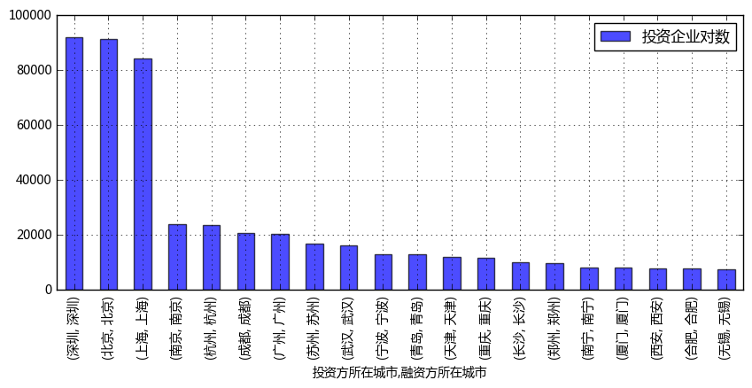
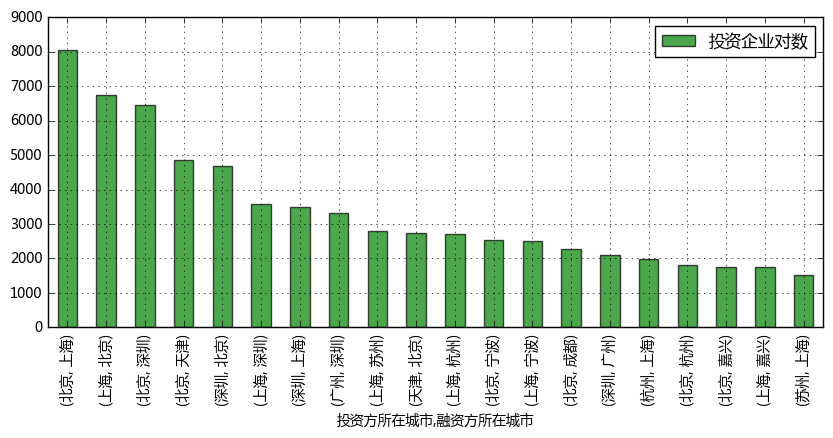
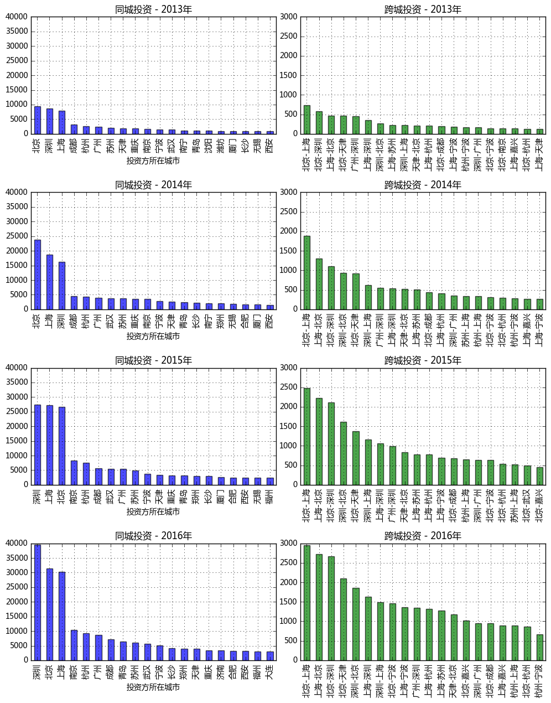
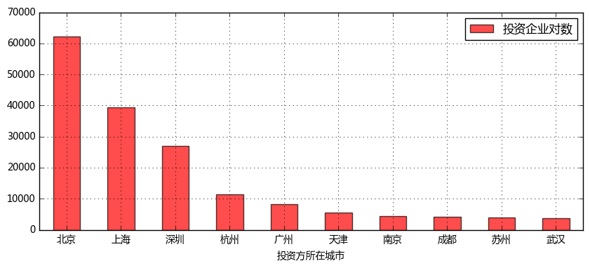
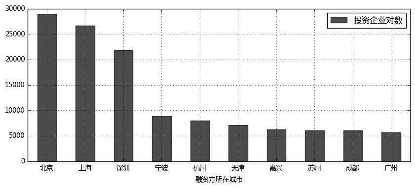
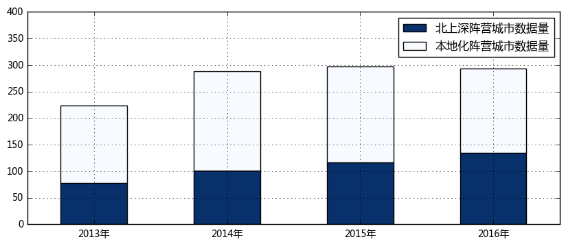

```python
'''
【项目12】  中国城市资本流动问题探索

数据：全国2013-2016所有企业间的投融资信息数据

作业要求
1、查看全国城际控股型投资关系
要求：
① 通过“data.xlsx”导出csv后，直接通过gephi看全国投资情况，有什么发现？
② 分别筛选出“同城投资”、“跨城投资”的TOP20，比较一下两类投资的数据分布
   ** 按照2013-2016年的汇总数据来计算
   ** 分开比较2013-2016四个年度的数据
   ** 需要绘制柱状图来辅助分析，这里用matplotlib即可
提示：
① 原始数据中，同一年中的投资数据会重复记录，所以需要将数据以'投资方所在城市','融资方所在城市','年份'这三个字段做一个分组汇总
② 用df.plot(kind = 'bar')来绘制图表，这里index为城市名即可

2、2013-2016年全国跨城市资本流动情况
要求：
① 结合“中国城市代码对照表.xlsx”数据，给2013-2016年“跨城投资”的汇总数据添加城市的经纬度
② 通过2013-2016年“跨城投资”的汇总数据，在gephi中绘制“城市关系图”
   ** 这里gephi中“点标签”只显示投资笔数TOP20的城市
③ 通过2013-2016年“跨城投资”的汇总数据，在echarts中绘制“全国跨城市资本流动OD图”
   ** 这里通过qgis的插件，做点转线
   ** 通过echart制作最后的资本
   ** 这里line的value为投资笔数
提示：
① 添加经纬度时，“投资方所在城市”、“融资方所在城市”都需要匹配城市经纬度
   ** 需要将“区/县”中最后一个字去掉
② gephi制图所需要导出的csv参考课程资料里的模板：边文件 → edge_model.csv；点文件 → node_model.csv（主要注意列名）
   ** 其中边数据的value需要做标准化处理 → 0-1之间
   ** gephi中单独显示某些城市的点标签方法 → 导入数据后，设置label，然后用label来显示标签，其中label只标注top20的数据
③ qgis中需要安装插件“LinePlotter”来转线
④ shapefile转geojson时：注意shapefile保持wgs84地理坐标系

3、深挖跨城市资本流动：钱从哪里来，到哪里去？
要求：
① 近四年对外控股型投资笔数最多的10个城市是哪些？
② 近四年吸引对外控股型投资笔数最多的10个城市又是哪些？
③ 从2013年到2016年，资本流动两大阵营的变化趋势：“北上深阵营”、“本地化阵营”
   ** “北上深阵营”：最大的外来投资方为北上深之一的城市
   ** “本地化阵营”：这里简化计算，将非“北上深阵营”都划入“本地化阵营”
   ** 该问题从“北上深阵营”历年来城市数量占比来看
   ** 可以qgis辅助绘制城市空间分布
提示：
① 资本流动两大阵营在计算中，主要以“融资方所在城市”为对象研究
② 资本流动两大阵营变化趋势计算中，可以构建函数，以年份为参数
③ 如何得到某年融资城市对应的最大的外来投资城市？
   ** 首先按照“融资方所在城市”做groupby分组，计算“投资企业对数”的max，得到一个Series
   ** Series通过reset_index转化为dataframe
   ** 再通过和源数据merge，找到该融资城市的最大外来投资对应的“投资方城市”，这里merge中的参数 on = ['融资方所在城市','投资企业对数']
④ 为了在qgis中制图，需要给数据添加经纬度信息，这里只需要添加“融资方所在城市”的经纬度
⑤ 为了qgis更好识别阵营类型，数据“阵营”字段用数字表示：0代表“本地化阵营”，1代表“北上深阵营”
⑥ qgis中制图时，既不属于“本地化阵营”又不属于“北上深阵营”的城市，颜色填充和“本地化阵营”一样即可


'''
```


```python
import numpy as np
import pandas as pd
import matplotlib.pyplot as plt
% matplotlib inline

import warnings
warnings.filterwarnings('ignore') 
# 不发出警告

from bokeh.io import output_notebook
output_notebook()
# 导入notebook绘图模块

from bokeh.plotting import figure,show
from bokeh.models import ColumnDataSource,HoverTool
# 导入图表绘制、图标展示模块
# 导入ColumnDataSource模块
```


    <div class="bk-root">
        <a href="https://bokeh.pydata.org" target="_blank" class="bk-logo bk-logo-small bk-logo-notebook"></a>
        <span id="5218ec01-f904-4cf5-b103-1a5e76bb77b4">Loading BokehJS ...</span>
    </div>


```python
'''
1、查看全国城际控股型投资关系
要求：
① 通过“data.xlsx”导出csv后，直接通过gephi看全国投资情况，有什么发现？
② 分别筛选出“同城投资”、“跨城投资”的TOP20，比较一下两类投资的数据分布
   ** 按照2013-2016年的汇总数据来计算
   ** 分开比较2013-2016四个年度的数据
   ** 需要绘制柱状图来辅助分析，这里用matplotlib即可
提示：
① 原始数据中，同一年中的投资数据会重复记录，所以需要将数据以'投资方所在城市','融资方所在城市','年份'这三个字段做一个分组汇总
② 用df.plot(kind = 'bar')来绘制图表，这里index为城市名即可

'''
```


```python
# 数据读取，筛选出“同城投资”、“跨城投资”数据

df = pd.read_excel('C:/Users/Hjx/Desktop/项目12中国城市资本流动问题探索/data.xlsx')
# 数据读取

df = df.groupby(['投资方所在城市','融资方所在城市','年份']).sum().reset_index()
# 汇总数据

data_tc = df[df['投资方所在城市'] == df['融资方所在城市']]
data_tc = data_tc.sort_values(by = '投资企业对数',ascending = False).reset_index()
del data_tc['index']
# 筛选出“同城投资”数据

data_kc = df[df['投资方所在城市'] != df['融资方所在城市']]
data_kc = data_kc.sort_values(by = '投资企业对数',ascending = False).reset_index()
del data_kc['index']
# 筛选出“跨城投资”数据
```


```python
# 比较一下“同城投资”、“跨城投资”TOP20的数据分布
# 按照2013-2017年的汇总数据来计算，比较

tc_sum = data_tc.groupby(['投资方所在城市','融资方所在城市']).sum().sort_values(by = '投资企业对数',ascending = False)
del tc_sum['年份']
# 汇总“同城投资”数据

kc_sum = data_kc.groupby(['投资方所在城市','融资方所在城市']).sum().sort_values(by = '投资企业对数',ascending = False)
del kc_sum['年份']
# 汇总“跨城投资”数据
```


```python
# 查看“同城投资”
tc_sum.iloc[:20]
```


<div>
<table border="1" class="dataframe">
  <thead>
    <tr style="text-align: right;">
      <th></th>
      <th></th>
      <th>投资企业对数</th>
    </tr>
    <tr>
      <th>投资方所在城市</th>
      <th>融资方所在城市</th>
      <th></th>
    </tr>
  </thead>
  <tbody>
    <tr>
      <th>深圳</th>
      <th>深圳</th>
      <td>92065</td>
    </tr>
    <tr>
      <th>北京</th>
      <th>北京</th>
      <td>91391</td>
    </tr>
    <tr>
      <th>上海</th>
      <th>上海</th>
      <td>84298</td>
    </tr>
    <tr>
      <th>南京</th>
      <th>南京</th>
      <td>23873</td>
    </tr>
    <tr>
      <th>杭州</th>
      <th>杭州</th>
      <td>23791</td>
    </tr>
    <tr>
      <th>成都</th>
      <th>成都</th>
      <td>20639</td>
    </tr>
    <tr>
      <th>广州</th>
      <th>广州</th>
      <td>20534</td>
    </tr>
    <tr>
      <th>苏州</th>
      <th>苏州</th>
      <td>16768</td>
    </tr>
    <tr>
      <th>武汉</th>
      <th>武汉</th>
      <td>16404</td>
    </tr>
    <tr>
      <th>宁波</th>
      <th>宁波</th>
      <td>13108</td>
    </tr>
    <tr>
      <th>青岛</th>
      <th>青岛</th>
      <td>13080</td>
    </tr>
    <tr>
      <th>天津</th>
      <th>天津</th>
      <td>11905</td>
    </tr>
    <tr>
      <th>重庆</th>
      <th>重庆</th>
      <td>11869</td>
    </tr>
    <tr>
      <th>长沙</th>
      <th>长沙</th>
      <td>10216</td>
    </tr>
    <tr>
      <th>郑州</th>
      <th>郑州</th>
      <td>9714</td>
    </tr>
    <tr>
      <th>南宁</th>
      <th>南宁</th>
      <td>8218</td>
    </tr>
    <tr>
      <th>厦门</th>
      <th>厦门</th>
      <td>8156</td>
    </tr>
    <tr>
      <th>西安</th>
      <th>西安</th>
      <td>7972</td>
    </tr>
    <tr>
      <th>合肥</th>
      <th>合肥</th>
      <td>7956</td>
    </tr>
    <tr>
      <th>无锡</th>
      <th>无锡</th>
      <td>7661</td>
    </tr>
  </tbody>
</table>
</div>


```python
# 查看“跨城投资”
kc_sum.iloc[:20]
```


<div>
<table border="1" class="dataframe">
  <thead>
    <tr style="text-align: right;">
      <th></th>
      <th></th>
      <th>投资企业对数</th>
    </tr>
    <tr>
      <th>投资方所在城市</th>
      <th>融资方所在城市</th>
      <th></th>
    </tr>
  </thead>
  <tbody>
    <tr>
      <th>北京</th>
      <th>上海</th>
      <td>8065</td>
    </tr>
    <tr>
      <th>上海</th>
      <th>北京</th>
      <td>6733</td>
    </tr>
    <tr>
      <th rowspan="2" valign="top">北京</th>
      <th>深圳</th>
      <td>6467</td>
    </tr>
    <tr>
      <th>天津</th>
      <td>4862</td>
    </tr>
    <tr>
      <th>深圳</th>
      <th>北京</th>
      <td>4674</td>
    </tr>
    <tr>
      <th>上海</th>
      <th>深圳</th>
      <td>3580</td>
    </tr>
    <tr>
      <th>深圳</th>
      <th>上海</th>
      <td>3495</td>
    </tr>
    <tr>
      <th>广州</th>
      <th>深圳</th>
      <td>3324</td>
    </tr>
    <tr>
      <th>上海</th>
      <th>苏州</th>
      <td>2804</td>
    </tr>
    <tr>
      <th>天津</th>
      <th>北京</th>
      <td>2736</td>
    </tr>
    <tr>
      <th>上海</th>
      <th>杭州</th>
      <td>2708</td>
    </tr>
    <tr>
      <th>北京</th>
      <th>宁波</th>
      <td>2545</td>
    </tr>
    <tr>
      <th>上海</th>
      <th>宁波</th>
      <td>2499</td>
    </tr>
    <tr>
      <th>北京</th>
      <th>成都</th>
      <td>2266</td>
    </tr>
    <tr>
      <th>深圳</th>
      <th>广州</th>
      <td>2114</td>
    </tr>
    <tr>
      <th>杭州</th>
      <th>上海</th>
      <td>1991</td>
    </tr>
    <tr>
      <th rowspan="2" valign="top">北京</th>
      <th>杭州</th>
      <td>1816</td>
    </tr>
    <tr>
      <th>嘉兴</th>
      <td>1767</td>
    </tr>
    <tr>
      <th>上海</th>
      <th>嘉兴</th>
      <td>1743</td>
    </tr>
    <tr>
      <th>苏州</th>
      <th>上海</th>
      <td>1521</td>
    </tr>
  </tbody>
</table>
</div>


```python
tc_sum.iloc[:20].plot(kind = 'bar',grid = True, figsize = (10,4),color = 'blue',alpha = 0.7)
kc_sum.iloc[:20].plot(kind = 'bar',grid = True, figsize = (10,4),color = 'green',alpha = 0.7)
```


    <matplotlib.axes._subplots.AxesSubplot at 0xb890dd8>








```python
# 结论1
# ① 从2013-2016的汇总数据来看，投资比数“同城投资”>“跨城投资”
# ② “同城投资”中领头的城市为北上广深及部分二线强城市，其中 深圳>北京>上海>>其他城市
# ③ “跨城投资”中领头的城市仍为北上广深（相互投资），或者北上广深向周边城市投资（城市群）
```


```python
# 比较一下“同城投资”、“跨城投资”TOP20的数据分布
# 分开比较2013-2016四个年度的数据

def f1(year):
    tc_year = data_tc[data_tc['年份'] == year].sort_values(by = '投资企业对数',ascending = False)
    kc_year = data_kc[data_kc['年份'] == year].sort_values(by = '投资企业对数',ascending = False)
    tc_year.index = tc_year['投资方所在城市']
    kc_year.index = kc_year['投资方所在城市'] + '-' + kc_year['融资方所在城市']
    # 筛选该年的“同城投资”、“跨城投资”
    #print('%i年同城投资TOP20:' % year)
    #print(tc_year.iloc[:20])
    #print('-----')
    #print('%i年跨城投资TOP20:' % year)
    #print(kc_year.iloc[:20])
    #print('-----')
    return(tc_year.iloc[:20],kc_year.iloc[:20])
    # 输出该年“同城投资”、“跨城投资”TOP20 
# 创建函数
```


```python
# 绘制图表

fig,axes = plt.subplots(4,2,figsize=(12,15))
plt.subplots_adjust(wspace = 0.1,hspace=0.5)
f1(2013)[0]['投资企业对数'].plot(kind = 'bar',grid = True, color = 'blue',alpha = 0.7,ax = axes[0,0],title = '同城投资 - 2013年',ylim = [0,40000])
f1(2013)[1]['投资企业对数'].plot(kind = 'bar',grid = True, color = 'green',alpha = 0.7,ax = axes[0,1],title = '跨城投资 - 2013年',ylim = [0,3000])
# 2013年
f1(2014)[0]['投资企业对数'].plot(kind = 'bar',grid = True, color = 'blue',alpha = 0.7,ax = axes[1,0],title = '同城投资 - 2014年',ylim = [0,40000])
f1(2014)[1]['投资企业对数'].plot(kind = 'bar',grid = True, color = 'green',alpha = 0.7,ax = axes[1,1],title = '跨城投资 - 2014年',ylim = [0,3000])
# 2014年
f1(2015)[0]['投资企业对数'].plot(kind = 'bar',grid = True, color = 'blue',alpha = 0.7,ax = axes[2,0],title = '同城投资 - 2015年',ylim = [0,40000])
f1(2015)[1]['投资企业对数'].plot(kind = 'bar',grid = True, color = 'green',alpha = 0.7,ax = axes[2,1],title = '跨城投资 - 2015年',ylim = [0,3000])
# 2015年
f1(2016)[0]['投资企业对数'].plot(kind = 'bar',grid = True, color = 'blue',alpha = 0.7,ax = axes[3,0],title = '同城投资 - 2016年',ylim = [0,40000])
f1(2016)[1]['投资企业对数'].plot(kind = 'bar',grid = True, color = 'green',alpha = 0.7,ax = axes[3,1],title = '跨城投资 - 2016年',ylim = [0,3000])
# 2016年
```


    <matplotlib.axes._subplots.AxesSubplot at 0xb55cc50>





```python
# 结论2
# ① 分开2013-2016年来看，每年“同城投资”、“跨城投资”均呈上升趋势
# ② “同城投资”中，头部城市仍为北上深（没有广州），且随着时间推移，越来越拉开和其他城市的“同城投资”差距（注意这个结论）
# ③ “跨城投资”中，投资关系较强的城市为“北京-上海” > “北京-深圳” > “上海-深圳” → 一线城市之间投资力度较大
# ** 接下来详细挖掘一下“全国跨城市资本流动情况”
```


```python
'''
2、2013-2016年全国跨城市资本流动情况
要求：
① 结合“中国城市代码对照表.xlsx”数据，给2013-2016年“跨城投资”的汇总数据添加城市的经纬度
② 通过2013-2016年“跨城投资”的汇总数据，在gephi中绘制“城市关系图”
   ** 这里gephi中“点标签”只显示投资笔数TOP20的城市
③ 通过2013-2016年“跨城投资”的汇总数据，在echarts中绘制“全国跨城市资本流动OD图”
   ** 这里通过qgis的插件，做点转线
   ** 通过echart制作最后的资本
   ** 这里line的value为投资笔数
提示：
① gephi制图所需要导出的csv参考课程资料里的模板：边文件 → edge_model.csv；点文件 → node_model.csv（主要注意列名）
   ** 其中边数据的value需要做标准化处理 → 0-1之间
   ** gephi中单独显示某些城市的点标签方法 → 导入数据后，设置label，然后用label来显示标签，其中label只标注top20的数据
② qgis中需要安装插件“LinePlotter”来转线
③ shapefile转geojson时：注意shapefile保持wgs84地理坐标系

'''
```


```python
# 读取“中国城市代码对照表.xlsx”数据及重新设置kc_sum数据的index

city = pd.read_excel('C:/Users/Hjx/Desktop/项目12中国城市资本流动问题探索/中国城市代码对照表.xlsx')
kc_sum.reset_index(inplace = True) 
```


```python
# 结合“中国行政代码对照表.xlsx”数据，给2013-2016年“跨城投资”的汇总数据添加城市的经纬度

kc_data = pd.merge(kc_sum,city[['城市名称','经度','纬度']],left_on ='投资方所在城市',right_on = '城市名称')
kc_data = pd.merge(kc_data,city[['城市名称','经度','纬度']],left_on ='融资方所在城市',right_on = '城市名称')
kc_data = kc_data[['投资方所在城市','融资方所在城市','投资企业对数','经度_x','纬度_x','经度_y','纬度_y']] 
kc_data.columns = ['投资方所在城市','融资方所在城市','投资企业对数','lng_tz','lat_tz','lng_rz','lat_rz']
kc_data.head()
```


<div>
<table border="1" class="dataframe">
  <thead>
    <tr style="text-align: right;">
      <th></th>
      <th>投资方所在城市</th>
      <th>融资方所在城市</th>
      <th>投资企业对数</th>
      <th>lng_tz</th>
      <th>lat_tz</th>
      <th>lng_rz</th>
      <th>lat_rz</th>
    </tr>
  </thead>
  <tbody>
    <tr>
      <th>0</th>
      <td>北京</td>
      <td>上海</td>
      <td>8065</td>
      <td>116.409349</td>
      <td>40.184118</td>
      <td>121.404085</td>
      <td>31.084462</td>
    </tr>
    <tr>
      <th>1</th>
      <td>深圳</td>
      <td>上海</td>
      <td>3495</td>
      <td>113.981097</td>
      <td>22.661217</td>
      <td>121.404085</td>
      <td>31.084462</td>
    </tr>
    <tr>
      <th>2</th>
      <td>广州</td>
      <td>上海</td>
      <td>815</td>
      <td>113.535310</td>
      <td>23.357246</td>
      <td>121.404085</td>
      <td>31.084462</td>
    </tr>
    <tr>
      <th>3</th>
      <td>天津</td>
      <td>上海</td>
      <td>782</td>
      <td>117.332395</td>
      <td>39.308554</td>
      <td>121.404085</td>
      <td>31.084462</td>
    </tr>
    <tr>
      <th>4</th>
      <td>杭州</td>
      <td>上海</td>
      <td>1991</td>
      <td>119.484701</td>
      <td>29.904980</td>
      <td>121.404085</td>
      <td>31.084462</td>
    </tr>
  </tbody>
</table>
</div>


```python
# 导出gephi制图数据

gephi_edge = kc_data[['投资方所在城市','融资方所在城市','投资企业对数']]
gephi_edge.columns = ['source','target','weight']
gephi_edge['weight'] = (gephi_edge['weight'] - gephi_edge['weight'].min())/(gephi_edge['weight'].max() - gephi_edge['weight'].min())
gephi_edge.to_csv('C:/Users/Hjx/Desktop/gephi_edge.csv',index = False)
# 导出边数据

citys = list(set(gephi_edge['source'].tolist()+gephi_edge['target'].tolist()))
gephi_nodes = pd.DataFrame({'Id':citys})  
# 筛选出所有的城市节点，并生成dataframe
top_node = gephi_edge.sort_values(by = 'weight',ascending = False)
top_node20 = top_node['source'].drop_duplicates().iloc[:20]
top_node20_df = pd.DataFrame({'Id':top_node20, 'Label':top_node20})
# 筛选出投资对数较大，且不重复的前20个城市，并生成dataframe
gephi_nodes = pd.merge(gephi_nodes,top_node20_df,on = 'Id',how = 'left')
# 合并，给点数据增加label字段
gephi_nodes.to_csv('C:/Users/Hjx/Desktop/gephi_nodes.csv',index = False)
# 导出点数据

print('finished!')
```

    finished!
    


```python
# 导出qgis制图数据

kc_data.to_csv('C:/Users/Hjx/Desktop/qgisdata.csv',index = False)
print('finished!')
```

    finished!
    


```python
# 结论3
# ① 通过“全国跨城市资本流动OD图”可以明显看到
# ** 三个亮点密集的区域：长三角城市群、珠三角城市群、北京-天津城市群
# ** 这三个城市群与成都-重庆西部城市群构成了一个钻石形状
# ** 在钻石之外，仅有星星点点的东北和西部的几个亮点游离；
# ** 而这颗大钻石内的资本流动，占据了全国资本流动的90%以上！！
# ② 通过“城市关系图”可以发现：
# ** 城际投资的全国城市拓扑关系 → 以“北上深”为中心的城市网络
```


```python
'''
3、深挖跨城市资本流动：钱从哪里来，到哪里去？
要求：
① 近四年对外控股型投资笔数最多的10个城市是哪些？
② 近四年吸引对外控股型投资笔数最多的10个城市又是哪些？
③ 从2013年到2016年，资本流动两大阵营的变化趋势：“北上深阵营”、“本地化阵营”
   ** “北上深阵营”：最大的外来投资方为北上深之一的城市
   ** “本地化阵营”：这里简化计算，将非“北上深阵营”都划入“本地化阵营”
   ** 该问题从“北上深阵营”历年来城市数量占比来看
   ** 可以qgis辅助绘制城市空间分布
提示：
① 资本流动两大阵营在计算中，主要以“融资方所在城市”为对象研究
② 资本流动两大阵营变化趋势计算中，可以构建函数，以年份为参数
③ 如何得到某年融资城市对应的最大的外来投资城市？
   ** 首先按照“融资方所在城市”做groupby分组，计算“投资企业对数”的max，得到一个Series
   ** Series通过reset_index转化为dataframe
   ** 再通过和源数据merge，找到该融资城市的最大外来投资对应的“投资方城市”，这里merge中的参数 on = ['融资方所在城市','投资企业对数']
④ 为了在qgis中制图，需要给数据添加经纬度信息，这里只需要添加“融资方所在城市”的经纬度
⑤ 为了qgis更好识别阵营类型，数据“阵营”字段用数字表示：0代表“本地化阵营”，1代表“北上深阵营”
⑥ qgis中制图时，既不属于“本地化阵营”又不属于“北上深阵营”的城市，颜色填充和“本地化阵营”一样即可

'''
```


```python
# 近四年对外控股型投资笔数最多的10个城市是哪些？

result1 = kc_sum[['投资方所在城市','投资企业对数']].groupby('投资方所在城市').sum().sort_values(by = '投资企业对数',ascending = False).iloc[:10]
result1
```


<div>
<table border="1" class="dataframe">
  <thead>
    <tr style="text-align: right;">
      <th></th>
      <th>投资企业对数</th>
    </tr>
    <tr>
      <th>投资方所在城市</th>
      <th></th>
    </tr>
  </thead>
  <tbody>
    <tr>
      <th>北京</th>
      <td>62284</td>
    </tr>
    <tr>
      <th>上海</th>
      <td>39506</td>
    </tr>
    <tr>
      <th>深圳</th>
      <td>26953</td>
    </tr>
    <tr>
      <th>杭州</th>
      <td>11364</td>
    </tr>
    <tr>
      <th>广州</th>
      <td>8283</td>
    </tr>
    <tr>
      <th>天津</th>
      <td>5598</td>
    </tr>
    <tr>
      <th>南京</th>
      <td>4299</td>
    </tr>
    <tr>
      <th>成都</th>
      <td>4238</td>
    </tr>
    <tr>
      <th>苏州</th>
      <td>4051</td>
    </tr>
    <tr>
      <th>武汉</th>
      <td>3832</td>
    </tr>
  </tbody>
</table>
</div>


```python
# 近四年吸引对外控股型投资笔数最多的10个城市又是哪些？

result2 = kc_sum[['融资方所在城市','投资企业对数']].groupby('融资方所在城市').sum().sort_values(by = '投资企业对数',ascending = False).iloc[:10]
result2
```


<div>
<table border="1" class="dataframe">
  <thead>
    <tr style="text-align: right;">
      <th></th>
      <th>投资企业对数</th>
    </tr>
    <tr>
      <th>融资方所在城市</th>
      <th></th>
    </tr>
  </thead>
  <tbody>
    <tr>
      <th>北京</th>
      <td>28844</td>
    </tr>
    <tr>
      <th>上海</th>
      <td>26689</td>
    </tr>
    <tr>
      <th>深圳</th>
      <td>21849</td>
    </tr>
    <tr>
      <th>宁波</th>
      <td>8893</td>
    </tr>
    <tr>
      <th>杭州</th>
      <td>8004</td>
    </tr>
    <tr>
      <th>天津</th>
      <td>7111</td>
    </tr>
    <tr>
      <th>嘉兴</th>
      <td>6196</td>
    </tr>
    <tr>
      <th>苏州</th>
      <td>6077</td>
    </tr>
    <tr>
      <th>成都</th>
      <td>6068</td>
    </tr>
    <tr>
      <th>广州</th>
      <td>5698</td>
    </tr>
  </tbody>
</table>
</div>


```python
result1.plot(kind = 'bar',grid = True, figsize = (10,4),color = 'red',alpha = 0.7, rot = 0)
result2.plot(kind = 'bar',grid = True, figsize = (10,4),color = 'black',alpha = 0.7, rot = 0)
```


    <matplotlib.axes._subplots.AxesSubplot at 0xb5adf60>








```python
# 结论4
# ① 通过“对外控股型投资笔数-城市排名TOP10”可以看出
# ** 北京、上海、深圳毫无悬念地包揽了前三名，且在量级上远远超过了其他城市 → 北上深在一定程度上控制着全国的资金流向和经济命脉
# ** 杭州 → 第四名，表现最为亮眼的省会城市，崛起的新一线城市
# ** 广州 → 第五名，江湖人称“北上广”三兄弟的广州，在对外投资的控制力上已经与另两位兄弟渐行渐远了
# ** 前10名中有5名都是长三角区域的城市，可以看到长三角地区资本的活跃程度
# ② 通过“吸引对外控股型投资笔数-城市排名TOP10”可以看出
# ** 吸引外来控股型投资笔数最多的前三名的仍然是北上深
# ** 在外来资本流入城市的榜单中，嘉兴挤掉了南京,进入前十名 → 相比资本对外输出，嘉兴是一个更受资本青睐的城市
```


```python
# 从2013年到2016年，资本流动两大阵营的变化趋势：“北上深阵营”、“本地化阵营”
# ** “北上深阵营”：最大的外来投资方为北上深之一的城市
# ** “本地化阵营”：这里简化计算，将非“北上深阵营”都划入“本地化阵营”

def f2(year):
    kc_datai = data_kc[data_kc['年份']==year]
    x = kc_datai[['融资方所在城市','投资企业对数']].groupby('融资方所在城市').max().reset_index()
    city_tz_max = pd.merge(kc_datai,x,on = ['融资方所在城市','投资企业对数'],how = 'right')
    # 数据整理 → 得到融资城市的最大外来投资对应的“投资方城市”
    city_tz_max['阵营'] = 0
    city_tz_max['阵营'][(city_tz_max['投资方所在城市'] == '北京') |
                        (city_tz_max['投资方所在城市'] == '上海') | 
                        (city_tz_max['投资方所在城市'] == '深圳') ] = 1
    # 划分“北上深阵营”、“本地化阵营”
    city_tz_max = pd.merge(city_tz_max,city[['城市名称','经度','纬度']],left_on ='融资方所在城市',right_on = '城市名称')
    city_tz_max = city_tz_max[['投资方所在城市','融资方所在城市','投资企业对数','阵营','经度','纬度']] 
    # 添加融资方所在城市经纬度
    dici = {}
    dici['北上深阵营城市数据量'] = city_tz_max['阵营'].value_counts().iloc[1]
    dici['本地化阵营城市数据量'] = city_tz_max['阵营'].value_counts().iloc[0]
    # 计算“北上深阵营”、“本地化阵营”的城市数量，并放入一个字典
    return(city_tz_max,dici)
# 创建函数

zy_year = pd.DataFrame([f2(2013)[1],f2(2014)[1],f2(2015)[1],f2(2016)[1]],index = ['2013年','2014年','2015年','2016年'])
zy_year['北上深阵营占比'] = zy_year['北上深阵营城市数据量']/(zy_year['北上深阵营城市数据量'] + zy_year['本地化阵营城市数据量'])
zy_year[['北上深阵营城市数据量','本地化阵营城市数据量']].plot(kind='bar',grid = True,colormap='Blues_r',rot = 0,
                                                              stacked=True,figsize = (10,4),ylim = [0,400])
# 绘制堆叠图查看占比变化趋势
zy_year
```


<div>
<table border="1" class="dataframe">
  <thead>
    <tr style="text-align: right;">
      <th></th>
      <th>北上深阵营城市数据量</th>
      <th>本地化阵营城市数据量</th>
      <th>北上深阵营占比</th>
    </tr>
  </thead>
  <tbody>
    <tr>
      <th>2013年</th>
      <td>78</td>
      <td>146</td>
      <td>0.348214</td>
    </tr>
    <tr>
      <th>2014年</th>
      <td>101</td>
      <td>187</td>
      <td>0.350694</td>
    </tr>
    <tr>
      <th>2015年</th>
      <td>117</td>
      <td>180</td>
      <td>0.393939</td>
    </tr>
    <tr>
      <th>2016年</th>
      <td>135</td>
      <td>159</td>
      <td>0.459184</td>
    </tr>
  </tbody>
</table>
</div>





```python
# 数据导出csv，qgis绘图

f2(2013)[0].to_csv('C:/Users/Hjx/Desktop/year2013.csv',index = False)
f2(2014)[0].to_csv('C:/Users/Hjx/Desktop/year2014.csv',index = False)
f2(2015)[0].to_csv('C:/Users/Hjx/Desktop/year2015.csv',index = False)
f2(2016)[0].to_csv('C:/Users/Hjx/Desktop/year2016.csv',index = False)
print('finished!')
```

    finished!
    


```python
# 结论5
# “北上深阵营”高歌猛进，“本地化阵营”节节败退
# ① 2013年，“北上深阵营”的地盘仅仅局限于国内少数相对发达地区，以及各省省会城市
# ② 随着时间的推移，“北上深阵营”的势力范围逐步扩大，东北和内蒙的大部分地区纳入了“北上深阵营”
# ③ 越来越多的中小型城市也逐渐成为“北上深阵营”的一员
# ④ 2014年，90%的控股型城际投资去向了99个城市，而到了2017年，90%的城际投资只去向了60个城市
# → “北上深”越来越强大的资本力量，正在逐步地穿透中国经济的底层——三四线城市
```
